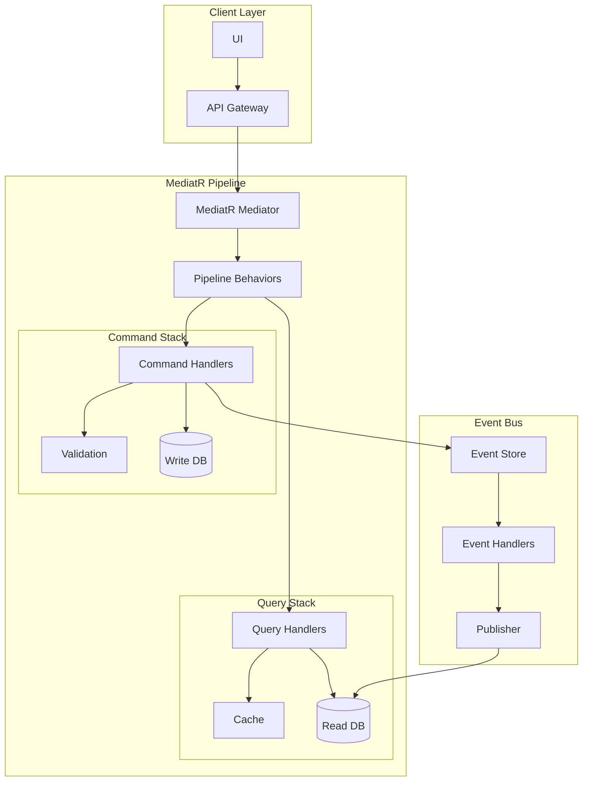

# Data Migration System Features

## Overview
The Data Migration System is an enterprise solution for secure, efficient data transfer between heterogeneous database systems. This document details the technical implementation of features outlined in the PRD.

## Architecture Overview

### MediatR CQRS Implementation


### Base MediatR CQRS Types
```csharp
// Commands
public interface ICommand : IRequest<CommandResult> { }
public interface ICommandHandler<TCommand> : IRequestHandler<TCommand, CommandResult> 
    where TCommand : ICommand { }

// Queries
public interface IQuery<TResult> : IRequest<TResult> { }
public interface IQueryHandler<TQuery, TResult> : IRequestHandler<TQuery, TResult> 
    where TQuery : IQuery<TResult> { }

// Events
public interface IDomainEvent : INotification { }
public interface IDomainEventHandler<TEvent> : INotificationHandler<TEvent> 
    where TEvent : IDomainEvent { }

// Pipeline Behaviors
public class LoggingBehavior<TRequest, TResponse> : IPipelineBehavior<TRequest, TResponse>
{
    private readonly ILogger<LoggingBehavior<TRequest, TResponse>> _logger;

    public async Task<TResponse> Handle(
        TRequest request, 
        RequestHandlerDelegate<TResponse> next, 
        CancellationToken cancellationToken)
    {
        _logger.LogInformation($"Handling {typeof(TRequest).Name}");
        var response = await next();
        _logger.LogInformation($"Handled {typeof(TRequest).Name}");
        return response;
    }
}

public class ValidationBehavior<TRequest, TResponse> : IPipelineBehavior<TRequest, TResponse>
    where TRequest : IRequest<TResponse>
{
    private readonly IEnumerable<IValidator<TRequest>> _validators;

    public async Task<TResponse> Handle(
        TRequest request,
        RequestHandlerDelegate<TResponse> next,
        CancellationToken cancellationToken)
    {
        if (_validators.Any())
        {
            var context = new ValidationContext<TRequest>(request);
            var validationResults = await Task.WhenAll(
                _validators.Select(v => v.ValidateAsync(context, cancellationToken)));
            var failures = validationResults
                .SelectMany(r => r.Errors)
                .Where(f => f != null)
                .ToList();

            if (failures.Count != 0)
                throw new ValidationException(failures);
        }
        return await next();
    }
}

// MediatR Registration
public static class MediatRServiceConfiguration
{
    public static IServiceCollection AddMediatRServices(this IServiceCollection services)
    {
        services.AddMediatR(cfg => {
            cfg.RegisterServicesFromAssembly(Assembly.GetExecutingAssembly());
            cfg.AddBehavior(typeof(IPipelineBehavior<,>), typeof(LoggingBehavior<,>));
            cfg.AddBehavior(typeof(IPipelineBehavior<,>), typeof(ValidationBehavior<,>));
        });

        return services;
    }
}
```

## Core Features Timeline

### Phase 1 - MVP (8 weeks)

1. **Authentication & Authorization** (P0)
   - Commands:
     ```csharp
     public record RegisterUserCommand : ICommand
     {
         public string Email { get; init; }
         public string Password { get; init; }
         public string FirstName { get; init; }
         public string LastName { get; init; }
     }

     public class RegisterUserCommandHandler : ICommandHandler<RegisterUserCommand>
     {
         private readonly IMediator _mediator;
         private readonly IUserRepository _repository;

         public async Task<CommandResult> Handle(
             RegisterUserCommand command, 
             CancellationToken cancellationToken)
         {
             var user = new User(command.Email, command.Password);
             await _repository.SaveAsync(user);
             
             await _mediator.Publish(new UserRegisteredEvent
             {
                 UserId = user.Id,
                 Email = user.Email,
                 RegisteredAt = DateTime.UtcNow
             }, cancellationToken);

             return CommandResult.Success(user.Id);
         }
     }
     ```

   - Queries:
     ```csharp
     public record GetUserByIdQuery : IQuery<UserDto>
     {
         public Guid UserId { get; init; }
     }

     public class GetUserByIdQueryHandler : IQueryHandler<GetUserByIdQuery, UserDto>
     {
         private readonly IUserReadRepository _repository;
         private readonly ICache _cache;

         public async Task<UserDto> Handle(
             GetUserByIdQuery query, 
             CancellationToken cancellationToken)
         {
             var cacheKey = $"user:{query.UserId}";
             return await _cache.GetOrCreateAsync(cacheKey, 
                 () => _repository.GetByIdAsync(query.UserId));
         }
     }
     ```

2. **Project Management** (P0)
   - Commands:
     ```csharp
     public record CreateProjectCommand : ICommand
     {
         public string Name { get; init; }
         public string Description { get; init; }
         public Guid OrganizationId { get; init; }
     }

     public class CreateProjectCommandHandler : ICommandHandler<CreateProjectCommand>
     {
         private readonly IMediator _mediator;
         private readonly IProjectRepository _repository;

         public async Task<CommandResult> Handle(
             CreateProjectCommand command, 
             CancellationToken cancellationToken)
         {
             var project = new Project(command.Name, command.Description);
             await _repository.SaveAsync(project);
             
             await _mediator.Publish(new ProjectCreatedEvent
             {
                 ProjectId = project.Id,
                 Name = project.Name,
                 CreatedBy = command.OrganizationId
             }, cancellationToken);

             return CommandResult.Success(project.Id);
         }
     }
     ```

   - Events:
     ```csharp
     public record ProjectCreatedEvent : IDomainEvent
     {
         public Guid ProjectId { get; init; }
         public string Name { get; init; }
         public Guid CreatedBy { get; init; }
     }

     public class ProjectCreatedEventHandler : IDomainEventHandler<ProjectCreatedEvent>
     {
         private readonly IProjectReadRepository _readRepository;
         private readonly INotificationService _notificationService;

         public async Task Handle(
             ProjectCreatedEvent notification, 
             CancellationToken cancellationToken)
         {
             await _readRepository.CreateAsync(new ProjectReadModel
             {
                 Id = notification.ProjectId,
                 Name = notification.Name,
                 CreatedBy = notification.CreatedBy,
                 Status = ProjectStatus.Draft
             });

             await _notificationService.NotifyProjectCreatedAsync(notification);
         }
     }
     ```

## API Controllers Implementation

```csharp
[ApiController]
[Route("api/[controller]")]
public class ProjectsController : ControllerBase
{
    private readonly IMediator _mediator;

    public ProjectsController(IMediator mediator)
    {
        _mediator = mediator;
    }

    [HttpPost]
    public async Task<ActionResult<Guid>> Create(
        CreateProjectCommand command,
        CancellationToken cancellationToken)
    {
        var result = await _mediator.Send(command, cancellationToken);
        return Ok(result.Data);
    }

    [HttpGet("{id}")]
    public async Task<ActionResult<ProjectDto>> Get(
        Guid id,
        CancellationToken cancellationToken)
    {
        var query = new GetProjectByIdQuery { ProjectId = id };
        var result = await _mediator.Send(query, cancellationToken);
        return Ok(result);
    }
}
```

## Dependency Injection Setup

```csharp
public static class DependencyInjection
{
    public static IServiceCollection AddApplication(this IServiceCollection services)
    {
        services.AddMediatR(cfg => {
            cfg.RegisterServicesFromAssembly(Assembly.GetExecutingAssembly());
        });

        services.AddTransient(typeof(IPipelineBehavior<,>), typeof(ValidationBehavior<,>));
        services.AddTransient(typeof(IPipelineBehavior<,>), typeof(LoggingBehavior<,>));
        services.AddTransient(typeof(IPipelineBehavior<,>), typeof(TransactionBehavior<,>));

        return services;
    }
}
```

## Validation Implementation

```csharp
public class CreateProjectCommandValidator : AbstractValidator<CreateProjectCommand>
{
    public CreateProjectCommandValidator()
    {
        RuleFor(x => x.Name)
            .NotEmpty()
            .MaximumLength(100);

        RuleFor(x => x.Description)
            .MaximumLength(500);

        RuleFor(x => x.OrganizationId)
            .NotEmpty();
    }
}
```

## Transaction Behavior

```csharp
public class TransactionBehavior<TRequest, TResponse> 
    : IPipelineBehavior<TRequest, TResponse>
    where TRequest : IRequest<TResponse>
{
    private readonly IUnitOfWork _unitOfWork;

    public async Task<TResponse> Handle(
        TRequest request,
        RequestHandlerDelegate<TResponse> next,
        CancellationToken cancellationToken)
    {
        if (request is ICommand)
        {
            using var transaction = await _unitOfWork.BeginTransactionAsync();
            try
            {
                var response = await next();
                await _unitOfWork.CommitAsync(cancellationToken);
                return response;
            }
            catch
            {
                await _unitOfWork.RollbackAsync(cancellationToken);
                throw;
            }
        }

        return await next();
    }
}
``` 