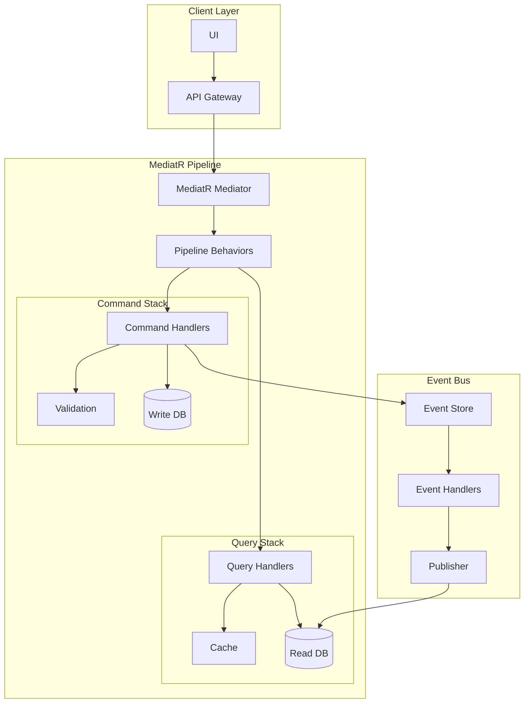

# Data Migration System Features

## Overview
The Data Migration System is an enterprise solution for secure, efficient data transfer between heterogeneous database systems. This document details the technical implementation of features outlined in the PRD.

Key Metrics:
- 60% reduction in migration time
- 80% lower error rates
- $150,000 average cost savings per project
- 95% successful migration rate

## Architecture Overview

### MediatR CQRS Implementation


### Base MediatR CQRS Types
```csharp
// Commands
public interface ICommand : IRequest<CommandResult> { }
public interface ICommandHandler<TCommand> : IRequestHandler<TCommand, CommandResult> 
    where TCommand : ICommand { }

// Queries
public interface IQuery<TResult> : IRequest<TResult> { }
public interface IQueryHandler<TQuery, TResult> : IRequestHandler<TQuery, TResult> 
    where TQuery : IQuery<TResult> { }

// Events
public interface IDomainEvent : INotification { }
public interface IDomainEventHandler<TEvent> : INotificationHandler<TEvent> 
    where TEvent : IDomainEvent { }

// Pipeline Behaviors
public class LoggingBehavior<TRequest, TResponse> : IPipelineBehavior<TRequest, TResponse>
{
    private readonly ILogger<LoggingBehavior<TRequest, TResponse>> _logger;

    public async Task<TResponse> Handle(
        TRequest request, 
        RequestHandlerDelegate<TResponse> next, 
        CancellationToken cancellationToken)
    {
        _logger.LogInformation($"Handling {typeof(TRequest).Name}");
        var response = await next();
        _logger.LogInformation($"Handled {typeof(TRequest).Name}");
        return response;
    }
}

public class ValidationBehavior<TRequest, TResponse> : IPipelineBehavior<TRequest, TResponse>
    where TRequest : IRequest<TResponse>
{
    private readonly IEnumerable<IValidator<TRequest>> _validators;

    public async Task<TResponse> Handle(
        TRequest request,
        RequestHandlerDelegate<TResponse> next,
        CancellationToken cancellationToken)
    {
        if (_validators.Any())
        {
            var context = new ValidationContext<TRequest>(request);
            var validationResults = await Task.WhenAll(
                _validators.Select(v => v.ValidateAsync(context, cancellationToken)));
            var failures = validationResults
                .SelectMany(r => r.Errors)
                .Where(f => f != null)
                .ToList();

            if (failures.Count != 0)
                throw new ValidationException(failures);
        }
        return await next();
    }
}

// MediatR Registration
public static class MediatRServiceConfiguration
{
    public static IServiceCollection AddMediatRServices(this IServiceCollection services)
    {
        services.AddMediatR(cfg => {
            cfg.RegisterServicesFromAssembly(Assembly.GetExecutingAssembly());
            cfg.AddBehavior(typeof(IPipelineBehavior<,>), typeof(LoggingBehavior<,>));
            cfg.AddBehavior(typeof(IPipelineBehavior<,>), typeof(ValidationBehavior<,>));
            cfg.AddBehavior(typeof(IPipelineBehavior<,>), typeof(TransactionBehavior<,>));
            cfg.AddBehavior(typeof(IPipelineBehavior<,>), typeof(CachingBehavior<,>));
            cfg.AddBehavior(typeof(IPipelineBehavior<,>), typeof(SecurityBehavior<,>));
            cfg.AddBehavior(typeof(IPipelineBehavior<,>), typeof(RetryBehavior<,>));
        });

        return services;
    }
}
```

## Core Features Timeline

### Phase 1 - MVP (8 weeks)

1. **Authentication & Authorization** (P0)
   - Commands:
     ```csharp
     public record RegisterUserCommand : ICommand
     {
         public string Email { get; init; }
         public string Password { get; init; }
         public string FirstName { get; init; }
         public string LastName { get; init; }
     }

     public record EnableMfaCommand : ICommand
     {
         public Guid UserId { get; init; }
         public string Secret { get; init; }
     }

     public record CreateApiKeyCommand : ICommand
     {
         public string Name { get; init; }
         public List<string> Scopes { get; init; }
         public DateTime? ExpiresAt { get; init; }
     }
     ```

   - Queries:
     ```csharp
     public record GetUserByIdQuery : IQuery<UserDto>
     {
         public Guid UserId { get; init; }
     }

     public record ValidateUserCredentialsQuery : IQuery<AuthResult>
     {
         public string Email { get; init; }
         public string Password { get; init; }
     }

     public record GetUserApiKeysQuery : IQuery<List<ApiKeyDto>>
     {
         public Guid UserId { get; init; }
     }
     ```

   - Events:
     ```csharp
     public record UserRegisteredEvent : IDomainEvent
     {
         public Guid UserId { get; init; }
         public string Email { get; init; }
         public DateTime RegisteredAt { get; init; }
     }

     public record MfaEnabledEvent : IDomainEvent
     {
         public Guid UserId { get; init; }
         public DateTime EnabledAt { get; init; }
     }

     public record ApiKeyCreatedEvent : IDomainEvent
     {
         public Guid ApiKeyId { get; init; }
         public Guid UserId { get; init; }
         public string Name { get; init; }
         public DateTime CreatedAt { get; init; }
     }
     ```

2. **Project Management** (P0)
   - Commands:
     ```csharp
     public record CreateProjectCommand : ICommand
     {
         public string Name { get; init; }
         public string Description { get; init; }
         public Guid OrganizationId { get; init; }
     }

     public record UpdateProjectStatusCommand : ICommand
     {
         public Guid ProjectId { get; init; }
         public ProjectStatus NewStatus { get; init; }
     }

     public record AssignUserToProjectCommand : ICommand
     {
         public Guid ProjectId { get; init; }
         public Guid UserId { get; init; }
         public ProjectRole Role { get; init; }
     }
     ```

   - Queries:
     ```csharp
     public record GetProjectByIdQuery : IQuery<ProjectDto>
     {
         public Guid ProjectId { get; init; }
     }

     public record GetProjectsListQuery : IQuery<PagedResult<ProjectDto>>
     {
         public int Page { get; init; }
         public int PageSize { get; init; }
         public ProjectFilter Filter { get; init; }
     }

     public record GetProjectHistoryQuery : IQuery<List<ProjectHistoryDto>>
     {
         public Guid ProjectId { get; init; }
         public DateTime? FromDate { get; init; }
         public DateTime? ToDate { get; init; }
     }
     ```

   - Events:
     ```csharp
     public record ProjectCreatedEvent : IDomainEvent
     {
         public Guid ProjectId { get; init; }
         public string Name { get; init; }
         public Guid CreatedBy { get; init; }
     }

     public record ProjectStatusChangedEvent : IDomainEvent
     {
         public Guid ProjectId { get; init; }
         public ProjectStatus OldStatus { get; init; }
         public ProjectStatus NewStatus { get; init; }
     }

     public record UserAssignedToProjectEvent : IDomainEvent
     {
         public Guid ProjectId { get; init; }
         public Guid UserId { get; init; }
         public ProjectRole Role { get; init; }
     }
     ```

3. **Database Connection Management** (P0)
   - Commands:
     ```csharp
     public record CreateConnectionCommand : ICommand
     {
         public string Name { get; init; }
         public DatabaseType Type { get; init; }
         public ConnectionConfig Config { get; init; }
         public EncryptedCredentials Credentials { get; init; }
     }

     public record TestConnectionCommand : ICommand
     {
         public Guid ConnectionId { get; init; }
     }

     public record UpdateConnectionCredentialsCommand : ICommand
     {
         public Guid ConnectionId { get; init; }
         public EncryptedCredentials NewCredentials { get; init; }
     }
     ```

   - Queries:
     ```csharp
     public record GetConnectionByIdQuery : IQuery<ConnectionDto>
     {
         public Guid ConnectionId { get; init; }
     }

     public record GetConnectionStatusQuery : IQuery<ConnectionStatus>
     {
         public Guid ConnectionId { get; init; }
     }

     public record GetConnectionMetricsQuery : IQuery<ConnectionMetricsDto>
     {
         public Guid ConnectionId { get; init; }
         public DateTime FromDate { get; init; }
         public DateTime ToDate { get; init; }
     }
     ```

   - Events:
     ```csharp
     public record ConnectionCreatedEvent : IDomainEvent
     {
         public Guid ConnectionId { get; init; }
         public DatabaseType Type { get; init; }
     }

     public record ConnectionTestedEvent : IDomainEvent
     {
         public Guid ConnectionId { get; init; }
         public bool Success { get; init; }
         public string ErrorMessage { get; init; }
     }

     public record ConnectionCredentialsUpdatedEvent : IDomainEvent
     {
         public Guid ConnectionId { get; init; }
         public DateTime UpdatedAt { get; init; }
     }
     ```

4. **Schema Management** (P0)
   - Commands:
     ```csharp
     public record AnalyzeSchemaCommand : ICommand
     {
         public Guid ConnectionId { get; init; }
         public SchemaAnalysisOptions Options { get; init; }
     }

     public record CreateSchemaMappingCommand : ICommand
     {
         public Guid SourceSchemaId { get; init; }
         public Guid TargetSchemaId { get; init; }
         public List<ColumnMapping> Mappings { get; init; }
     }

     public record ValidateSchemaMappingCommand : ICommand
     {
         public Guid MappingId { get; init; }
         public ValidationOptions Options { get; init; }
     }
     ```

   - Queries:
     ```csharp
     public record GetSchemaAnalysisQuery : IQuery<SchemaAnalysisDto>
     {
         public Guid ConnectionId { get; init; }
     }

     public record GetSchemaMappingQuery : IQuery<SchemaMappingDto>
     {
         public Guid MappingId { get; init; }
     }

     public record GetSchemaValidationResultQuery : IQuery<ValidationResultDto>
     {
         public Guid MappingId { get; init; }
     }
     ```

   - Events:
     ```csharp
     public record SchemaAnalyzedEvent : IDomainEvent
     {
         public Guid ConnectionId { get; init; }
         public SchemaAnalysisResult Result { get; init; }
     }

     public record SchemaMappingCreatedEvent : IDomainEvent
     {
         public Guid MappingId { get; init; }
         public Guid SourceSchemaId { get; init; }
         public Guid TargetSchemaId { get; init; }
     }

     public record SchemaValidationCompletedEvent : IDomainEvent
     {
         public Guid MappingId { get; init; }
         public bool IsValid { get; init; }
         public List<ValidationError> Errors { get; init; }
     }
     ```

### Phase 2 - Enhanced Features (12 weeks)

1. **Advanced Mapping** (P1)
   - Commands:
     ```csharp
     public record CreateTransformationRuleCommand : ICommand
     {
         public string Name { get; init; }
         public string Expression { get; init; }
         public TransformationType Type { get; init; }
     }

     public record ApplyMappingTemplateCommand : ICommand
     {
         public Guid TemplateId { get; init; }
         public Guid MappingId { get; init; }
     }

     public record SaveMappingTemplateCommand : ICommand
     {
         public string Name { get; init; }
         public string Description { get; init; }
         public Guid SourceMappingId { get; init; }
     }
     ```

   - Queries:
     ```csharp
     public record GetTransformationRulesQuery : IQuery<List<TransformationRuleDto>>
     {
         public TransformationType? Type { get; init; }
     }

     public record GetMappingTemplatesQuery : IQuery<List<MappingTemplateDto>>
     {
         public DatabaseType? SourceType { get; init; }
         public DatabaseType? TargetType { get; init; }
     }

     public record PreviewTransformationQuery : IQuery<TransformationPreviewDto>
     {
         public string Expression { get; init; }
         public List<SampleData> TestData { get; init; }
     }
     ```

2. **Migration Execution** (P1)
   - Commands:
     ```csharp
     public record StartMigrationCommand : ICommand
     {
         public Guid ProjectId { get; init; }
         public MigrationConfig Config { get; init; }
     }

     public record PauseMigrationCommand : ICommand
     {
         public Guid MigrationId { get; init; }
     }

     public record ResumeMigrationCommand : ICommand
     {
         public Guid MigrationId { get; init; }
     }

     public record RollbackMigrationCommand : ICommand
     {
         public Guid MigrationId { get; init; }
         public RollbackOptions Options { get; init; }
     }
     ```

   - Queries:
     ```csharp
     public record GetMigrationStatusQuery : IQuery<MigrationStatusDto>
     {
         public Guid MigrationId { get; init; }
     }

     public record GetMigrationProgressQuery : IQuery<MigrationProgressDto>
     {
         public Guid MigrationId { get; init; }
     }

     public record GetMigrationLogsQuery : IQuery<PagedResult<MigrationLogDto>>
     {
         public Guid MigrationId { get; init; }
         public LogLevel? MinLevel { get; init; }
         public DateTime? FromDate { get; init; }
         public DateTime? ToDate { get; init; }
         public int Page { get; init; }
         public int PageSize { get; init; }
     }
     ```

   - Events:
     ```csharp
     public record MigrationStartedEvent : IDomainEvent
     {
         public Guid MigrationId { get; init; }
         public Guid ProjectId { get; init; }
         public DateTime StartedAt { get; init; }
     }

     public record MigrationProgressUpdatedEvent : IDomainEvent
     {
         public Guid MigrationId { get; init; }
         public long ProcessedRecords { get; init; }
         public long TotalRecords { get; init; }
         public int ProgressPercentage { get; init; }
         public TimeSpan EstimatedTimeRemaining { get; init; }
     }

     public record MigrationCompletedEvent : IDomainEvent
     {
         public Guid MigrationId { get; init; }
         public bool Success { get; init; }
         public MigrationStatistics Statistics { get; init; }
         public DateTime CompletedAt { get; init; }
     }
     ```

3. **Monitoring & Analytics** (P1)
   - Commands:
     ```csharp
     public record ConfigureAlertCommand : ICommand
     {
         public string Name { get; init; }
         public AlertType Type { get; init; }
         public AlertCondition Condition { get; init; }
         public List<NotificationChannel> Channels { get; init; }
     }

     public record AcknowledgeAlertCommand : ICommand
     {
         public Guid AlertId { get; init; }
         public string Comment { get; init; }
     }
     ```

   - Queries:
     ```csharp
     public record GetSystemMetricsQuery : IQuery<SystemMetricsDto>
     {
         public DateTime FromDate { get; init; }
         public DateTime ToDate { get; init; }
         public MetricType[] Types { get; init; }
     }

     public record GetActiveAlertsQuery : IQuery<List<AlertDto>>
     {
         public AlertSeverity? MinSeverity { get; init; }
     }

     public record GenerateAnalyticsReportQuery : IQuery<AnalyticsReportDto>
     {
         public ReportType Type { get; init; }
         public DateTime FromDate { get; init; }
         public DateTime ToDate { get; init; }
         public ReportFormat Format { get; init; }
     }
     ```

## API Controllers Implementation

```csharp
[ApiController]
[Route("api/[controller]")]
public class ProjectsController : ControllerBase
{
    private readonly IMediator _mediator;

    public ProjectsController(IMediator mediator)
    {
        _mediator = mediator;
    }

    [HttpPost]
    public async Task<ActionResult<Guid>> Create(
        CreateProjectCommand command,
        CancellationToken cancellationToken)
    {
        var result = await _mediator.Send(command, cancellationToken);
        return Ok(result.Data);
    }

    [HttpGet("{id}")]
    public async Task<ActionResult<ProjectDto>> Get(
        Guid id,
        CancellationToken cancellationToken)
    {
        var query = new GetProjectByIdQuery { ProjectId = id };
        var result = await _mediator.Send(query, cancellationToken);
        return Ok(result);
    }

    [HttpPut("{id}/status")]
    public async Task<ActionResult> UpdateStatus(
        Guid id,
        UpdateProjectStatusCommand command,
        CancellationToken cancellationToken)
    {
        command = command with { ProjectId = id };
        await _mediator.Send(command, cancellationToken);
        return NoContent();
    }
}
```

## Dependency Injection Setup

```csharp
public static class DependencyInjection
{
    public static IServiceCollection AddApplication(this IServiceCollection services)
    {
        services.AddMediatR(cfg => {
            cfg.RegisterServicesFromAssembly(Assembly.GetExecutingAssembly());
        });

        // Pipeline Behaviors
        services.AddTransient(typeof(IPipelineBehavior<,>), typeof(ValidationBehavior<,>));
        services.AddTransient(typeof(IPipelineBehavior<,>), typeof(LoggingBehavior<,>));
        services.AddTransient(typeof(IPipelineBehavior<,>), typeof(TransactionBehavior<,>));
        services.AddTransient(typeof(IPipelineBehavior<,>), typeof(CachingBehavior<,>));
        services.AddTransient(typeof(IPipelineBehavior<,>), typeof(SecurityBehavior<,>));
        services.AddTransient(typeof(IPipelineBehavior<,>), typeof(RetryBehavior<,>));

        // Validators
        services.AddValidatorsFromAssembly(Assembly.GetExecutingAssembly());

        // AutoMapper
        services.AddAutoMapper(Assembly.GetExecutingAssembly());

        // Cache
        services.AddStackExchangeRedisCache(options => {
            options.Configuration = "localhost:6379";
            options.InstanceName = "DataMigration:";
        });

        return services;
    }
}
```

## Validation Implementation

```csharp
public class CreateProjectCommandValidator : AbstractValidator<CreateProjectCommand>
{
    public CreateProjectCommandValidator()
    {
        RuleFor(x => x.Name)
            .NotEmpty()
            .MaximumLength(100)
            .Matches("^[a-zA-Z0-9-_]+$")
            .WithMessage("Project name can only contain letters, numbers, hyphens, and underscores");

        RuleFor(x => x.Description)
            .MaximumLength(500);

        RuleFor(x => x.OrganizationId)
            .NotEmpty();
    }
}

public class ConnectionConfigValidator : AbstractValidator<ConnectionConfig>
{
    public ConnectionConfigValidator()
    {
        RuleFor(x => x.Host)
            .NotEmpty()
            .MaximumLength(255);

        RuleFor(x => x.Port)
            .InclusiveBetween(1, 65535);

        RuleFor(x => x.Database)
            .NotEmpty()
            .MaximumLength(100);

        RuleFor(x => x.Username)
            .NotEmpty()
            .MaximumLength(100);

        RuleFor(x => x.Password)
            .NotEmpty()
            .MinimumLength(8)
            .MaximumLength(100);

        RuleFor(x => x.ConnectionString)
            .Must(BeValidConnectionString)
            .When(x => !string.IsNullOrEmpty(x.ConnectionString));
    }

    private bool BeValidConnectionString(string connectionString)
    {
        try
        {
            var builder = new NpgsqlConnectionStringBuilder(connectionString);
            return true;
        }
        catch
        {
            return false;
        }
    }
}
```

## Transaction Behavior

```csharp
public class TransactionBehavior<TRequest, TResponse> 
    : IPipelineBehavior<TRequest, TResponse>
    where TRequest : IRequest<TResponse>
{
    private readonly IUnitOfWork _unitOfWork;
    private readonly ILogger<TransactionBehavior<TRequest, TResponse>> _logger;

    public async Task<TResponse> Handle(
        TRequest request,
        RequestHandlerDelegate<TResponse> next,
        CancellationToken cancellationToken)
    {
        if (request is not ICommand)
        {
            return await next();
        }

        try
        {
            _logger.LogInformation(
                "Beginning transaction for {RequestType}", 
                typeof(TRequest).Name);

            using var transaction = await _unitOfWork.BeginTransactionAsync();
            try
            {
                var response = await next();
                await _unitOfWork.CommitAsync(cancellationToken);
                
                _logger.LogInformation(
                    "Committed transaction for {RequestType}", 
                    typeof(TRequest).Name);
                
                return response;
            }
            catch
            {
                await _unitOfWork.RollbackAsync(cancellationToken);
                
                _logger.LogError(
                    "Rolled back transaction for {RequestType}", 
                    typeof(TRequest).Name);
                
                throw;
            }
        }
        catch (Exception ex)
        {
            _logger.LogError(
                ex,
                "Error handling transaction for {RequestType}", 
                typeof(TRequest).Name);
            
            throw;
        }
    }
}
```

## Caching Behavior

```csharp
public class CachingBehavior<TRequest, TResponse>
    : IPipelineBehavior<TRequest, TResponse>
    where TRequest : IRequest<TResponse>
{
    private readonly IDistributedCache _cache;
    private readonly ILogger<CachingBehavior<TRequest, TResponse>> _logger;

    public async Task<TResponse> Handle(
        TRequest request,
        RequestHandlerDelegate<TResponse> next,
        CancellationToken cancellationToken)
    {
        if (request is not ICacheableQuery<TResponse> cacheableQuery)
        {
            return await next();
        }

        var cacheKey = cacheableQuery.CacheKey;
        try
        {
            var cachedValue = await _cache.GetAsync<TResponse>(cacheKey, cancellationToken);
            if (cachedValue != null)
            {
                _logger.LogInformation(
                    "Cache hit for {RequestType} with key {CacheKey}",
                    typeof(TRequest).Name,
                    cacheKey);
                
                return cachedValue;
            }
        }
        catch (Exception ex)
        {
            _logger.LogError(
                ex,
                "Error retrieving from cache for {RequestType} with key {CacheKey}",
                typeof(TRequest).Name,
                cacheKey);
        }

        var response = await next();

        try
        {
            var options = new DistributedCacheEntryOptions
            {
                AbsoluteExpirationRelativeToNow = cacheableQuery.CacheDuration
            };

            await _cache.SetAsync(
                cacheKey,
                response,
                options,
                cancellationToken);

            _logger.LogInformation(
                "Cached response for {RequestType} with key {CacheKey}",
                typeof(TRequest).Name,
                cacheKey);
        }
        catch (Exception ex)
        {
            _logger.LogError(
                ex,
                "Error caching response for {RequestType} with key {CacheKey}",
                typeof(TRequest).Name,
                cacheKey);
        }

        return response;
    }
}
```

## Security Behavior

```csharp
public class SecurityBehavior<TRequest, TResponse>
    : IPipelineBehavior<TRequest, TResponse>
    where TRequest : IRequest<TResponse>
{
    private readonly ICurrentUser _currentUser;
    private readonly IAuthorizationService _authorizationService;
    private readonly ILogger<SecurityBehavior<TRequest, TResponse>> _logger;

    public async Task<TResponse> Handle(
        TRequest request,
        RequestHandlerDelegate<TResponse> next,
        CancellationToken cancellationToken)
    {
        if (request is ISecuredRequest securedRequest)
        {
            var user = await _currentUser.GetUserAsync();
            if (user == null)
            {
                throw new UnauthorizedAccessException("User is not authenticated");
            }

            var authResult = await _authorizationService.AuthorizeAsync(
                user,
                securedRequest,
                securedRequest.Requirements);

            if (!authResult.Succeeded)
            {
                _logger.LogWarning(
                    "Authorization failed for user {UserId} on {RequestType}",
                    user.Id,
                    typeof(TRequest).Name);

                throw new ForbiddenAccessException(
                    "User does not have required permissions");
            }
        }

        return await next();
    }
}
```

## Domain Models

```csharp
public class Project : AggregateRoot
{
    public Guid Id { get; private set; }
    public string Name { get; private set; }
    public string Description { get; private set; }
    public ProjectStatus Status { get; private set; }
    public DateTime CreatedAt { get; private set; }
    public Guid OrganizationId { get; private set; }
    private readonly List<MigrationJob> _jobs = new();
    private readonly List<Connection> _connections = new();

    protected override void When(IDomainEvent @event)
    {
        switch (@event)
        {
            case ProjectCreatedEvent e:
                Id = e.ProjectId;
                Name = e.Name;
                Status = ProjectStatus.Draft;
                CreatedAt = DateTime.UtcNow;
                break;
            case ProjectStatusChangedEvent e:
                Status = e.NewStatus;
                break;
        }
    }
}

public class Connection : AggregateRoot
{
    public Guid Id { get; private set; }
    public string Name { get; private set; }
    public DatabaseType Type { get; private set; }
    public ConnectionConfig Config { get; private set; }
    public EncryptedCredentials Credentials { get; private set; }
    public bool IsSource { get; private set; }
    public Guid ProjectId { get; private set; }
    private readonly List<SchemaMapping> _schemaMappings = new();

    protected override void When(IDomainEvent @event)
    {
        switch (@event)
        {
            case ConnectionCreatedEvent e:
                Id = e.ConnectionId;
                Type = e.Type;
                break;
            case ConnectionCredentialsUpdatedEvent e:
                // Handle credentials update
                break;
        }
    }
}

public class SchemaMapping : AggregateRoot
{
    public Guid Id { get; private set; }
    public string SourceSchema { get; private set; }
    public string TargetSchema { get; private set; }
    public JsonDocument MappingRules { get; private set; }
    public Guid ConnectionId { get; private set; }
    private readonly List<ColumnMapping> _columnMappings = new();

    protected override void When(IDomainEvent @event)
    {
        switch (@event)
        {
            case SchemaMappingCreatedEvent e:
                Id = e.MappingId;
                SourceSchema = e.SourceSchema;
                TargetSchema = e.TargetSchema;
                break;
        }
    }
}

public class MigrationJob : AggregateRoot
{
    public Guid Id { get; private set; }
    public DateTime StartTime { get; private set; }
    public DateTime? EndTime { get; private set; }
    public MigrationStatus Status { get; private set; }
    public JsonDocument Statistics { get; private set; }
    public Guid ProjectId { get; private set; }
    private readonly List<MigrationLog> _logs = new();

    protected override void When(IDomainEvent @event)
    {
        switch (@event)
        {
            case MigrationStartedEvent e:
                Id = e.MigrationId;
                StartTime = e.StartedAt;
                Status = MigrationStatus.InProgress;
                break;
            case MigrationCompletedEvent e:
                EndTime = e.CompletedAt;
                Status = e.Success ? MigrationStatus.Completed : MigrationStatus.Failed;
                Statistics = JsonDocument.Parse(JsonSerializer.Serialize(e.Statistics));
                break;
        }
    }
}
```

## Value Objects

```csharp
public record ConnectionConfig
{
    public string Host { get; init; }
    public int Port { get; init; }
    public string Database { get; init; }
    public string Username { get; init; }
    public string ConnectionString { get; init; }
}

public record EncryptedCredentials
{
    public byte[] EncryptedPassword { get; init; }
    public byte[] IV { get; init; }
    public byte[] KeyId { get; init; }
}

public record ColumnMapping
{
    public string SourceColumn { get; init; }
    public string TargetColumn { get; init; }
    public string TransformRule { get; init; }
}

public record MigrationStatistics
{
    public long TotalRecords { get; init; }
    public long ProcessedRecords { get; init; }
    public long FailedRecords { get; init; }
    public TimeSpan Duration { get; init; }
    public long AverageSpeed { get; init; }
    public Dictionary<string, long> TableStatistics { get; init; }
}
```

## Advanced Features

### AI-Powered Schema Mapping

```csharp
public interface ISchemaMatchingService
{
    Task<List<SchemaMappingSuggestion>> GenerateMappingSuggestionsAsync(
        SchemaInfo source,
        SchemaInfo target,
        CancellationToken cancellationToken);
}

public class AISchemaMatchingService : ISchemaMatchingService
{
    private readonly IOpenAIClient _openAIClient;
    private readonly ISchemaAnalyzer _schemaAnalyzer;
    
    public async Task<List<SchemaMappingSuggestion>> GenerateMappingSuggestionsAsync(
        SchemaInfo source,
        SchemaInfo target,
        CancellationToken cancellationToken)
    {
        var sourceAnalysis = await _schemaAnalyzer.AnalyzeSchemaAsync(source);
        var targetAnalysis = await _schemaAnalyzer.AnalyzeSchemaAsync(target);
        
        return await _openAIClient.GenerateMappingSuggestionsAsync(
            sourceAnalysis,
            targetAnalysis);
    }
}
```

### Real-time Monitoring

```csharp
public interface IMonitoringService
{
    Task<PerformanceMetrics> GetCurrentMetricsAsync(Guid migrationId);
    Task<List<Alert>> CheckHealthAsync(Guid migrationId);
    Task NotifyStatusChangeAsync(Guid migrationId, MigrationStatus newStatus);
}

public class MonitoringService : IMonitoringService
{
    private readonly IMetricsCollector _metricsCollector;
    private readonly IAlertService _alertService;
    private readonly INotificationService _notificationService;
    
    public async Task<List<Alert>> CheckHealthAsync(Guid migrationId)
    {
        var metrics = await _metricsCollector.CollectMetricsAsync(migrationId);
        var alerts = await _alertService.EvaluateMetricsAsync(metrics);
        
        if (alerts.Any(a => a.Severity == AlertSeverity.Critical))
        {
            await _notificationService.SendAlertsAsync(alerts);
        }
        
        return alerts;
    }
}
```

### Data Validation Framework

```csharp
public interface IDataValidator
{
    Task<ValidationResult> ValidateDataAsync(
        DataSet data,
        List<ValidationRule> rules,
        CancellationToken cancellationToken);
}

public class DataValidator : IDataValidator
{
    private readonly IValidationRuleEngine _ruleEngine;
    private readonly IDataQualityService _qualityService;
    
    public async Task<ValidationResult> ValidateDataAsync(
        DataSet data,
        List<ValidationRule> rules,
        CancellationToken cancellationToken)
    {
        var qualityScore = await _qualityService.CalculateQualityScoreAsync(data);
        var ruleResults = await _ruleEngine.EvaluateRulesAsync(data, rules);
        
        return new ValidationResult
        {
            QualityScore = qualityScore,
            RuleResults = ruleResults,
            IsValid = ruleResults.All(r => r.Passed) && qualityScore >= 0.9
        };
    }
}
```

### Security Implementation

```csharp
public interface ISecurityService
{
    Task<EncryptedCredentials> EncryptCredentialsAsync(string password);
    Task<string> DecryptCredentialsAsync(EncryptedCredentials credentials);
    Task<AuditLog> RecordAuditEventAsync(AuditEvent evt);
}

public class SecurityService : ISecurityService
{
    private readonly IKeyVaultService _keyVault;
    private readonly IAuditLogger _auditLogger;
    
    public async Task<EncryptedCredentials> EncryptCredentialsAsync(string password)
    {
        var key = await _keyVault.GetLatestEncryptionKeyAsync();
        using var aes = Aes.Create();
        
        var encryptedData = await TransformAsync(
            Encoding.UTF8.GetBytes(password),
            aes.CreateEncryptor());
            
        return new EncryptedCredentials
        {
            EncryptedPassword = encryptedData,
            IV = aes.IV,
            KeyId = key.Id
        };
    }
}
```

## Performance Optimization

```csharp
public interface IPerformanceOptimizer
{
    Task<MigrationConfig> OptimizeConfigAsync(
        MigrationJob job,
        SystemResources resources);
}

public class PerformanceOptimizer : IPerformanceOptimizer
{
    private readonly IResourceMonitor _resourceMonitor;
    private readonly IPerformancePredictor _predictor;
    
    public async Task<MigrationConfig> OptimizeConfigAsync(
        MigrationJob job,
        SystemResources resources)
    {
        var prediction = await _predictor.PredictPerformanceAsync(job);
        var optimal = await CalculateOptimalSettingsAsync(
            prediction,
            resources);
            
        return new MigrationConfig
        {
            BatchSize = optimal.BatchSize,
            ParallelTasks = optimal.ParallelTasks,
            BufferSize = optimal.BufferSize,
            UseCompression = optimal.ShouldUseCompression
        };
    }
}
```

## Integration Tests

```csharp
[TestFixture]
public class MigrationEndToEndTests
{
    [Test]
    public async Task FullMigrationFlow_Success()
    {
        // Arrange
        var project = await CreateTestProject();
        var source = await ConfigureSourceDatabase();
        var target = await ConfigureTargetDatabase();
        
        // Act
        var job = await StartMigration(project.Id);
        await WaitForCompletion(job.Id);
        
        // Assert
        var result = await ValidateMigration(job.Id);
        Assert.That(result.Success, Is.True);
        Assert.That(result.DataAccuracy, Is.GreaterThan(99.9));
    }
}

[TestFixture]
public class PerformanceTests
{
    [Test]
    public async Task LargeDatasetMigration_MeetsPerformanceTargets()
    {
        // Arrange
        var config = new TestConfig
        {
            RecordCount = 1_000_000,
            ExpectedThroughput = 10_000, // records/second
            MaxDuration = TimeSpan.FromHours(1)
        };
        
        // Act
        var result = await RunPerformanceTest(config);
        
        // Assert
        Assert.That(result.ActualThroughput, Is.GreaterThan(config.ExpectedThroughput));
        Assert.That(result.Duration, Is.LessThan(config.MaxDuration));
    }
}
``` 