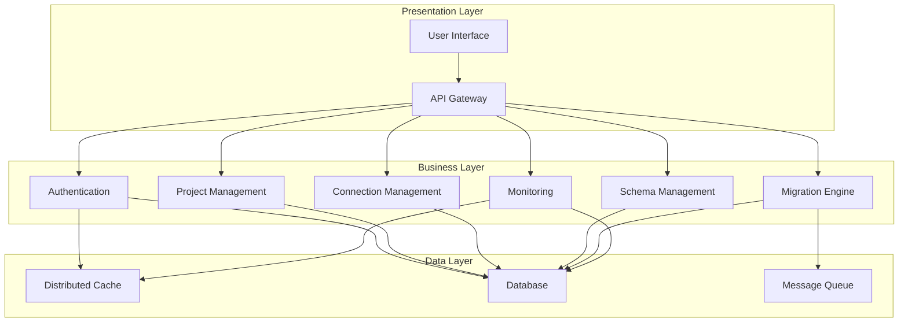
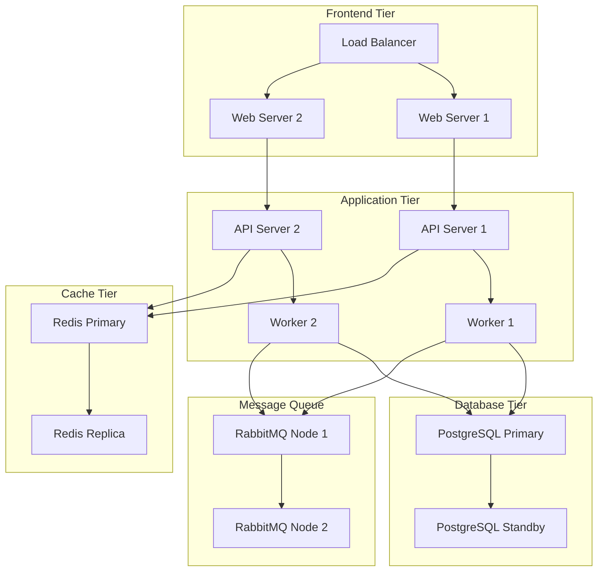
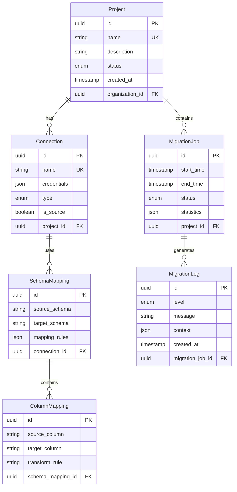
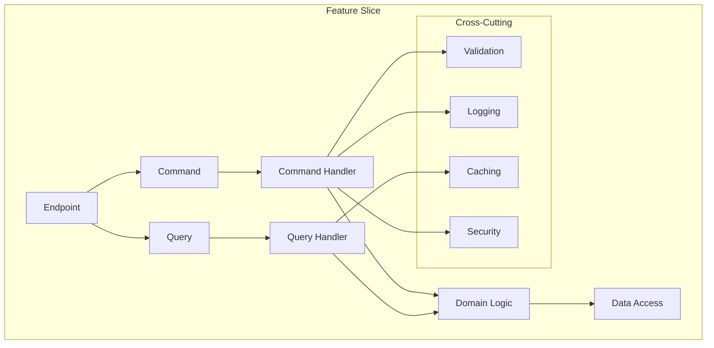
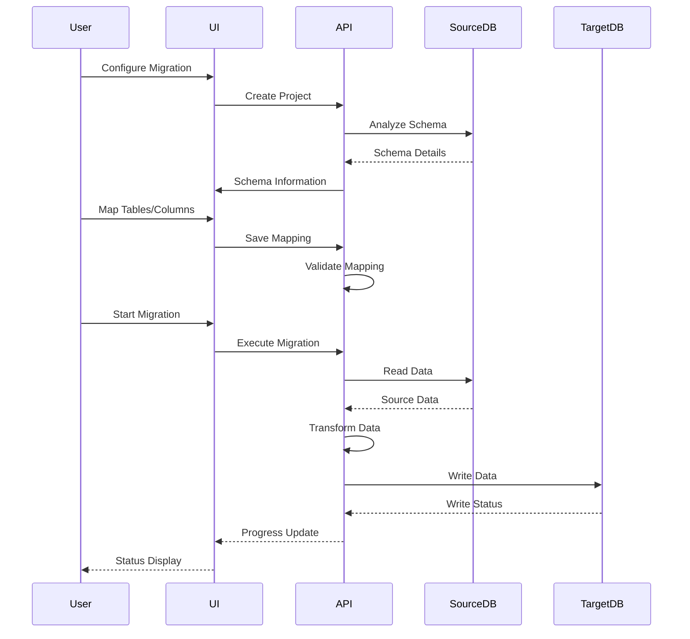
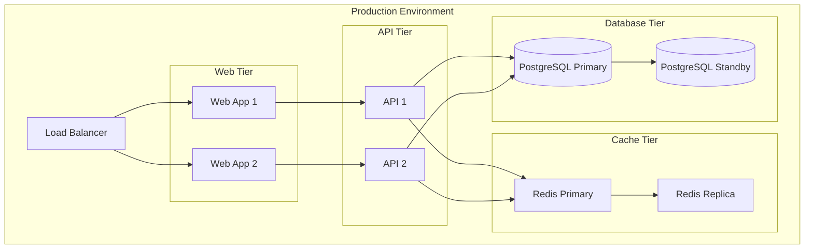
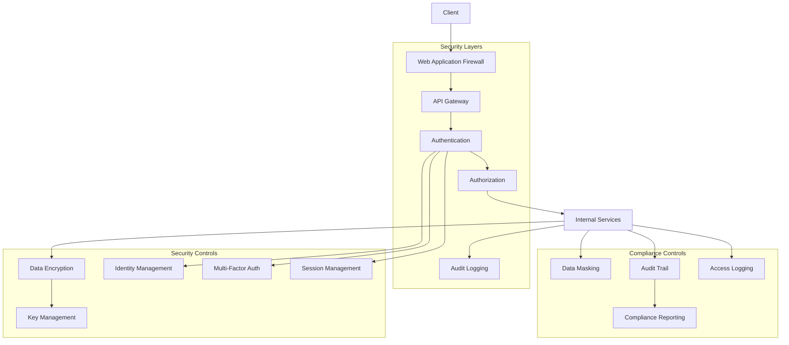

# Data Migration System - Product Requirements Document (PRD)

## Executive Summary
The Data Migration System is an enterprise solution for secure, efficient data transfer between heterogeneous database systems. The system combines AI-powered schema mapping, visual interfaces, and automated validation to reduce migration time by 60% and error rates by 80% compared to manual processes.

### Business Context
- **Market Need**: 
  - 78% of enterprises require monthly data migrations
  - Average migration project costs $250,000
  - 40% of migrations fail due to mapping errors
- **Target Users**: 
  - Database Administrators (65% of users)
  - System Integrators (25% of users)
  - DevOps Teams (10% of users)
- **Business Value**: 
  - 60% reduction in migration time
  - 80% lower error rates
  - $150,000 average cost savings per project
  - 95% successful migration rate

### Key Differentiators
- AI-powered schema mapping with 95% accuracy
- Visual mapping interface reducing setup time by 70%
- Real-time monitoring with predictive failure detection
- Enterprise-grade security with SOC2 and ISO27001 compliance

## Overview
The Data Migration System is an enterprise-grade solution for transferring data between different database systems, with a primary focus on PostgreSQL databases. The system provides both visual (drag-and-drop) and automatic mapping capabilities, along with project state management features.

## System Architecture

### Logical Architecture


### Physical Architecture


### Database Architecture


### Normalization Guidelines
1. **First Normal Form (1NF)**
   - All tables have primary keys
   - No repeating groups
   - Atomic values in columns

2. **Second Normal Form (2NF)**
   - Meets 1NF requirements
   - No partial dependencies
   - All non-key attributes depend on the entire primary key

3. **Third Normal Form (3NF)**
   - Meets 2NF requirements
   - No transitive dependencies
   - All attributes depend directly on the primary key

4. **Data Integrity Rules**
   - Foreign key constraints enforced
   - Unique constraints on business keys
   - Check constraints for enums and status fields
   - Default values for audit fields

### Feature Slice Architecture


### Data Flow Architecture


### Additional Features

1. **Smart Mapping Engine**
   - AI-powered schema matching
   - Historical mapping learning
   - Mapping templates
   - Custom transformation rules library

2. **Data Quality Management**
   - Data profiling
   - Data cleansing rules
   - Quality score metrics
   - Validation rule templates

3. **Migration Optimization**
   - Parallel processing
   - Bulk operations
   - Incremental updates
   - Change data capture

4. **Compliance & Governance**
   - Data masking
   - Audit trails
   - Compliance reporting
   - Data lineage tracking

5. **Enhanced Security**
   - End-to-end encryption
   - Key rotation
   - Access control matrices
   - Security compliance reporting

6. **Data Profiling**
   - Automatic schema discovery and analysis
   - Column property detection
   - Value distribution analysis
   - Data quality scoring

7. **Data Validation Framework**
   ```mermaid
   graph TD
       A[Data Input] --> B[Validation Rules]
       B --> C{Quality Check}
       C -->|Pass| D[Process Data]
       C -->|Fail| E[Error Queue]
       E --> F[Manual Review]
       F --> A
   ```

8. **Quality Metrics**
   - Null value analysis
   - Unique value counts
   - Pattern matching
   - Data type consistency
   - Referential integrity

9. **Machine Learning Integration**
   - Smart Schema Mapping
   - Anomaly Detection
   - Performance Prediction

10. **Multi-Tenancy Support**
   - Tenant Isolation
   - Resource Management
   - Tenant Analytics

11. **Error Recovery & Resilience**
   - Checkpoint Management
   - Recovery Strategies
   - Resilience Patterns

12. **API Management**
   - API Versioning
   - Rate Limiting
   - API Analytics

13. **Disaster Recovery**
   - Backup Management
   - Recovery Testing
   - Business Continuity

### Deployment Architecture


## Vertical Slice Architecture Implementation

### Feature Organization
1. **Project Management Feature**
   - Commands
     - CreateProject
     - UpdateProjectState
     - DeleteProject
   - Queries
     - GetProjectById
     - GetProjectsList
     - GetProjectHistory
   - Models
     - ProjectDto
     - ProjectStateDto
   - Validators
     - CreateProjectValidator
     - UpdateProjectValidator
   - Behaviors
     - LoggingBehavior
     - ValidationBehavior

2. **Database Connection Feature**
   - Commands
     - CreateConnection
     - TestConnection
     - UpdateConnection
   - Queries
     - GetConnectionDetails
     - GetConnectionsList
   - Models
     - ConnectionDto
     - ConnectionTestResultDto
   - Validators
     - ConnectionValidator
   - Behaviors
     - SecurityBehavior
     - RetryBehavior

3. **Schema Management Feature**
   - Commands
     - SyncSchema
     - UpdateSchemaMapping
   - Queries
     - GetSourceSchema
     - GetTargetSchema
     - GetSchemaDifferences
   - Models
     - SchemaDto
     - TableDto
     - ColumnDto
   - Validators
     - SchemaMappingValidator
   - Behaviors
     - CachingBehavior

4. **Data Migration Feature**
   - Commands
     - StartMigration
     - PauseMigration
     - ResumeMigration
     - RollbackMigration
   - Queries
     - GetMigrationStatus
     - GetMigrationLogs
     - GetMigrationStatistics
   - Models
     - MigrationDto
     - MigrationStatusDto
     - MigrationLogDto
   - Validators
     - MigrationValidator
   - Behaviors
     - TransactionBehavior
     - RetryBehavior

### Frontend Implementation (Blazor WebAssembly)

1. **Shared Components**
   - Layout
     - MainLayout
     - NavMenu
     - TopBar
   - Common
     - LoadingIndicator
     - ErrorBoundary
     - Toast Notifications
     - Confirmation Dialog

2. **Feature Components**
   - ProjectManagement
     - ProjectList
     - ProjectCreate
     - ProjectDetails
     - ProjectHistory
   - DatabaseConnection
     - ConnectionManager
     - ConnectionTest
     - ConnectionForm
   - SchemaManagement
     - SchemaViewer
     - SchemaMapper
     - DragDropInterface
   - DataMigration
     - MigrationDashboard
     - MigrationProgress
     - MigrationLogs

3. **State Management**
   - Fluxor for State Management
   - Feature States
     - ProjectState
     - ConnectionState
     - SchemaState
     - MigrationState
   - Actions
   - Reducers
   - Effects

### Technical Stack

1. **Backend Technologies**
   - .NET 8
   - MediatR for CQRS
   - FluentValidation
   - Dapper for Data Access
   - EF Core for Complex Queries
   - Serilog for Logging
   - Polly for Resilience
   - AutoMapper
   - HealthChecks

2. **Frontend Technologies**
   - Blazor WebAssembly
   - MudBlazor Component Library
   - Fluxor for State Management
   - Blazored.LocalStorage
   - Microsoft.AspNetCore.Components.WebAssembly.Authentication
   - System.Net.Http.Json

3. **Cross-Cutting Concerns**
   - Authentication (JWT + OAuth2)
   - Authorization (Policy-based)
   - Caching (Memory + Distributed)
   - Logging (Structured)
   - Error Handling
   - Performance Monitoring

### Project Structure
```
src/
├── DataMigrationSystem.Web/               # Blazor WebAssembly Project
│   ├── Features/                          # Feature-based Components
│   ├── Shared/                            # Shared Components
│   ├── Services/                          # Frontend Services
│   └── Store/                             # State Management
├── DataMigrationSystem.Api/               # API Project
│   ├── Features/                          # Vertical Slices
│   │   ├── Projects/                      # Project Management Feature
│   │   ├── Connections/                   # Database Connection Feature
│   │   ├── Schemas/                       # Schema Management Feature
│   │   └── Migrations/                    # Data Migration Feature
│   ├── Infrastructure/                    # Cross-cutting Infrastructure
│   └── Common/                            # Shared Code
└── DataMigrationSystem.Shared/            # Shared DTOs and Contracts
```

## Core Features

### 1. Project Management
- Project creation with unique names (e.g., "ecommerce-migration")
- Project state management:
  - Draft
  - In Progress
  - Completed
  - Failed
- Project metadata storage
- Project versioning and history

### 2. Database Connection Management
- Source database connection configuration
- Target database connection configuration
- Connection testing and validation
- Secure credential storage
- Support for multiple database types (future expansion)

### 3. Schema Management
#### Source Schema
- Automatic schema discovery
- Table structure analysis
- Column properties detection
- Primary/Foreign key relationship mapping
- Index identification

#### Target Schema
- Schema validation
- Compatibility checking
- Constraint verification
- Auto-creation of missing structures (optional)

### 4. Mapping Capabilities

#### Visual Mapping (Drag and Drop)
- Interactive table mapping interface
- Column-level mapping
- Custom transformation rules
- Validation rules configuration
- Real-time mapping preview

#### Auto Mapping
- Intelligent table name matching
- Column name similarity detection
- Data type compatibility checking
- Relationship preservation
- Mapping suggestions based on:
  - Name similarity
  - Data type compatibility
  - Column position
  - Common patterns

### 5. Data Transformation
- Data type conversions
- Value transformations
- Custom mapping functions
- Null handling
- Default value management

### 6. Validation & Testing
- Pre-migration validation
- Sample data preview
- Error detection
- Constraint checking
- Performance estimation

### 7. Migration Execution
- Batch processing
- Transaction management
- Error handling
- Rollback capabilities
- Progress tracking
- Performance optimization

### 8. Monitoring & Logging
- Real-time progress monitoring
- Detailed logging
- Error reporting
- Performance metrics
- Audit trail

## Technical Requirements

### API Design
- RESTful API endpoints
- Swagger/OpenAPI documentation
- Versioned API
- Rate limiting
- Authentication/Authorization
- API versioning through URL path (/api/v1/)
- GraphQL endpoint for complex schema queries (optional)
- API rate limiting and throttling
- Comprehensive error responses with proper HTTP status codes
- API documentation with examples
- Health check endpoints
- Bulk operations support
- ETags for resource caching

### Clean Architecture Layers
1. **Domain Layer**
   - Entities
   - Value Objects
   - Domain Events
   - Interfaces

2. **Application Layer**
   - Commands
   - Queries
   - DTOs
   - Interfaces
   - Validation

3. **Infrastructure Layer**
   - Database Context
   - Repositories
   - External Services
   - Logging
   - Authentication

4. **Presentation Layer**
   - API Controllers
   - Middleware
   - API Models
   - Documentation

### CQRS Implementation
- Separate Command and Query models
- Command handlers
- Query handlers
- Event sourcing (optional)
- Message bus integration

### Integration Services
- Database connectors
- Authentication services
- Logging services
- Monitoring services
- Message queue services

### Security Requirements
- JWT authentication
- Role-based access control
- Data encryption
- Secure credential storage
- Audit logging
- OAuth2.0/OpenID Connect support
- API key management
- Rate limiting per user/API key
- SQL injection prevention
- XSS protection
- CORS policy configuration
- Security headers implementation
- Data masking for sensitive information
- Regular security audits
- Vulnerability scanning

### Performance Requirements
- Support for large datasets
- Batch processing
- Caching strategies
- Async operations
- Resource optimization

### Modern Architecture Patterns
- Vertical Slice Architecture for feature organization
- Mediator pattern using MediatR
- Repository pattern with Unit of Work
- Specification pattern for complex queries
- Domain-Driven Design (DDD) principles
- Event-driven architecture for system notifications
- Circuit breaker pattern for external services
- Retry policies for resilience
- Outbox pattern for reliable message publishing

### DevOps & Infrastructure
- Docker containerization
- Kubernetes orchestration support
- CI/CD pipeline configuration
- Infrastructure as Code (IaC)
- Blue-Green deployment strategy
- Database migration scripts
- Automated testing in pipeline
- Environment-specific configurations
- Monitoring and alerting setup
- APM (Application Performance Monitoring) integration

### Observability
- Distributed tracing (e.g., OpenTelemetry)
- Metrics collection
- Structured logging
- Error tracking
- Performance profiling
- Real-time dashboards
- System health monitoring
- Resource usage tracking
- User activity analytics

### Testing Strategy
- Unit testing (minimum 80% coverage)
- Integration testing
- End-to-end testing
- Performance testing
- Load testing
- Security testing
- Chaos testing
- Contract testing
- User acceptance testing
- Automated regression testing

### Code Quality & Standards
- Code style guidelines
- Static code analysis
- Code complexity metrics
- Code review process
- Documentation standards
- Git branching strategy
- Commit message conventions
- Version control best practices
- Pair programming guidelines

### Error Handling & Resilience
- Global exception handling
- Detailed error logging
- Retry mechanisms
- Circuit breakers
- Fallback strategies
- Graceful degradation
- Timeout policies
- Dead letter queues
- Error notification system

## Security & Compliance

### Security Architecture


### Compliance Requirements

1. **Data Protection Standards**
   - GDPR Compliance
     - Data minimization
     - Right to be forgotten
     - Data portability
     - Privacy by design
     - Data protection impact assessment
   
   - SOC 2 Type II
     - Security controls
     - Availability measures
     - Processing integrity
     - Confidentiality
     - Privacy protection
   
   - ISO 27001
     - Information security policies
     - Asset management
     - Access control
     - Cryptography
     - Operations security

2. **Industry-Specific Requirements**
   - HIPAA (Healthcare)
     - PHI protection
     - Access controls
     - Audit trails
     - Encryption requirements
   
   - PCI DSS (Payment)
     - Secure network
     - Data protection
     - Access control
     - Security testing
   
   - CCPA (California Privacy)
     - Data disclosure
     - Opt-out rights
     - Data deletion
     - Privacy notices

### Encryption Specifications

1. **Data at Rest**
   - Database Encryption
     - AES-256 encryption
     - Transparent Data Encryption (TDE)
     - Encrypted backups
     - Key rotation every 90 days
   
   - File System Encryption
     - Volume-level encryption
     - File-level encryption
     - Secure key storage
     - Regular key rotation

2. **Data in Transit**
   - TLS 1.3 for all communications
   - Perfect Forward Secrecy (PFS)
   - Strong cipher suites
   - Certificate management
   - Regular security assessments

3. **Key Management**
   - Hardware Security Modules (HSM)
   - Key hierarchy
     - Master Key
     - Data Encryption Keys
     - Key Encryption Keys
   - Key rotation policies
   - Backup and recovery procedures

### Access Control Matrix

| Role                | Project | Connection | Schema | Migration | Analytics | Admin |
|---------------------|---------|------------|--------|-----------|-----------|--------|
| System Admin        | Full    | Full       | Full   | Full      | Full      | Full   |
| Org Admin          | Full    | Full       | Full   | Full      | Full      | Read   |
| Project Manager     | Full    | Full       | Full   | Full      | Read      | None   |
| Data Engineer       | Read    | Full       | Full   | Full      | Read      | None   |
| Developer          | Read    | Read       | Read   | None      | Read      | None   |
| Viewer             | Read    | Read       | Read   | None      | Read      | None   |

### Security Controls

1. **Authentication**
   - Multi-factor authentication (MFA)
     - Time-based OTP
     - Hardware security keys
     - Biometric authentication
   - Password policies
     - Minimum 12 characters
     - Complexity requirements
     - History of 10 passwords
     - Maximum age 90 days
   - Session management
     - 15-minute idle timeout
     - 8-hour maximum session
     - Concurrent session limits
     - Secure session storage

2. **Authorization**
   - Role-based access control (RBAC)
   - Attribute-based access control (ABAC)
   - Just-in-time access
   - Privilege escalation workflow
   - Regular access reviews

3. **Audit & Monitoring**
   - Security event logging
     - Authentication attempts
     - Authorization decisions
     - Data access patterns
     - System changes
   - Real-time alerting
     - Security violations
     - Unusual activity
     - System errors
     - Performance issues
   - Compliance reporting
     - Access reports
     - Activity summaries
     - Compliance status
     - Risk assessments

### Security Testing Requirements

1. **Automated Testing**
   - SAST (Static Analysis)
   - DAST (Dynamic Analysis)
   - Dependency scanning
   - Container scanning
   - Infrastructure scanning

2. **Manual Testing**
   - Penetration testing
   - Vulnerability assessment
   - Code review
   - Architecture review
   - Configuration review

3. **Continuous Monitoring**
   - Security monitoring
   - Performance monitoring
   - Availability monitoring
   - Compliance monitoring
   - Threat monitoring

## Feature Implementation Plan

### MVP Features (Phase 1 - 8 weeks)
1. **Authentication & Authorization** (P0)
   - Basic user authentication
   - Role-based access control
   - API key management
   - Integration Tests:
     - User registration flow
     - Login with MFA
     - Role permission validation
     - API key authentication

2. **Project Management** (P0)
   - Project CRUD operations
   - Basic metadata management
   - User assignment
   - Integration Tests:
     - Project lifecycle
     - User assignment flow
     - Permission inheritance
     - Concurrent access

3. **Database Connections** (P0)
   - PostgreSQL connection support
   - Credential management
   - Connection testing
   - Integration Tests:
     - Connection creation
     - Credential encryption
     - Connection pooling
     - Failover handling

4. **Schema Management** (P0)
   - Schema discovery
   - Basic mapping interface
   - Data type validation
   - Integration Tests:
     - Schema sync
     - Mapping validation
     - Type conversion
     - Constraint verification

### Phase 2 Features (12 weeks)
1. **Advanced Mapping** (P1)
   - Visual mapping interface
   - Transformation rules
   - Template management
   - Integration Tests:
     - Complex mappings
     - Rule validation
     - Template application
     - Performance testing

2. **Migration Execution** (P1)
   - Batch processing
   - Error handling
   - Progress tracking
   - Integration Tests:
     - Large dataset migration
     - Error recovery
     - Progress reporting
     - Resource utilization

3. **Monitoring & Analytics** (P1)
   - Real-time monitoring
   - Performance metrics
   - Error analytics
   - Integration Tests:
     - Metric collection
     - Alert triggering
     - Report generation
     - Dashboard updates

### Future Features (Phase 3+)
1. **AI-Powered Features** (P2)
   - Smart schema mapping
   - Anomaly detection
   - Performance optimization
   - Integration Tests:
     - ML model accuracy
     - Prediction validation
     - Resource optimization
     - Learning feedback

2. **Advanced Security** (P2)
   - Data masking
   - Audit logging
   - Compliance reporting
   - Integration Tests:
     - Masking rules
     - Audit trail
     - Compliance checks
     - Security scanning

3. **Enterprise Features** (P2)
   - Multi-tenant support
   - Custom branding
   - Advanced analytics
   - Integration Tests:
     - Tenant isolation
     - Resource quotas
     - White-labeling
     - Analytics accuracy

### Integration Test Scenarios
1. **End-to-End Migration Flow**
   ```mermaid
   sequenceDiagram
       participant User
       participant Auth
       participant Project
       participant Connection
       participant Schema
       participant Migration
       
       User->>Auth: Login
       Auth-->>User: Token
       User->>Project: Create Project
       Project-->>User: Project ID
       User->>Connection: Configure Source
       Connection-->>User: Source Ready
       User->>Connection: Configure Target
       Connection-->>User: Target Ready
       User->>Schema: Discover Schema
       Schema-->>User: Schema Map
       User->>Migration: Execute
       Migration-->>User: Complete
   ```

2. **Error Recovery Flow**
   ```mermaid
   sequenceDiagram
       participant Migration
       participant Monitor
       participant ErrorHandler
       participant Notification
       
       Migration->>Monitor: Start Migration
       Monitor->>ErrorHandler: Detect Error
       ErrorHandler->>Migration: Pause
       ErrorHandler->>Notification: Alert
       Migration->>ErrorHandler: Retry Strategy
       ErrorHandler->>Migration: Resume
       Migration->>Monitor: Complete
   ```

3. **Performance Test Flow**
   ```mermaid
   sequenceDiagram
       participant Test
       participant System
       participant Metrics
       participant Analysis
       
       Test->>System: Initialize Load
       System->>Metrics: Collect Data
       Metrics->>Analysis: Process
       Analysis->>Test: Results
       Test->>System: Adjust Load
       System->>Metrics: Collect Data
       Metrics->>Analysis: Process
       Analysis->>Test: Final Report
   ```