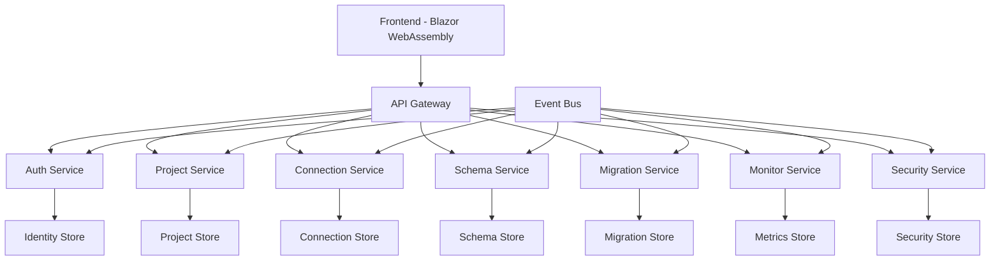

# Data Migration System

## Overview
The Data Migration System is a comprehensive solution for managing and executing data migrations between different database systems. It provides a secure, efficient, and user-friendly platform for planning, executing, and monitoring data migrations while ensuring data integrity and compliance.

## System Architecture

### High-Level Architecture


### Core Features
1. **Authentication & User Management**
   - Secure user authentication and authorization
   - Role-based access control
   - Multi-factor authentication
   - API key management

2. **Project Management**
   - Project lifecycle management
   - Team collaboration
   - Resource allocation
   - Progress tracking

3. **Database Connection Management**
   - Secure connection handling
   - Connection pooling
   - Connection testing
   - Credential management

4. **Schema Management**
   - Schema analysis
   - Schema mapping
   - Data type compatibility
   - Constraint management

5. **Data Migration Execution**
   - Migration planning
   - Execution control
   - Error handling
   - Progress monitoring

6. **Monitoring & Analytics**
   - Real-time monitoring
   - Performance metrics
   - Resource utilization
   - Custom dashboards

7. **Security & Compliance**
   - Security policies
   - Compliance checks
   - Audit logging
   - Vulnerability management

## Documentation

### Request for Comments (RFCs)
1. [RFC 000: Authentication & User Management](RFCs/000-authentication.md)
   - Core authentication system
   - User management
   - Access control
   - Security features

2. [RFC 001: Project Management](RFCs/001-project-management.md)
   - Project lifecycle
   - Team management
   - Resource tracking
   - Progress monitoring

3. [RFC 002: Database Connection Management](RFCs/002-database-connection.md)
   - Connection handling
   - Connection security
   - Pool management
   - Performance optimization

4. [RFC 003: Schema Management](RFCs/003-schema-management.md)
   - Schema analysis
   - Mapping engine
   - Validation system
   - Type compatibility

5. [RFC 004: Data Migration Execution](RFCs/004-data-migration.md)
   - Migration engine
   - Execution control
   - Error handling
   - Progress tracking

6. [RFC 005: Monitoring & Analytics](RFCs/005-monitoring.md)
   - Metrics collection
   - Performance analysis
   - Resource monitoring
   - Custom reporting

7. [RFC 006: Security & Compliance](RFCs/006-security.md)
   - Security policies
   - Compliance checks
   - Audit system
   - Risk management

### Additional Documentation
- [Features](Features.md) - Detailed feature documentation
- [Rules](Rules.md) - Development rules and guidelines
- [PRD](PRD.md) - Product Requirements Document

## Technology Stack
- **Frontend**: Blazor WebAssembly
- **Backend**: .NET 8 Web API
- **Database**: PostgreSQL
- **Cache**: Redis
- **Message Bus**: RabbitMQ
- **Monitoring**: Prometheus & Grafana
- **Logging**: Elasticsearch & Kibana
- **Security**: Identity Server & OAuth 2.0

## Getting Started

### Prerequisites
1. .NET 8 SDK
2. Docker & Docker Compose
3. Node.js & npm
4. Git

### Installation
1. Clone the repository:
   ```bash
   git clone https://github.com/yourusername/data-migration-system.git
   ```

2. Navigate to the project directory:
   ```bash
   cd data-migration-system
   ```

3. Install dependencies:
   ```bash
   dotnet restore
   ```

4. Start the development environment:
   ```bash
   docker-compose up -d
   ```

5. Run the application:
   ```bash
   dotnet run --project src/DataMigration.Web
   ```

### Development
1. Follow the [Rules](Rules.md) document for development guidelines
2. Use the provided `.cursorrules` for consistent formatting
3. Run tests before committing:
   ```bash
   dotnet test
   ```

## Contributing
1. Fork the repository
2. Create a feature branch
3. Commit your changes
4. Push to the branch
5. Create a Pull Request

## License
This project is licensed under the MIT License - see the [LICENSE](LICENSE) file for details.

## Support
For support, please open an issue in the GitHub repository or contact the development team.

## Roadmap
See the [PRD](PRD.md) document for planned features and improvements. 