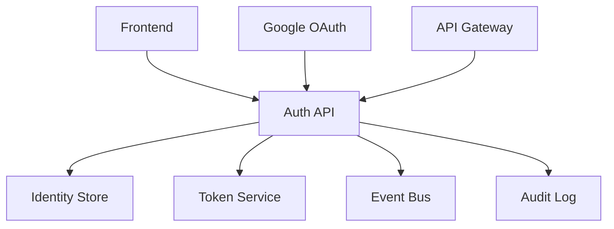
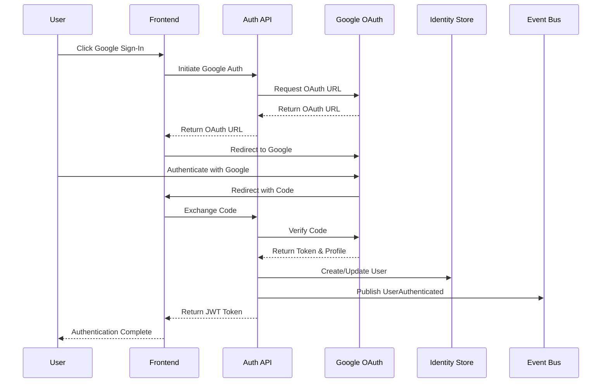
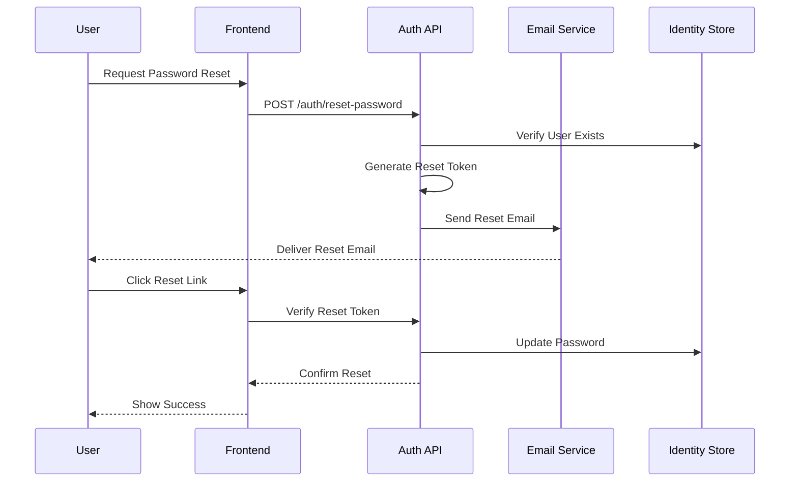

# RFC 000: Authentication & User Management

## Status Information
- **Status**: Draft
- **Type**: Feature
- **Start Date**: 2024-01-20
- **Author**: System
- **Priority**: P0 (Highest)
- **Dependencies**: None (Foundational Component)

## 1. Overview
### 1.1 Summary
A foundational authentication and user management system that provides secure access control and user management capabilities across all features of the Data Migration System, including social authentication through Google.

### 1.2 Goals
1. Implement secure user authentication and authorization
2. Support Google Sign-In integration
3. Manage user roles and permissions effectively
4. Support multi-factor authentication
5. Enable API key management
6. Maintain comprehensive audit logs
7. Ensure compliance with security standards

### 1.3 Success Metrics
1. Authentication response time < 500ms
2. Zero security breaches
3. 99.99% system availability
4. < 0.1% failed login attempts
5. 100% audit log coverage
6. < 2s Google Sign-In flow completion

## 2. Requirements

### 2.1 Functional Requirements
1. User Management
   - User registration with email verification
   - Google Sign-In integration
   - Password management with secure reset flow
   - Profile management
   - Role and permission assignment

2. Authentication
   - Email/password authentication
   - Google OAuth2 authentication
   - Multi-factor authentication
   - Remember me functionality
   - Session management
   - Token-based authentication

3. Authorization
   - Role-based access control
   - Permission-based access control
   - Resource-level permissions
   - API key management

4. Audit & Security
   - Comprehensive audit logging
   - Failed login attempt tracking
   - Session monitoring
   - Security event logging

### 2.2 Non-Functional Requirements
1. Performance
   - Authentication response time < 500ms
   - Support for 10,000 concurrent users
   - Token validation < 100ms
   - Google Sign-In response < 2s

2. Security
   - Password hashing using Argon2id
   - TLS 1.3 for all communications
   - JWT with proper signing
   - Secure token storage
   - OAuth2 state validation
   - PKCE for OAuth flows

3. Scalability
   - Horizontal scaling capability
   - Load balancing support
   - Cache support for token validation

4. Availability
   - 99.99% uptime
   - Failover capability
   - Disaster recovery plan

## 3. Technical Design

### 3.1 System Components


### 3.2 Authentication Flows

#### Google Sign-In Flow


#### Password Reset Flow


### 3.3 Data Models
```csharp
public class User
{
    public Guid Id { get; private set; }
    public string Email { get; private set; }
    public string? HashedPassword { get; private set; }
    public string? GoogleId { get; private set; }
    public bool IsEmailVerified { get; private set; }
    public bool IsMfaEnabled { get; private set; }
    public DateTime CreatedAt { get; private set; }
    public DateTime? LastLoginAt { get; private set; }
    public AuthProvider AuthProvider { get; private set; }
    public List<UserRole> Roles { get; private set; }
    public List<ApiKey> ApiKeys { get; private set; }
}

public enum AuthProvider
{
    Local,
    Google
}
```

### 3.4 API Endpoints
1. Authentication
   ```http
   POST /api/auth/register
   POST /api/auth/login
   POST /api/auth/google/login
   POST /api/auth/google/callback
   POST /api/auth/refresh
   POST /api/auth/logout
   ```

2. User Management
   ```http
   GET /api/users/{id}
   PUT /api/users/{id}
   GET /api/users/{id}/roles
   PUT /api/users/{id}/roles
   ```

3. API Keys
   ```http
   POST /api/apikeys
   GET /api/apikeys
   DELETE /api/apikeys/{id}
   ```

## 4. Implementation Plan

### 4.1 Phase 1: Core Authentication (Week 1)
1. Setup project structure
2. Implement user registration
3. Implement login/logout
4. Add password hashing
5. Create token service
6. Implement Google Sign-In

### 4.2 Phase 2: Enhanced Security (Week 2)
1. Add multi-factor authentication
2. Implement password reset
3. Add account lockout
4. Setup audit logging
5. Add API key support
6. Add OAuth state management

### 4.3 Phase 3: User Management (Week 3)
1. Add role management
2. Implement permissions
3. Add user profiles
4. Create admin interface
5. Add user search
6. Add social profile linking

### 4.4 Phase 4: Integration & Testing (Week 4)
1. Integration testing
2. Performance testing
3. Security testing
4. Documentation
5. Deployment preparation
6. OAuth flow testing

## 5. Testing Strategy

### 5.1 Unit Testing
1. Authentication flows
2. Password hashing
3. Token generation
4. Permission checks
5. Data validation
6. OAuth state validation

### 5.2 Integration Testing
1. End-to-end authentication
2. Google Sign-In flow
3. Role-based access
4. API key authentication
5. Event publishing
6. Audit logging

### 5.3 Security Testing
1. OAuth2 flow security
2. State parameter validation
3. Token security
4. CSRF protection
5. XSS prevention
6. Redirect validation

## 6. Monitoring & Maintenance

### 6.1 Metrics
1. Authentication success/failure rates
2. Google Sign-In success rates
3. API response times
4. Token usage patterns
5. Resource utilization
6. Security incidents

### 6.2 Alerts
1. Failed login attempts
2. OAuth failures
3. Security violations
4. Performance degradation
5. System errors
6. Token validation failures

## 7. Documentation Requirements
1. API documentation
2. Security guidelines
3. Integration guides
4. OAuth setup guide
5. Troubleshooting guides
6. User guides

## 8. Open Questions
1. Token refresh strategy?
2. Session management approach?
3. Audit log retention policy?
4. MFA implementation details?
5. Rate limiting strategy?
6. Social account linking policy?

## 9. Privacy & Compliance

### 9.1 Data Protection
1. Personal Data Handling
   - Email addresses
   - Google profile information
   - Authentication history
   - Session data

2. Data Retention
   - Active user data: Indefinite
   - Inactive user data: 12 months
   - Auth logs: 6 months
   - Failed attempts: 3 months

3. GDPR Compliance
   - Right to be forgotten
   - Data export capability
   - Consent management
   - Privacy policy integration

### 9.2 Rate Limiting
1. Authentication Endpoints
   - Login: 5 attempts per minute
   - Password reset: 3 attempts per hour
   - Google Sign-In: 10 attempts per minute
   - API key creation: 10 per day

2. User Management Endpoints
   - User creation: 10 per hour
   - Profile updates: 30 per hour
   - Role changes: 20 per hour

### 9.3 Error Handling
1. Authentication Errors
   ```json
   {
     "error": "auth_failed",
     "message": "Authentication failed",
     "details": {
       "reason": "invalid_credentials",
       "attempts_remaining": 2
     }
   }
   ```

2. Google Sign-In Errors
   ```json
   {
     "error": "google_auth_failed",
     "message": "Google authentication failed",
     "details": {
       "reason": "invalid_state",
       "correlation_id": "abc123"
     }
   }
   ```

3. Rate Limit Errors
   ```json
   {
     "error": "rate_limit_exceeded",
     "message": "Too many attempts",
     "details": {
       "retry_after": 300,
       "limit": 5,
       "window": "1m"
     }
   }
   ``` 