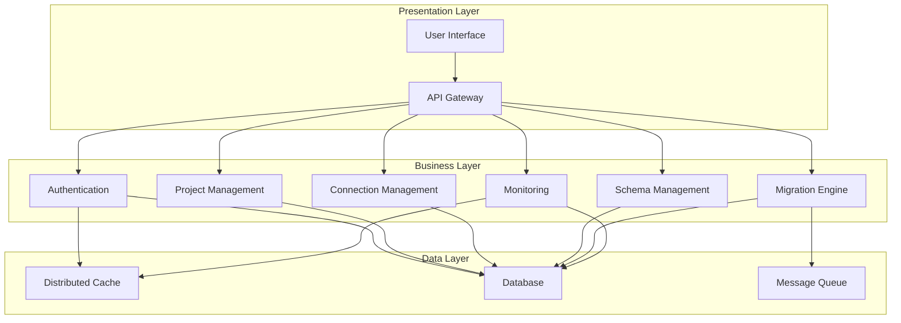
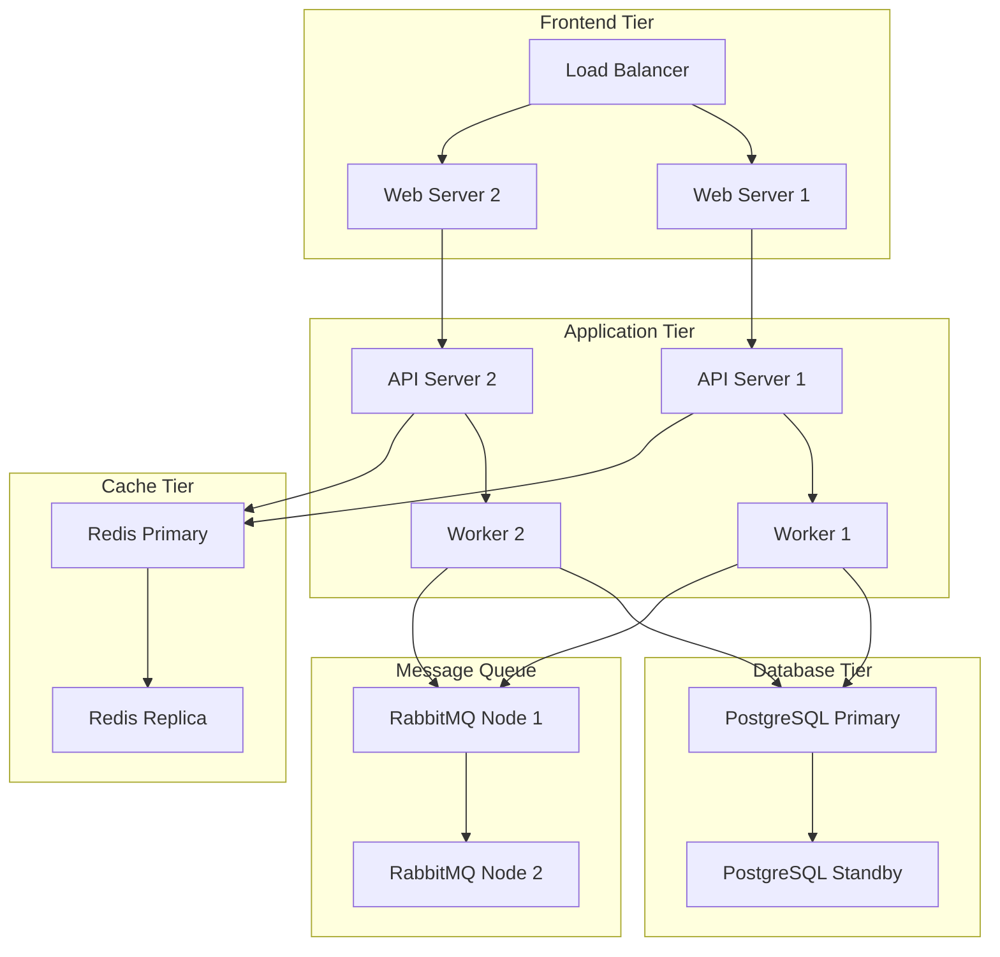
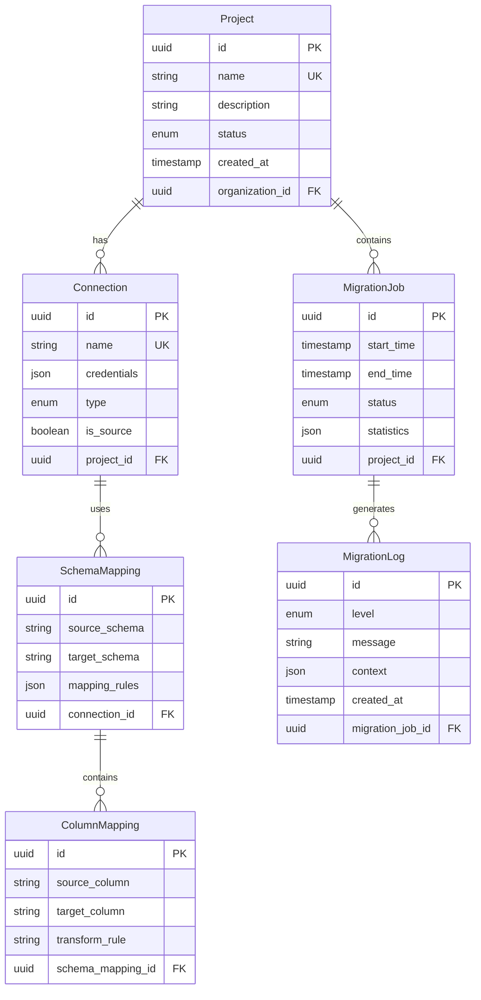
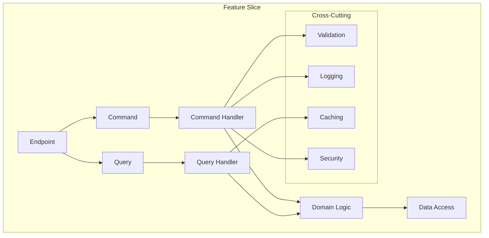

# RFC 001: Solution Template & Core Architecture

## Status Information
- **Status**: Draft
- **Type**: Architecture
- **Start Date**: 2024-01-20
- **Author**: System
- **Priority**: P0 (Highest)
- **Dependencies**: RFC-000 (Authentication & User Management)

## 1. Overview

### 1.1 Summary
This RFC defines the solution structure, core components, and architectural patterns for the Data Migration System. It establishes the foundation for all feature implementations while ensuring maintainability, testability, and scalability.

### 1.2 Goals
1. Define a clean, modular solution structure
2. Establish core architectural patterns and practices
3. Implement cross-cutting concerns
4. Set up development workflows and standards
5. Enable feature isolation and parallel development
6. Ensure consistent error handling and validation
7. Facilitate testing at all levels

## 2. Solution Structure

System Overview

The system focuses on transferring data between various databases, including PostgreSQL, with advanced features for schema mapping, data transformation, and real-time monitoring.

### Logical Architecture


### Physical Architecture


### Database Architecture


### Feature Slice Architecture


### 2.1 Projects Organization
```
src/
├── Core/
│   ├── DataMigration.Domain/
│   ├── DataMigration.Application/
│   └── DataMigration.Infrastructure/
├── Features/
│   ├── DataMigration.Auth/
│   ├── DataMigration.Projects/
│   ├── DataMigration.Connections/
│   └── DataMigration.Migrations/
├── Shared/
│   ├── DataMigration.Common/
│   └── DataMigration.Testing/
├── Presentation/
│   ├── DataMigration.Api/
│   └── DataMigration.Admin/
└── Tests/
    ├── DataMigration.UnitTests/
    ├── DataMigration.IntegrationTests/
    └── DataMigration.E2ETests/
```

### 2.2 Project Responsibilities

#### Core Layer
```csharp
// DataMigration.Domain
public abstract class Entity
{
    public Guid Id { get; protected set; }
    public DateTime CreatedAt { get; protected set; }
    public DateTime? UpdatedAt { get; protected set; }
    private readonly List<IDomainEvent> _domainEvents = new();
    
    protected Entity()
    {
        Id = Guid.NewGuid();
        CreatedAt = DateTime.UtcNow;
    }
}

public abstract class AggregateRoot : Entity
{
    private readonly List<IDomainEvent> _domainEvents = new();
    
    protected void AddDomainEvent(IDomainEvent domainEvent)
    {
        _domainEvents.Add(domainEvent);
    }
    
    public IReadOnlyList<IDomainEvent> GetDomainEvents() => _domainEvents.AsReadOnly();
    
    public void ClearDomainEvents() => _domainEvents.Clear();
}

// DataMigration.Application
public interface ICommandHandler<TCommand, TResponse>
    where TCommand : ICommand<TResponse>
{
    Task<ErrorOr<TResponse>> Handle(TCommand command, CancellationToken cancellationToken);
}

public interface IQueryHandler<TQuery, TResponse>
    where TQuery : IQuery<TResponse>
{
    Task<ErrorOr<TResponse>> Handle(TQuery query, CancellationToken cancellationToken);
}

// DataMigration.Infrastructure
public abstract class Repository<T> where T : AggregateRoot
{
    protected readonly DbContext _context;
    
    public async Task<ErrorOr<T>> GetByIdAsync(Guid id)
    {
        var entity = await _context.Set<T>().FindAsync(id);
        if (entity == null)
            return Error.NotFound($"{typeof(T).Name} with ID {id} not found");
        return entity;
    }
    
    public async Task<ErrorOr<Unit>> AddAsync(T entity)
    {
        await _context.Set<T>().AddAsync(entity);
        try
        {
            await _context.SaveChangesAsync();
            return Unit.Value;
        }
        catch (Exception ex)
        {
            return Error.Failure($"Failed to add {typeof(T).Name}: {ex.Message}");
        }
    }
}
```

#### Feature Modules
```csharp
// DataMigration.Auth - Example Feature Module
public class AuthModule : IFeatureModule
{
    public IServiceCollection RegisterModule(IServiceCollection services)
    {
        services.AddScoped<IAuthenticationService, AuthenticationService>();
        services.AddScoped<IAuthorizationService, AuthorizationService>();
        // ... other registrations
        return services;
    }
}

// DataMigration.Projects - Example Feature Module
public class ProjectsModule : IFeatureModule
{
    public IServiceCollection RegisterModule(IServiceCollection services)
    {
        services.AddScoped<IProjectRepository, ProjectRepository>();
        services.AddScoped<IProjectService, ProjectService>();
        // ... other registrations
        return services;
    }
}
```

#### Shared Components
```csharp
// DataMigration.Common
public static class Results
{
    public static ErrorOr<T> Success<T>(T value) => value;
    
    public static ErrorOr<T> NotFound<T>(string message) 
        => Error.NotFound(message);
    
    public static ErrorOr<T> ValidationError<T>(string message) 
        => Error.Validation(message);
    
    public static ErrorOr<T> Unauthorized<T>(string message) 
        => Error.Unauthorized(message);
}

public class ValidationBehavior<TRequest, TResponse> 
    : IPipelineBehavior<TRequest, ErrorOr<TResponse>>
    where TRequest : IRequest<ErrorOr<TResponse>>
{
    private readonly IValidator<TRequest>? _validator;

    public async Task<ErrorOr<TResponse>> Handle(
        TRequest request,
        RequestHandlerDelegate<ErrorOr<TResponse>> next,
        CancellationToken cancellationToken)
    {
        if (_validator == null)
            return await next();

        var validationResult = await _validator.ValidateAsync(request, cancellationToken);
        if (!validationResult.IsValid)
        {
            return Error.Validation(
                string.Join(", ", validationResult.Errors.Select(e => e.ErrorMessage)));
        }

        return await next();
    }
}
```

#### API Layer
```csharp
// DataMigration.Api
public abstract class ApiController : ControllerBase
{
    protected IActionResult Problem(List<Error> errors)
    {
        if (errors.Count == 0)
            return Problem();

        if (errors.All(e => e.Type == ErrorType.Validation))
            return ValidationProblem(errors);

        var firstError = errors[0];
        return Problem(firstError);
    }

    private IActionResult Problem(Error error)
    {
        var statusCode = error.Type switch
        {
            ErrorType.NotFound => StatusCodes.Status404NotFound,
            ErrorType.Validation => StatusCodes.Status400BadRequest,
            ErrorType.Unauthorized => StatusCodes.Status401Unauthorized,
            ErrorType.Forbidden => StatusCodes.Status403Forbidden,
            _ => StatusCodes.Status500InternalServerError
        };

        return Problem(
            title: error.Description,
            statusCode: statusCode);
    }
}

[ApiController]
[Route("api/[controller]")]
public class ProjectsController : ApiController
{
    private readonly IMediator _mediator;

    [HttpPost]
    public async Task<IActionResult> Create(CreateProjectCommand command)
    {
        var result = await _mediator.Send(command);
        return result.Match(
            project => Ok(project),
            errors => Problem(errors));
    }
}
```

### 2.3 Core Infrastructure Components

#### Database Context
```csharp
public class DataMigrationDbContext : DbContext
{
    private readonly ICurrentUser _currentUser;
    private readonly IDateTime _dateTime;
    
    public DataMigrationDbContext(
        DbContextOptions options,
        ICurrentUser currentUser,
        IDateTime dateTime) : base(options)
    {
        _currentUser = currentUser;
        _dateTime = dateTime;
    }
    
    public override async Task<int> SaveChangesAsync(CancellationToken cancellationToken = default)
    {
        foreach (var entry in ChangeTracker.Entries<Entity>())
        {
            switch (entry.State)
            {
                case EntityState.Added:
                    entry.Entity.CreatedAt = _dateTime.UtcNow;
                    entry.Entity.CreatedBy = _currentUser.Id;
                    break;
                case EntityState.Modified:
                    entry.Entity.UpdatedAt = _dateTime.UtcNow;
                    entry.Entity.UpdatedBy = _currentUser.Id;
                    break;
            }
        }
        
        var result = await base.SaveChangesAsync(cancellationToken);
        
        // Dispatch domain events after save
        var events = ChangeTracker.Entries<AggregateRoot>()
            .Select(x => x.Entity)
            .SelectMany(x => x.GetDomainEvents())
            .ToList();
            
        foreach (var @event in events)
        {
            await _mediator.Publish(@event, cancellationToken);
        }
        
        return result;
    }
    
    protected override void OnModelCreating(ModelBuilder modelBuilder)
    {
        modelBuilder.ApplyConfigurationsFromAssembly(Assembly.GetExecutingAssembly());
        base.OnModelCreating(modelBuilder);
    }
}
```

#### Unit of Work
```csharp
public interface IUnitOfWork
{
    Task<ErrorOr<Unit>> SaveChangesAsync(CancellationToken cancellationToken = default);
    Task BeginTransactionAsync();
    Task CommitTransactionAsync();
    Task RollbackTransactionAsync();
}

public class UnitOfWork : IUnitOfWork
{
    private readonly DataMigrationDbContext _context;
    private IDbContextTransaction? _transaction;
    
    public async Task<ErrorOr<Unit>> SaveChangesAsync(CancellationToken cancellationToken = default)
    {
        try
        {
            await _context.SaveChangesAsync(cancellationToken);
            return Unit.Value;
        }
        catch (DbUpdateConcurrencyException ex)
        {
            return Error.Conflict("ConcurrencyConflict", ex.Message);
        }
        catch (DbUpdateException ex)
        {
            return Error.Failure("DatabaseError", ex.Message);
        }
    }
    
    public async Task BeginTransactionAsync()
    {
        _transaction = await _context.Database.BeginTransactionAsync();
    }
    
    public async Task CommitTransactionAsync()
    {
        try
        {
            await _transaction?.CommitAsync()!;
        }
        finally
        {
            await _transaction?.DisposeAsync()!;
        }
    }
    
    public async Task RollbackTransactionAsync()
    {
        try
        {
            await _transaction?.RollbackAsync()!;
        }
        finally
        {
            await _transaction?.DisposeAsync()!;
        }
    }
}
```

#### Caching Infrastructure
```csharp
public interface ICacheService
{
    Task<T?> GetAsync<T>(string key);
    Task SetAsync<T>(string key, T value, TimeSpan? expiry = null);
    Task RemoveAsync(string key);
    Task<T> GetOrSetAsync<T>(string key, Func<Task<T>> factory, TimeSpan? expiry = null);
}

public class RedisCacheService : ICacheService
{
    private readonly IDistributedCache _cache;
    private readonly ILogger<RedisCacheService> _logger;
    
    public async Task<T?> GetAsync<T>(string key)
    {
        try
        {
            var value = await _cache.GetAsync(key);
            return value == null ? default : JsonSerializer.Deserialize<T>(value);
        }
        catch (Exception ex)
        {
            _logger.LogError(ex, "Error getting value from cache for key {Key}", key);
            return default;
        }
    }
    
    public async Task<T> GetOrSetAsync<T>(string key, Func<Task<T>> factory, TimeSpan? expiry = null)
    {
        var value = await GetAsync<T>(key);
        if (value != null)
            return value;
            
        value = await factory();
        await SetAsync(key, value, expiry);
        return value;
    }
}
```

### 2.4 Feature Module Structure
Each feature module should follow this structure:
```
Feature/
├── Application/
│   ├── Commands/
│   │   ├── CreateProject/
│   │   │   ├── CreateProjectCommand.cs
│   │   │   ├── CreateProjectCommandHandler.cs
│   │   │   └── CreateProjectCommandValidator.cs
│   │   └── UpdateProject/
│   ├── Queries/
│   │   ├── GetProject/
│   │   └── ListProjects/
│   ├── Events/
│   │   ├── ProjectCreated/
│   │   └── ProjectUpdated/
│   └── Common/
│       ├── Mappings/
│       └── Validators/
├── Domain/
│   ├── Entities/
│   ├── ValueObjects/
│   ├── Events/
│   └── Errors/
├── Infrastructure/
│   ├── Persistence/
│   │   ├── Configurations/
│   │   └── Repositories/
│   └── Services/
└── Api/
    ├── Controllers/
    └── Models/
```

## 3. Core Components

### 3.1 Error Handling
```csharp
public static class DomainErrors
{
    public static class Project
    {
        public static Error NotFound(Guid id) 
            => Error.NotFound("Project.NotFound", $"Project with ID {id} was not found");
        
        public static Error DuplicateName(string name) 
            => Error.Conflict("Project.DuplicateName", $"Project with name {name} already exists");
        
        public static Error InvalidStatus(string status) 
            => Error.Validation("Project.InvalidStatus", $"Status {status} is not valid");
    }
    
    public static class Connection
    {
        public static Error InvalidConfiguration 
            => Error.Validation("Connection.InvalidConfiguration", "Connection configuration is invalid");
        
        public static Error TestFailed(string reason) 
            => Error.Failure("Connection.TestFailed", $"Connection test failed: {reason}");
    }
}
```

### 3.2 Validation
```csharp
public abstract class CommandValidator<TCommand> : AbstractValidator<TCommand>
    where TCommand : ICommand
{
    protected void RuleForId<T>(Expression<Func<TCommand, T>> expression)
    {
        RuleFor(expression)
            .NotEmpty()
            .WithMessage("Id cannot be empty");
    }
    
    protected void RuleForName(Expression<Func<TCommand, string>> expression)
    {
        RuleFor(expression)
            .NotEmpty()
            .MaximumLength(200)
            .WithMessage("Name must be between 1 and 200 characters");
    }
}

public class CreateProjectCommandValidator : CommandValidator<CreateProjectCommand>
{
    public CreateProjectCommandValidator()
    {
        RuleForName(x => x.Name);
        RuleFor(x => x.Description)
            .MaximumLength(1000);
    }
}
```

### 3.3 Logging & Telemetry
```csharp
public class LoggingBehavior<TRequest, TResponse> 
    : IPipelineBehavior<TRequest, ErrorOr<TResponse>>
{
    private readonly ILogger<LoggingBehavior<TRequest, TResponse>> _logger;
    private readonly ICurrentUser _currentUser;

    public async Task<ErrorOr<TResponse>> Handle(
        TRequest request,
        RequestHandlerDelegate<ErrorOr<TResponse>> next,
        CancellationToken cancellationToken)
    {
        var requestName = typeof(TRequest).Name;
        var userId = _currentUser.Id;
        
        _logger.LogInformation(
            "Handling {RequestName} for user {UserId}", 
            requestName, 
            userId);

        try
        {
            var result = await next();
            
            if (result.IsError)
            {
                _logger.LogWarning(
                    "Request {RequestName} failed for user {UserId} with errors: {Errors}",
                    requestName,
                    userId,
                    string.Join(", ", result.Errors.Select(e => e.Description)));
            }
            else
            {
                _logger.LogInformation(
                    "Successfully handled {RequestName} for user {UserId}",
                    requestName,
                    userId);
            }
            
            return result;
        }
        catch (Exception ex)
        {
            _logger.LogError(
                ex,
                "Request {RequestName} failed for user {UserId}",
                requestName,
                userId);
            
            throw;
        }
    }
}
```

### 3.4 Background Jobs
```csharp
public interface IBackgroundJobService
{
    string Enqueue<T>(Expression<Action<T>> methodCall);
    string Schedule<T>(Expression<Action<T>> methodCall, TimeSpan delay);
    string RecurringJob<T>(string jobId, Expression<Action<T>> methodCall, string cronExpression);
    bool Delete(string jobId);
}

public class HangfireJobService : IBackgroundJobService
{
    public string Enqueue<T>(Expression<Action<T>> methodCall)
    {
        return BackgroundJob.Enqueue(methodCall);
    }
    
    public string Schedule<T>(Expression<Action<T>> methodCall, TimeSpan delay)
    {
        return BackgroundJob.Schedule(methodCall, delay);
    }
    
    public string RecurringJob<T>(string jobId, Expression<Action<T>> methodCall, string cronExpression)
    {
        RecurringJob.AddOrUpdate(jobId, methodCall, cronExpression);
        return jobId;
    }
}
```

### 3.5 API Documentation
```csharp
public static class SwaggerConfiguration
{
    public static IServiceCollection AddSwaggerDocumentation(this IServiceCollection services)
    {
        services.AddSwaggerGen(c =>
        {
            c.SwaggerDoc("v1", new OpenApiInfo
            {
                Title = "Data Migration API",
                Version = "v1",
                Description = "API for managing data migrations"
            });
            
            c.AddSecurityDefinition("Bearer", new OpenApiSecurityScheme
            {
                Type = SecuritySchemeType.Http,
                Scheme = "bearer",
                BearerFormat = "JWT",
                Description = "JWT Authorization header using the Bearer scheme."
            });
            
            c.OperationFilter<SecurityRequirementsOperationFilter>();
            
            // Add XML comments
            var xmlFile = $"{Assembly.GetExecutingAssembly().GetName().Name}.xml";
            var xmlPath = Path.Combine(AppContext.BaseDirectory, xmlFile);
            c.IncludeXmlComments(xmlPath);
        });
        
        return services;
    }
}
```

## 4. Development Guidelines

### 4.1 Code Organization
1. Follow Clean Architecture principles
2. Use Feature Folders pattern
3. Keep cross-cutting concerns in Shared projects
4. Implement CQRS with MediatR
5. Use ErrorOr for consistent error handling
6. Follow Domain-Driven Design practices

### 4.2 Naming Conventions
1. Commands: `{Action}{Entity}Command`
2. Queries: `Get{Entity}{Criteria}Query`
3. Events: `{Entity}{Action}Event`
4. Handlers: `{Command/Query}Handler`
5. Controllers: `{Entity}Controller`

### 4.3 Testing Strategy
1. Unit Tests for business logic
2. Integration Tests for infrastructure
3. End-to-End Tests for critical flows
4. Use TestContainers for integration tests
5. Implement test data builders
6. Mock external dependencies

## 5. Recommendations

### 5.1 Additional Tools & Libraries
1. FluentValidation for validation
2. Serilog for structured logging
3. OpenTelemetry for observability
4. Polly for resilience
5. AutoMapper for object mapping
6. TestContainers for integration testing

### 5.2 Security Enhancements
1. Implement API versioning
2. Add rate limiting
3. Use security headers
4. Implement request throttling
5. Add API documentation with security requirements

### 5.3 Performance Optimizations
1. Implement caching strategy
2. Use response compression
3. Implement database indexes
4. Add connection pooling
5. Configure lazy loading

### 5.4 Monitoring & Diagnostics
1. Health checks
2. Custom metrics
3. Performance counters
4. Distributed tracing
5. Error tracking

## 5.5 Additional Architectural Enhancements

### 5.5.1 Resilience Patterns
```csharp
public static class ResiliencePolicies
{
    public static IAsyncPolicy<T> CreateCircuitBreakerPolicy<T>()
    {
        return Policy<T>
            .Handle<Exception>()
            .CircuitBreakerAsync(
                exceptionsAllowedBeforeBreaking: 3,
                durationOfBreak: TimeSpan.FromSeconds(30)
            );
    }

    public static IAsyncPolicy<T> CreateRetryPolicy<T>()
    {
        return Policy<T>
            .Handle<Exception>()
            .WaitAndRetryAsync(3, retryAttempt => 
                TimeSpan.FromSeconds(Math.Pow(2, retryAttempt))
            );
    }
}
```

### 5.5.2 API Versioning
```csharp
public static class ApiVersioningConfiguration
{
    public static IServiceCollection AddApiVersioningSetup(this IServiceCollection services)
    {
        services.AddApiVersioning(options =>
        {
            options.DefaultApiVersion = new ApiVersion(1, 0);
            options.AssumeDefaultVersionWhenUnspecified = true;
            options.ReportApiVersions = true;
            options.ApiVersionReader = ApiVersionReader.Combine(
                new UrlSegmentApiVersionReader(),
                new HeaderApiVersionReader("x-api-version"),
                new MediaTypeApiVersionReader("v")
            );
        });

        return services;
    }
}
```

### 5.5.3 Enhanced Health Checks
```csharp
public static class HealthChecksConfiguration
{
    public static IServiceCollection AddHealthChecksSetup(this IServiceCollection services, IConfiguration configuration)
    {
        services.AddHealthChecks()
            .AddDbContextCheck<DataMigrationDbContext>()
            .AddRedis(configuration.GetConnectionString("Redis"))
            .AddRabbitMQ(configuration.GetConnectionString("RabbitMQ"))
            .AddUrlGroup(new Uri(configuration["ExternalApi:BaseUrl"]), name: "external-api");

        return services;
    }
}
```

### 5.5.4 Advanced Caching Strategy
```csharp
public class CacheConfiguration
{
    public TimeSpan DefaultExpiration { get; set; } = TimeSpan.FromMinutes(10);
    public TimeSpan SlidingExpiration { get; set; } = TimeSpan.FromMinutes(2);
    public bool EnableCompression { get; set; } = true;
}

public interface ICacheKeyGenerator
{
    string Generate(string prefix, params object[] parameters);
}
```

### 5.5.5 Audit Trail System
```csharp
public interface IAuditTrail
{
    Task LogAsync(string action, string entity, string details, string userId);
}

public class AuditTrailBehavior<TRequest, TResponse> : IPipelineBehavior<TRequest, TResponse>
{
    private readonly IAuditTrail _auditTrail;
    private readonly ICurrentUser _currentUser;

    public async Task<TResponse> Handle(
        TRequest request,
        RequestHandlerDelegate<TResponse> next,
        CancellationToken cancellationToken)
    {
        var response = await next();
        
        await _auditTrail.LogAsync(
            typeof(TRequest).Name,
            typeof(TResponse).Name,
            JsonSerializer.Serialize(request),
            _currentUser.Id);

        return response;
    }
}
```

### 5.5.6 Rate Limiting
```csharp
public static class RateLimitingConfiguration
{
    public static IServiceCollection AddRateLimitingSetup(this IServiceCollection services)
    {
        services.AddRateLimiter(options =>
        {
            options.GlobalLimiter = PartitionedRateLimiter.Create<HttpContext, string>(context =>
                RateLimitPartition.GetFixedWindowLimiter(
                    partitionKey: context.User.Identity?.Name ?? context.Request.Headers.Host.ToString(),
                    factory: partition => new FixedWindowRateLimiterOptions
                    {
                        AutoReplenishment = true,
                        PermitLimit = 100,
                        Window = TimeSpan.FromMinutes(1)
                    }));
        });

        return services;
    }
}
```

### 5.5.7 Enhanced Metrics Collection
```csharp
public static class MetricsConfiguration
{
    public static IServiceCollection AddMetricsSetup(this IServiceCollection services)
    {
        services.AddMetrics()
            .AddPrometheusFormatter()
            .AddHealthChecks()
            .AddProcessMetrics()
            .AddSystemMetrics();

        return services;
    }
}
```

### 5.5.8 Feature Flags
```csharp
public interface IFeatureManager
{
    Task<bool> IsEnabledAsync(string feature);
    Task<bool> IsEnabledForUserAsync(string feature, string userId);
}

public class FeatureFlag
{
    public string Name { get; set; }
    public bool IsEnabled { get; set; }
    public string[] EnabledForUsers { get; set; }
    public double RolloutPercentage { get; set; }
}
```

### 5.5.9 AI-Powered Features
```csharp
public interface ISchemaMatchingService
{
    Task<IEnumerable<SchemaMatchPrediction>> PredictSchemaMatches(
        SourceSchema source, 
        TargetSchema target);
    
    Task<double> CalculateMatchConfidence(
        ColumnMapping mapping);
        
    Task LearnFromUserFeedback(
        ColumnMapping mapping, 
        bool wasCorrect);
}

public interface IAnomalyDetectionService
{
    Task<IEnumerable<DataAnomaly>> DetectAnomalies(
        MigrationJob job);
        
    Task<IEnumerable<PerformanceAnomaly>> DetectPerformanceIssues(
        MigrationMetrics metrics);
}

public class MLModelManager
{
    public async Task TrainModel(string modelType, TrainingData data)
    {
        // Model training implementation
    }
    
    public async Task<Prediction> Predict(string modelType, InputData data)
    {
        // Prediction implementation
    }
}
```

### 5.5.10 Multi-tenancy Architecture
```csharp
public interface ITenantProvider
{
    string CurrentTenant { get; }
    bool IsMultiTenant { get; }
}

public class TenantMiddleware
{
    private readonly RequestDelegate _next;
    
    public async Task InvokeAsync(HttpContext context)
    {
        var tenant = ResolveTenant(context);
        context.Items["TenantId"] = tenant;
        await _next(context);
    }
}

public class MultiTenantDbContext : DbContext
{
    private readonly ITenantProvider _tenantProvider;
    
    protected override void OnModelCreating(ModelBuilder modelBuilder)
    {
        // Apply tenant filter to entities
        modelBuilder.Entity<Project>()
            .HasQueryFilter(p => p.TenantId == _tenantProvider.CurrentTenant);
            
        // Other tenant-specific configurations
    }
}
```

### 5.5.11 Compliance & Governance
```csharp
public interface IDataMaskingService
{
    Task<string> MaskData(string data, MaskingRule rule);
    Task<IEnumerable<MaskingRule>> GetRulesForSchema(Schema schema);
}

public interface IComplianceReporter
{
    Task<ComplianceReport> GenerateReport(ReportType type, DateRange range);
    Task<IEnumerable<ComplianceViolation>> CheckCompliance(MigrationJob job);
}

public interface IDataLineageTracker
{
    Task TrackLineage(DataOperation operation);
    Task<IEnumerable<LineageRecord>> GetLineage(string dataElement);
}

public class DataGovernanceService
{
    private readonly IDataMaskingService _maskingService;
    private readonly IComplianceReporter _complianceReporter;
    private readonly IDataLineageTracker _lineageTracker;
    
    public async Task<GovernanceReport> EnforceGovernance(MigrationJob job)
    {
        // Governance implementation
    }
}
```

### 5.5.12 Data Quality Management
```csharp
public interface IDataQualityService
{
    Task<DataQualityReport> ProfileData(DataSource source);
    Task<ValidationResult> ValidateMapping(SchemaMapping mapping);
    Task<DataQualityScore> CalculateQualityScore(MigrationJob job);
}

public class DataQualityReport
{
    public IDictionary<string, ColumnProfile> ColumnProfiles { get; set; }
    public IEnumerable<DataQualityIssue> Issues { get; set; }
    public double OverallScore { get; set; }
}

public class ColumnProfile
{
    public string ColumnName { get; set; }
    public long NullCount { get; set; }
    public long UniqueCount { get; set; }
    public string DataPattern { get; set; }
    public Dictionary<string, int> ValueDistribution { get; set; }
    public DataQualityMetrics Metrics { get; set; }
}

public class DataQualityMetrics
{
    public double Completeness { get; set; }
    public double Accuracy { get; set; }
    public double Consistency { get; set; }
    public double Validity { get; set; }
}
```

### 5.5.13 Visual Interface Architecture
```csharp
public interface IVisualMappingService
{
    Task<MappingVisualization> GenerateVisualMapping(SchemaMapping mapping);
    Task<SchemaMapping> UpdateFromVisualChanges(VisualMappingChanges changes);
    Task<PerformanceMetrics> TrackUserInteraction(UserAction action);
}

public class MappingVisualization
{
    public IEnumerable<VisualNode> SourceNodes { get; set; }
    public IEnumerable<VisualNode> TargetNodes { get; set; }
    public IEnumerable<VisualConnection> Connections { get; set; }
    public IEnumerable<TransformationRule> Transformations { get; set; }
}

public class VisualMappingEngine
{
    private readonly ISchemaMatchingService _schemaMatchingService;
    private readonly IDataQualityService _dataQualityService;

    public async Task<MappingRecommendations> GenerateRecommendations(
        SourceSchema source,
        TargetSchema target)
    {
        var predictions = await _schemaMatchingService.PredictSchemaMatches(source, target);
        var qualityReport = await _dataQualityService.ProfileData(source);
        
        return new MappingRecommendations
        {
            SuggestedMappings = predictions,
            QualityInsights = qualityReport,
            TransformationSuggestions = GenerateTransformationSuggestions(predictions, qualityReport)
        };
    }
}
```

### 5.5.14 Performance Benchmarking
```csharp
public interface IPerformanceBenchmark
{
    Task<MigrationMetrics> MeasureMigrationPerformance(MigrationJob job);
    Task<TimeReduction> CalculateTimeImprovement(MigrationMetrics metrics);
    Task<ErrorRateReport> AnalyzeErrorRates(MigrationJob job);
}

public class PerformanceMetricsCollector
{
    private readonly IMetricsRegistry _metricsRegistry;
    private readonly ILogger<PerformanceMetricsCollector> _logger;

    public async Task<MigrationMetrics> CollectMetrics(MigrationJob job)
    {
        return new MigrationMetrics
        {
            TotalDuration = job.EndTime - job.StartTime,
            RecordsProcessed = await _metricsRegistry.GetCounter("records_processed").GetValueAsync(),
            ErrorCount = await _metricsRegistry.GetCounter("error_count").GetValueAsync(),
            Throughput = await CalculateThroughput(job),
            ResourceUtilization = await CollectResourceMetrics(job)
        };
    }
}

public class PerformanceAnalyzer
{
    public async Task<PerformanceReport> AnalyzePerformance(MigrationMetrics metrics)
    {
        return new PerformanceReport
        {
            TimeReduction = CalculateTimeReduction(metrics),
            ErrorRateImprovement = CalculateErrorRateImprovement(metrics),
            EfficiencyScore = CalculateEfficiencyScore(metrics),
            Recommendations = GenerateOptimizationRecommendations(metrics)
        };
    }

    private double CalculateTimeReduction(MigrationMetrics metrics)
    {
        // Calculate 60% reduction in migration time as specified in PRD
        var baselineTime = metrics.BaselineDuration;
        var actualTime = metrics.TotalDuration;
        return (baselineTime - actualTime) / baselineTime * 100;
    }

    private double CalculateErrorRateImprovement(MigrationMetrics metrics)
    {
        // Calculate 80% lower error rates as specified in PRD
        var baselineErrors = metrics.BaselineErrorCount;
        var actualErrors = metrics.ErrorCount;
        return (baselineErrors - actualErrors) / baselineErrors * 100;
    }
}
```

## 6. Implementation Plan

### 6.1 Phase 1: Core Setup (Week 1)
1. Create solution structure
2. Set up core projects
3. Implement base classes
4. Configure CQRS infrastructure
5. Set up error handling

### 6.2 Phase 2: Feature Infrastructure (Week 2)
1. Implement feature modules
2. Set up database context
3. Configure authentication
4. Add validation pipeline
5. Set up logging

### 6.3 Phase 3: Development Support (Week 3)
1. Set up testing infrastructure
2. Add development tools
3. Configure CI/CD
4. Add documentation
5. Create example implementations 

## 7. Quality Assurance

### 7.1 Code Quality Tools
```xml
<ItemGroup>
    <PackageReference Include="StyleCop.Analyzers" Version="1.2.0-beta.435">
        <PrivateAssets>all</PrivateAssets>
        <IncludeAssets>runtime; build; native; contentfiles; analyzers</IncludeAssets>
    </PackageReference>
    <PackageReference Include="SonarAnalyzer.CSharp" Version="8.35.0.42613">
        <PrivateAssets>all</PrivateAssets>
        <IncludeAssets>runtime; build; native; contentfiles; analyzers</IncludeAssets>
    </PackageReference>
</ItemGroup>
```

### 7.2 Testing Infrastructure
```csharp
public abstract class IntegrationTest : IAsyncLifetime
{
    protected readonly DataMigrationApiFactory Factory;
    protected readonly HttpClient Client;
    
    protected IntegrationTest()
    {
        Factory = new DataMigrationApiFactory();
        Client = Factory.CreateClient();
    }
    
    public Task InitializeAsync() => Factory.InitializeAsync();
    public Task DisposeAsync() => Factory.DisposeAsync().AsTask();
}

public class DataMigrationApiFactory : WebApplicationFactory<Program>, IAsyncLifetime
{
    private readonly TestcontainersContainer _dbContainer;
    private readonly TestcontainersContainer _redisContainer;
    
    public DataMigrationApiFactory()
    {
        _dbContainer = new TestcontainersBuilder<TestcontainersContainer>()
            .WithImage("postgres:latest")
            .WithEnvironment("POSTGRES_PASSWORD", "postgres")
            .WithPortBinding(5432, true)
            .Build();
            
        _redisContainer = new TestcontainersBuilder<TestcontainersContainer>()
            .WithImage("redis:latest")
            .WithPortBinding(6379, true)
            .Build();
    }
    
    public async Task InitializeAsync()
    {
        await _dbContainer.StartAsync();
        await _redisContainer.StartAsync();
    }
}
```

### 7.3 Performance Testing
```csharp
public class PerformanceTests
{
    private readonly NBomberRunner _runner;
    
    [Test]
    public void API_UnderLoad_MaintainsResponseTime()
    {
        var scenario = Scenario.Create("api_load_test", async context =>
        {
            var response = await context.Client.GetAsync("/api/projects");
            
            return response.IsSuccessStatusCode
                ? Response.Ok(statusCode: (int)response.StatusCode)
                : Response.Fail(statusCode: (int)response.StatusCode);
        })
        .WithWarmUpDuration(TimeSpan.FromSeconds(5))
        .WithLoadSimulations(
            Simulation.InjectPerSec(rate: 100, during: TimeSpan.FromSeconds(30))
        );
        
        var stats = NBomberRunner
            .RegisterScenarios(scenario)
            .WithReportFormats(ReportFormat.Txt, ReportFormat.Csv)
            .Run();
            
        Assert.That(stats.AllOkCount, Is.GreaterThan(0));
        Assert.That(stats.FailCount, Is.EqualTo(0));
        Assert.That(stats.RPS, Is.GreaterThan(50));
    }
}
```

## 8. DevOps & Deployment

### 8.1 Docker Configuration
```dockerfile
FROM mcr.microsoft.com/dotnet/aspnet:7.0 AS base
WORKDIR /app
EXPOSE 80
EXPOSE 443

FROM mcr.microsoft.com/dotnet/sdk:7.0 AS build
WORKDIR /src
COPY ["DataMigration.Api/DataMigration.Api.csproj", "DataMigration.Api/"]
RUN dotnet restore "DataMigration.Api/DataMigration.Api.csproj"
COPY . .
WORKDIR "/src/DataMigration.Api"
RUN dotnet build "DataMigration.Api.csproj" -c Release -o /app/build

FROM build AS publish
RUN dotnet publish "DataMigration.Api.csproj" -c Release -o /app/publish

FROM base AS final
WORKDIR /app
COPY --from=publish /app/publish .
ENTRYPOINT ["dotnet", "DataMigration.Api.dll"]
```

### 8.2 CI/CD Pipeline
```yaml
name: CI/CD Pipeline

on:
  push:
    branches: [ main ]
  pull_request:
    branches: [ main ]

jobs:
  build:
    runs-on: ubuntu-latest
    steps:
    - uses: actions/checkout@v2
    
    - name: Setup .NET
      uses: actions/setup-dotnet@v1
      with:
        dotnet-version: 7.0.x
        
    - name: Restore dependencies
      run: dotnet restore
      
    - name: Build
      run: dotnet build --no-restore --configuration Release
      
    - name: Test
      run: dotnet test --no-build --configuration Release --verbosity normal
      
    - name: Publish
      run: dotnet publish --configuration Release --output ./publish
      
    - name: Build and push Docker image
      uses: docker/build-push-action@v2
      with:
        context: .
        push: true
        tags: datamigration:latest
``` 