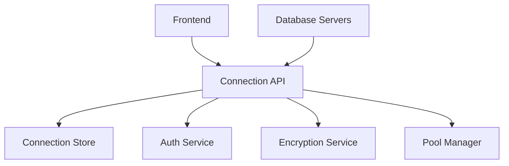
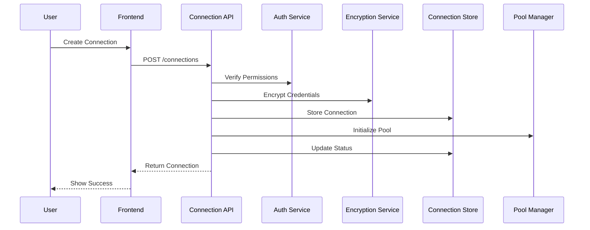
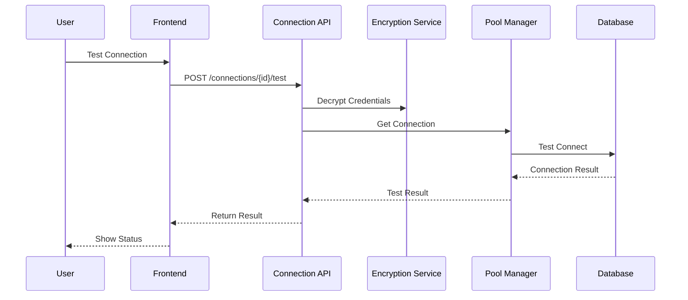

# RFC 002: Database Connection Management

## Status Information
- **Status**: Draft
- **Type**: Feature
- **Start Date**: 2024-01-20
- **Author**: System
- **Priority**: P1
- **Dependencies**: RFC 000 (Authentication & User Management)

## 1. Overview
### 1.1 Summary
A secure and efficient database connection management system that enables users to create, test, and manage database connections with proper access control and encryption.

### 1.2 Goals
1. Provide secure database connection management
2. Enable connection testing and validation
3. Support multiple database types
4. Maintain connection security
5. Support connection pooling
6. Ensure data protection

### 1.3 Success Metrics
1. Connection creation time < 1 second
2. Zero security breaches
3. 99.9% connection success rate
4. < 500ms connection test time
5. 100% encryption coverage

## 2. Requirements

### 2.1 Functional Requirements
1. Connection Management
   - Connection creation and configuration
   - Connection testing and validation
   - Connection pool management
   - Connection string encryption

2. Database Support
   - PostgreSQL support
   - SQL Server support
   - MySQL support
   - Oracle support

3. Security
   - Credential encryption
   - Access control (supporting both local and Google-authenticated users)
   - Audit logging
   - Connection monitoring

4. Connection Operations
   - Pool management
   - Connection health checks
   - Auto-reconnection
   - Load balancing

### 2.2 Non-Functional Requirements
1. Performance
   - Connection operation response time < 500ms
   - Support for 1,000 concurrent connections
   - Connection pool efficiency

2. Security
   - AES-256 encryption
   - Secure credential storage
   - Access logging
   - SSL/TLS support

3. Reliability
   - Auto-reconnection
   - Connection pooling
   - Load balancing
   - Failover support

4. Scalability
   - Horizontal scaling
   - Connection pool management
   - Resource optimization

## 3. Technical Design

### 3.1 System Components


### 3.2 Data Models
```csharp
public class DatabaseConnection
{
    public Guid Id { get; private set; }
    public string Name { get; private set; }
    public DatabaseType Type { get; private set; }
    public string Server { get; private set; }
    public string Database { get; private set; }
    public string EncryptedUsername { get; private set; }
    public string EncryptedPassword { get; private set; }
    public bool UseSSL { get; private set; }
    public int MaxPoolSize { get; private set; }
    public Guid CreatedById { get; private set; }
    public string? CreatedByGoogleEmail { get; private set; }  // For Google-authenticated users
    public DateTime CreatedAt { get; private set; }
    public DateTime? LastTestedAt { get; private set; }
    public ConnectionStatus Status { get; private set; }
}

public class ConnectionAccess
{
    public Guid ConnectionId { get; private set; }
    public Guid UserId { get; private set; }
    public string? GoogleEmail { get; private set; }  // For Google-authenticated users
    public ConnectionAccessLevel AccessLevel { get; private set; }
    public DateTime AssignedAt { get; private set; }
}
```

### 3.3 API Endpoints
1. Connection Management
   ```http
   POST /api/connections
   GET /api/connections
   GET /api/connections/{id}
   PUT /api/connections/{id}
   DELETE /api/connections/{id}
   ```

2. Connection Operations
   ```http
   POST /api/connections/{id}/test
   POST /api/connections/{id}/validate
   POST /api/connections/{id}/reset
   GET /api/connections/{id}/status
   ```

3. Access Management
   ```http
   POST /api/connections/{id}/access
   GET /api/connections/{id}/access
   DELETE /api/connections/{id}/access/{userId}
   ```

### 3.2 Connection Workflows

#### Connection Creation Flow


#### Connection Test Flow


## 4. Implementation Plan

### 4.1 Phase 1: Core Connection Management (Week 1)
1. Setup project structure
2. Implement connection CRUD
3. Add encryption service
4. Integrate with auth system
5. Add connection validation

### 4.2 Phase 2: Connection Security (Week 2)
1. Add credential encryption
2. Implement access control
3. Add audit logging
4. Setup monitoring
5. Add SSL/TLS support

### 4.3 Phase 3: Connection Operations (Week 3)
1. Add connection pooling
2. Implement health checks
3. Add auto-reconnection
4. Create monitoring system
5. Add load balancing

### 4.4 Phase 4: Integration & Testing (Week 4)
1. Integration testing
2. Performance testing
3. Security testing
4. Documentation
5. Deployment preparation

## 5. Testing Strategy

### 5.1 Unit Testing
1. Connection operations
2. Encryption/decryption
3. Access control
4. Pool management
5. Health checks

### 5.2 Integration Testing
1. Database connectivity
2. Authentication flow (both local and Google auth)
3. Pool management
4. Event handling
5. Audit logging

### 5.3 Security Testing
1. Encryption validation
2. Access control testing
3. SSL/TLS validation
4. Credential security
5. Audit trail validation

## 6. Monitoring & Maintenance

### 6.1 Metrics
1. Connection success rates
2. Response times
3. Pool utilization
4. Error rates
5. Security events

### 6.2 Alerts
1. Connection failures
2. Security violations
3. Performance issues
4. Pool exhaustion
5. System errors

## 7. Documentation Requirements
1. API documentation
2. Security guidelines
3. Integration guides
4. Operations manual
5. Troubleshooting guides

## 8. Open Questions
1. Connection pool sizing strategy?
2. Credential rotation policy?
3. SSL/TLS certificate management?
4. Failover configuration?
5. Load balancing strategy?

## 9. Privacy & Compliance

### 9.1 Data Protection
1. Connection Data Handling
   - Connection strings
   - Credentials
   - Access history
   - Usage patterns

2. Data Retention
   - Active connections: Indefinite
   - Inactive connections: 6 months
   - Connection logs: 3 months
   - Test results: 1 month

3. GDPR Compliance
   - Credential encryption
   - Access logging
   - Usage tracking
   - Data minimization

### 9.2 Rate Limiting
1. Connection Operations
   - Connection creation: 10 per hour
   - Connection tests: 30 per hour
   - Pool resets: 5 per hour
   - Access changes: 20 per hour

2. Query Operations
   - Connection list: 60 per minute
   - Status checks: 120 per minute
   - Pool stats: 60 per minute

### 9.3 Error Handling
1. Connection Operation Errors
   ```json
   {
     "error": "connection_operation_failed",
     "message": "Unable to establish connection",
     "details": {
       "reason": "authentication_failed",
       "database_type": "postgresql",
       "error_code": "28P01"
     }
   }
   ```

2. Pool Management Errors
   ```json
   {
     "error": "pool_operation_failed",
     "message": "Unable to manage connection pool",
     "details": {
       "reason": "pool_exhausted",
       "current_size": 100,
       "max_size": 100
     }
   }
   ```

3. Security Errors
   ```json
   {
     "error": "security_violation",
     "message": "Security check failed",
     "details": {
       "reason": "ssl_required",
       "current_protocol": "plain"
     }
   }
   ``` 