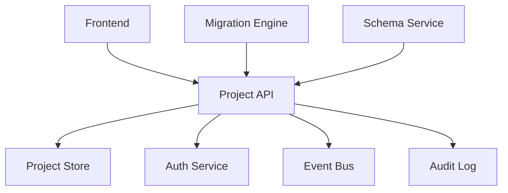
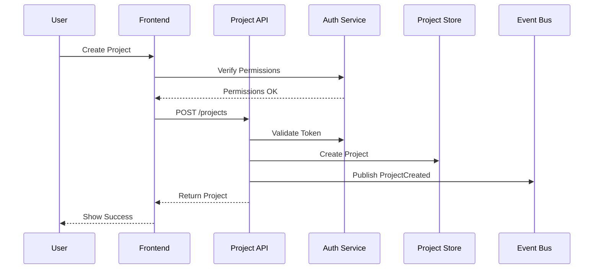
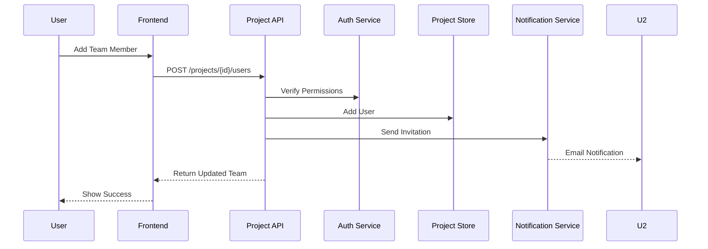

# RFC 001: Project Management System

## Status Information
- **Status**: Draft
- **Type**: Feature
- **Start Date**: 2024-01-20
- **Author**: System
- **Priority**: P1
- **Dependencies**: RFC 000 (Authentication & User Management)

## 1. Overview
### 1.1 Summary
A comprehensive project management system that enables users to create, manage, and monitor data migration projects with proper access control and collaboration features.

### 1.2 Goals
1. Provide efficient project lifecycle management
2. Enable team collaboration and access control
3. Track project progress and history
4. Maintain project metadata and configuration
5. Support multi-user collaboration
6. Ensure data consistency and reliability

### 1.3 Success Metrics
1. Project creation time < 2 minutes
2. Zero data loss incidents
3. 99.9% project operation success rate
4. < 1s average response time for project operations
5. 100% audit trail coverage

## 2. Requirements

### 2.1 Functional Requirements
1. Project Management
   - Project creation and configuration
   - Project state management (Draft, Active, Completed, Failed)
   - Project metadata management
   - Project history tracking

2. Team Collaboration
   - Team member assignment (supporting both local and Google-authenticated users)
   - Role-based access control
   - Activity tracking
   - Notification system

3. Project Operations
   - Project state transitions
   - Progress tracking
   - Resource allocation
   - Dependency management

4. Audit & History
   - Operation logging
   - State change tracking
   - User activity monitoring
   - Resource usage tracking

### 2.2 Non-Functional Requirements
1. Performance
   - Project operation response time < 1s
   - Support for 1,000 concurrent projects
   - History retrieval < 2s

2. Reliability
   - Transaction consistency
   - Data integrity checks
   - State machine validation
   - Conflict resolution

3. Scalability
   - Horizontal scaling support
   - Efficient data partitioning
   - Cache support for project data

4. Availability
   - 99.9% uptime
   - Automatic failover
   - Data backup and recovery

## 3. Technical Design

### 3.1 System Components


### 3.2 Data Models
```csharp
public class Project
{
    public Guid Id { get; private set; }
    public string Name { get; private set; }
    public string Description { get; private set; }
    public ProjectStatus Status { get; private set; }
    public Guid OwnerId { get; private set; }
    public DateTime CreatedAt { get; private set; }
    public DateTime? UpdatedAt { get; private set; }
    public DateTime? CompletedAt { get; private set; }
    public List<ProjectUser> Users { get; private set; }
    public Dictionary<string, string> Metadata { get; private set; }
}

public class ProjectUser
{
    public Guid ProjectId { get; private set; }
    public Guid UserId { get; private set; }
    public ProjectRole Role { get; private set; }
    public DateTime AssignedAt { get; private set; }
    public string? GoogleEmail { get; private set; }  // For Google-authenticated users
}
```

### 3.3 API Endpoints
1. Project Management
   ```http
   POST /api/projects
   GET /api/projects
   GET /api/projects/{id}
   PUT /api/projects/{id}
   DELETE /api/projects/{id}
   ```

2. Team Management
   ```http
   POST /api/projects/{id}/users
   GET /api/projects/{id}/users
   DELETE /api/projects/{id}/users/{userId}
   PUT /api/projects/{id}/users/{userId}/role
   ```

3. Project Operations
   ```http
   POST /api/projects/{id}/start
   POST /api/projects/{id}/pause
   POST /api/projects/{id}/resume
   POST /api/projects/{id}/complete
   ```

### 3.2 Project Workflows

#### Project Creation Flow


#### Team Collaboration Flow


## 4. Implementation Plan

### 4.1 Phase 1: Core Project Management (Week 1)
1. Setup project structure
2. Implement project CRUD
3. Add state management
4. Integrate with auth system
5. Add basic validation

### 4.2 Phase 2: Team Collaboration (Week 2)
1. Add team management
2. Implement access control
3. Add activity tracking
4. Setup notifications
5. Add collaboration features

### 4.3 Phase 3: Project Operations (Week 3)
1. Add operation workflows
2. Implement state machines
3. Add resource management
4. Create monitoring system
5. Add reporting features

### 4.4 Phase 4: Integration & Testing (Week 4)
1. Integration testing
2. Performance testing
3. Security testing
4. Documentation
5. Deployment preparation

## 5. Testing Strategy

### 5.1 Unit Testing
1. Project operations
2. State transitions
3. Access control
4. Data validation
5. Event handling

### 5.2 Integration Testing
1. End-to-end workflows
2. Team collaboration (including Google-authenticated users)
3. State management
4. Event publishing
5. Audit logging

### 5.3 Performance Testing
1. Concurrent operations
2. Data loading
3. State transitions
4. Team operations
5. History retrieval

## 6. Monitoring & Maintenance

### 6.1 Metrics
1. Project operation success rates
2. API response times
3. Resource utilization
4. User activity patterns
5. Error rates

### 6.2 Alerts
1. Failed operations
2. Performance degradation
3. Resource constraints
4. Security violations
5. System errors

## 7. Documentation Requirements
1. API documentation
2. User guides
3. Integration guides
4. Operations manual
5. Troubleshooting guides

## 8. Open Questions
1. Project archival strategy?
2. Long-term history retention?
3. Team size limits?
4. Resource quotas?
5. Backup frequency?

## 9. Privacy & Compliance

### 9.1 Data Protection
1. Project Data Handling
   - Project metadata
   - Team member information
   - Project history
   - Activity logs

2. Data Retention
   - Active projects: Indefinite
   - Completed projects: 24 months
   - Failed projects: 12 months
   - Activity logs: 6 months

3. GDPR Compliance
   - Project data export
   - Team member consent
   - Access control logs
   - Data minimization

### 9.2 Rate Limiting
1. Project Operations
   - Project creation: 10 per hour
   - Project updates: 30 per hour
   - Team member changes: 20 per hour
   - Status changes: 50 per hour

2. Query Operations
   - Project list: 60 per minute
   - Project details: 120 per minute
   - Team queries: 60 per minute

### 9.3 Error Handling
1. Project Operation Errors
   ```json
   {
     "error": "project_operation_failed",
     "message": "Unable to perform operation",
     "details": {
       "reason": "invalid_state_transition",
       "current_state": "active",
       "requested_state": "completed"
     }
   }
   ```

2. Team Management Errors
   ```json
   {
     "error": "team_update_failed",
     "message": "Unable to update team",
     "details": {
       "reason": "user_not_found",
       "user_id": "abc123"
     }
   }
   ```

3. Access Control Errors
   ```json
   {
     "error": "access_denied",
     "message": "Insufficient permissions",
     "details": {
       "required_role": "admin",
       "current_role": "viewer"
     }
   }
   ``` 