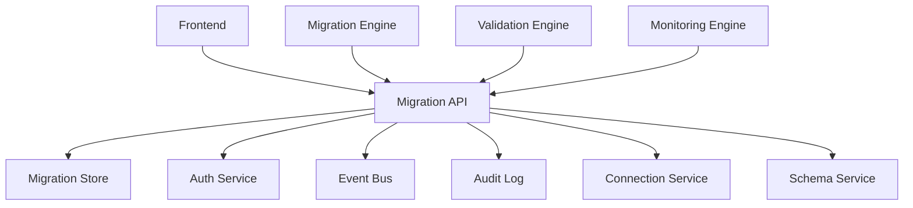
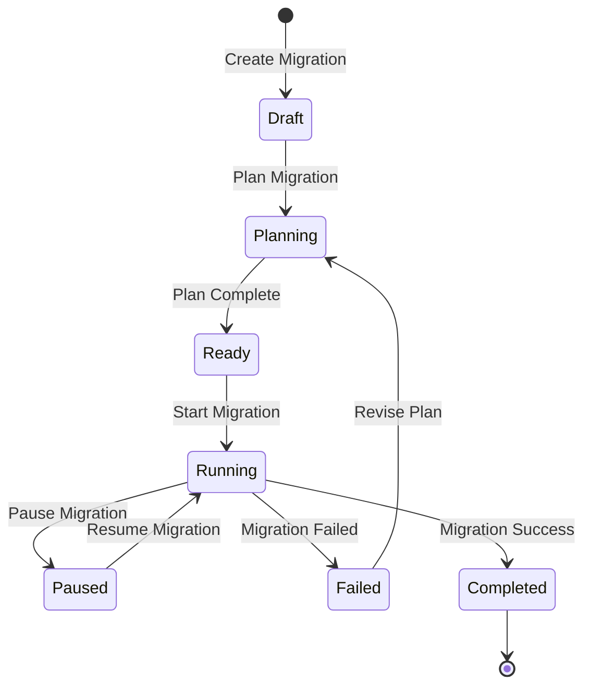
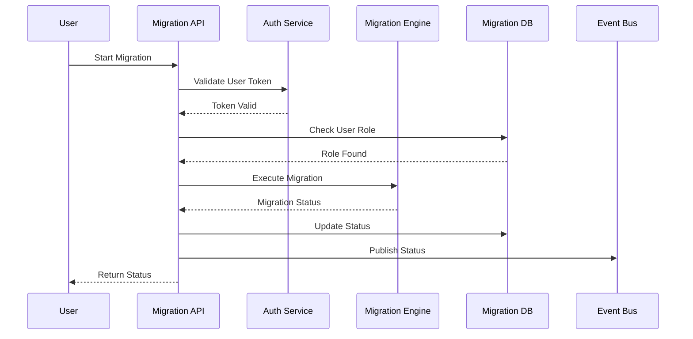
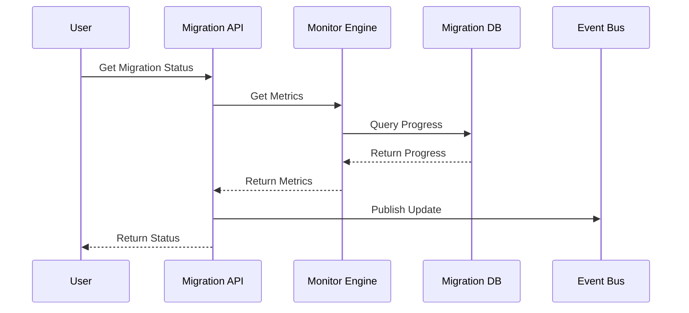
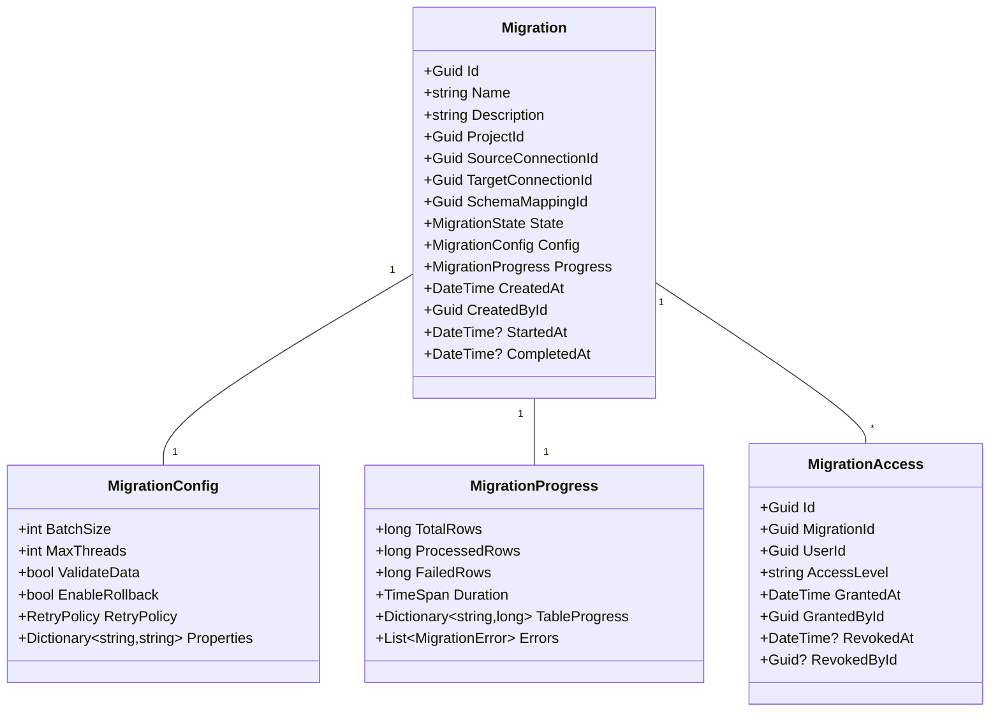

# RFC 004: Data Migration Execution

## Status
- **Status**: Draft
- **Type**: Feature
- **Start Date**: 2024-01-20
- **Author**: System
- **Priority**: P1
- **Related Issues**: N/A
- **Dependencies**: 
  - RFC 000 (Authentication & User Management)
  - RFC 001 (Project Management)
  - RFC 002 (Database Connection Management)
  - RFC 003 (Schema Management)

## Summary
This RFC proposes the implementation of a data migration execution system that provides secure, efficient, and user-scoped execution of data migrations. The system will handle migration planning, execution, monitoring, and validation while ensuring proper access control and security.

## Motivation
A robust data migration execution system is essential for:
1. Efficient data transfer between systems
2. Data transformation and validation
3. Progress monitoring and reporting
4. Error handling and recovery
5. Performance optimization
6. Security compliance
7. Audit trail maintenance
8. Resource management

## Design Details

### System Architecture

### Migration Lifecycle Flow

### Migration Execution Flow

### Migration Monitoring Flow

### Domain Model

## Implementation Strategy

### Phase 1: Core Migration
1. Migration execution with user context
2. Basic progress tracking
3. Migration access control
4. Integration with authentication
5. Basic error handling
6. Simple retry logic

### Phase 2: Enhanced Features
1. Advanced execution
2. Batch processing
3. Multi-threading
4. Progress reporting
5. Error recovery
6. Performance tuning

### Phase 3: Monitoring
1. Real-time monitoring
2. Performance metrics
3. Resource tracking
4. Alert system
5. Health checks
6. Dashboard integration

### Phase 4: Advanced Features
1. Smart batching
2. Auto-scaling
3. Impact analysis
4. Dependency tracking
5. Resource optimization
6. Migration patterns

## Security Considerations
1. Role-based access control
2. Migration access auditing
3. Data encryption in transit
4. Resource isolation
5. Access monitoring
6. Compliance requirements
7. Vulnerability scanning
8. Security updates
9. Data protection
10. Access reviews

## Testing Strategy
1. Unit tests for all commands and queries
2. Integration tests with auth system
3. Migration engine testing
4. Performance testing
5. Security testing
6. Load testing
7. Recovery testing
8. Rollback testing
9. Compliance testing
10. UI/UX testing

## Monitoring
1. Migration progress metrics
2. Performance metrics
3. Resource utilization
4. Error rates
5. Security events
6. User activity
7. System health
8. Audit trails
9. Compliance metrics
10. Cost metrics

## Documentation
1. API documentation
2. Migration guide
3. Performance tuning
4. Error handling
5. Best practices
6. Security guide
7. Integration guide
8. Recovery procedures
9. Compliance guide
10. User guide

## Migration Strategy
1. Existing migration data
2. Access control migration
3. Configuration migration
4. Progress tracking
5. Error handling
6. Performance tuning
7. Monitoring setup
8. Security policies
9. Documentation
10. Analytics data

## Dependencies
1. Authentication System (RFC 000)
2. Project Management (RFC 001)
3. Database Connection (RFC 002)
4. Schema Management (RFC 003)
5. Event bus
6. Monitoring system
7. Logging service
8. Metrics service
9. Alert service
10. Analytics service

## Timeline
- Phase 1 (Core Features): 2 weeks
  - Migration execution
  - Progress tracking
  - Access control
  - Auth integration
- Phase 2 (Enhanced Features): 2 weeks
  - Advanced execution
  - Batch processing
  - Error recovery
  - Performance
- Phase 3 (Monitoring): 2 weeks
  - Real-time monitoring
  - Performance metrics
  - Resource tracking
  - Alerts
- Phase 4 (Advanced): 2 weeks
  - Smart batching
  - Auto-scaling
  - Optimization
  - Patterns

## Unresolved Questions
1. Resource allocation strategy?
   - Auto-scaling rules
   - Resource limits
2. Error handling complexity?
   - Recovery strategies
   - Retry policies
3. Performance optimization?
   - Batch sizing
   - Thread management
4. Monitoring retention?
   - Storage requirements
   - Performance impact
5. Recovery procedures?
   - Rollback strategies
   - Data consistency

## Command Queries and Models

### Commands
1. CreateMigrationCommand
2. StartMigrationCommand
3. PauseMigrationCommand
4. ResumeMigrationCommand
5. CancelMigrationCommand
6. UpdateConfigCommand
7. RetryMigrationCommand
8. RollbackMigrationCommand
9. UpdateAccessCommand
10. ValidateMigrationCommand

### Queries
1. GetMigrationByIdQuery
2. GetMigrationListQuery
3. GetMigrationProgressQuery
4. GetMigrationMetricsQuery
5. GetMigrationErrorsQuery
6. GetMigrationAccessQuery
7. GetMigrationHistoryQuery
8. GetMigrationHealthQuery
9. GetMigrationAuditQuery
10. GetMigrationComplianceQuery

### Models
1. MigrationDto
2. MigrationConfigDto
3. MigrationProgressDto
4. MigrationErrorDto
5. MigrationAccessDto
6. MigrationMetricsDto
7. MigrationHistoryDto
8. MigrationHealthDto
9. MigrationAuditDto
10. MigrationComplianceDto

### Events
1. MigrationCreatedEvent
2. MigrationStartedEvent
3. MigrationPausedEvent
4. MigrationResumedEvent
5. MigrationCompletedEvent
6. MigrationFailedEvent
7. MigrationAccessGrantedEvent
8. MigrationAccessRevokedEvent
9. MigrationHealthChangedEvent
10. MigrationComplianceChangedEvent 