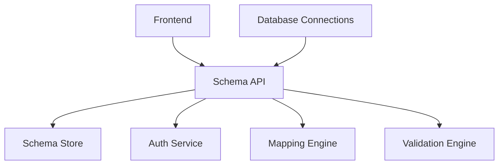
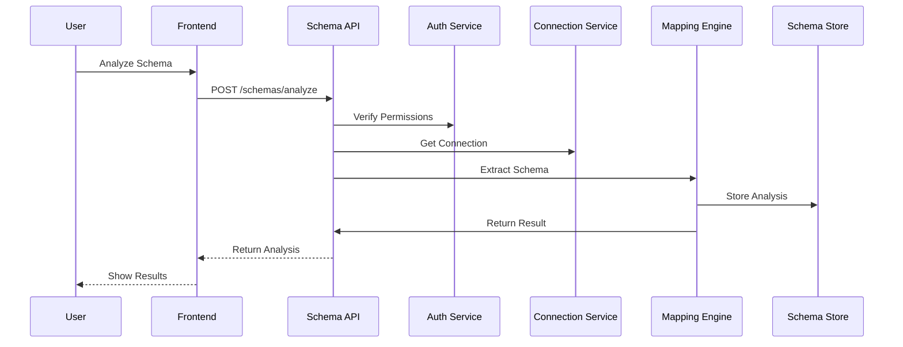
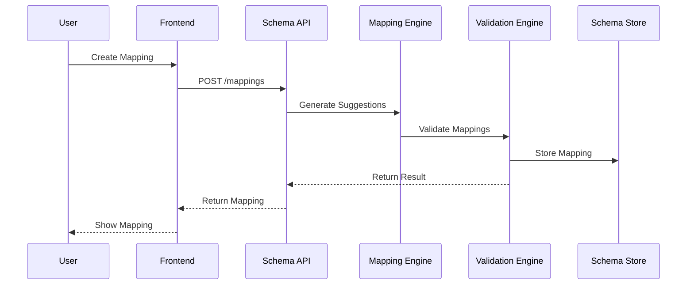

# RFC 003: Schema Management System

## Status Information
- **Status**: Draft
- **Type**: Feature
- **Start Date**: 2024-01-20
- **Author**: System
- **Priority**: P1
- **Dependencies**: 
  - RFC 000 (Authentication & User Management)
  - RFC 002 (Database Connection Management)

## 1. Overview
### 1.1 Summary
A comprehensive schema management system that enables users to analyze, map, and validate database schemas with intelligent mapping suggestions and validation rules.

### 1.2 Goals
1. Provide efficient schema analysis
2. Enable intelligent schema mapping
3. Support validation rules
4. Maintain mapping history
5. Support multiple database types
6. Ensure data integrity

### 1.3 Success Metrics
1. Schema analysis time < 30 seconds
2. 90% mapping suggestion accuracy
3. Zero data loss during mapping
4. < 2s mapping validation time
5. 100% schema coverage

## 2. Requirements

### 2.1 Functional Requirements
1. Schema Analysis
   - Database schema extraction
   - Schema comparison
   - Data type analysis
   - Constraint analysis

2. Schema Mapping
   - Visual mapping interface
   - Auto-mapping suggestions
   - Custom mapping rules
   - Mapping validation

3. Validation Rules
   - Data type compatibility
   - Constraint validation
   - Custom validation rules
   - Validation reporting

4. Schema Operations
   - Schema versioning
   - Schema history (with support for both local and Google-authenticated users)
   - Schema documentation
   - Schema export/import

### 2.2 Non-Functional Requirements
1. Performance
   - Schema analysis response time < 30s
   - Mapping operation response time < 2s
   - Support for large schemas (1000+ tables)

2. Reliability
   - Consistent mapping results
   - Data integrity checks
   - Validation accuracy
   - Error handling

3. Scalability
   - Horizontal scaling
   - Caching support
   - Resource optimization

4. Usability
   - Intuitive mapping interface
   - Clear validation messages
   - Documentation generation
   - Search capabilities

## 3. Technical Design

### 3.1 System Components


### 3.2 Data Models
```csharp
public class SchemaAnalysis
{
    public Guid Id { get; private set; }
    public Guid ConnectionId { get; private set; }
    public string DatabaseName { get; private set; }
    public List<TableInfo> Tables { get; private set; }
    public List<RelationshipInfo> Relationships { get; private set; }
    public Guid CreatedById { get; private set; }
    public string? CreatedByGoogleEmail { get; private set; }  // For Google-authenticated users
    public DateTime CreatedAt { get; private set; }
    public AnalysisStatus Status { get; private set; }
}

public class SchemaMapping
{
    public Guid Id { get; private set; }
    public Guid SourceSchemaId { get; private set; }
    public Guid TargetSchemaId { get; private set; }
    public List<TableMapping> TableMappings { get; private set; }
    public List<ValidationRule> ValidationRules { get; private set; }
    public Guid CreatedById { get; private set; }
    public string? CreatedByGoogleEmail { get; private set; }  // For Google-authenticated users
    public DateTime CreatedAt { get; private set; }
    public DateTime? LastModifiedAt { get; private set; }
    public MappingStatus Status { get; private set; }
}
```

### 3.3 API Endpoints
1. Schema Analysis
   ```http
   POST /api/schemas/analyze
   GET /api/schemas
   GET /api/schemas/{id}
   GET /api/schemas/{id}/tables
   GET /api/schemas/{id}/relationships
   ```

2. Schema Mapping
   ```http
   POST /api/mappings
   GET /api/mappings
   GET /api/mappings/{id}
   PUT /api/mappings/{id}
   DELETE /api/mappings/{id}
   ```

3. Validation
   ```http
   POST /api/mappings/{id}/validate
   GET /api/mappings/{id}/validation-results
   POST /api/mappings/{id}/rules
   GET /api/mappings/{id}/rules
   ```

### 3.2 Schema Workflows

#### Schema Analysis Flow


#### Schema Mapping Flow


## 4. Implementation Plan

### 4.1 Phase 1: Schema Analysis (Week 1)
1. Setup project structure
2. Implement schema extraction
3. Add schema comparison
4. Create analysis engine
5. Add basic validation

### 4.2 Phase 2: Schema Mapping (Week 2)
1. Add mapping engine
2. Implement auto-mapping
3. Add custom mapping rules
4. Create mapping UI
5. Add mapping validation

### 4.3 Phase 3: Validation Rules (Week 3)
1. Add validation engine
2. Implement rule system
3. Add custom rules
4. Create validation UI
5. Add validation reporting

### 4.4 Phase 4: Integration & Testing (Week 4)
1. Integration testing
2. Performance testing
3. Security testing
4. Documentation
5. Deployment preparation

## 5. Testing Strategy

### 5.1 Unit Testing
1. Schema analysis
2. Mapping operations
3. Validation rules
4. Data type handling
5. Constraint validation

### 5.2 Integration Testing
1. Database connectivity
2. Authentication flow (both local and Google auth)
3. Validation flow
4. Event handling
5. Error handling

### 5.3 Performance Testing
1. Large schema analysis
2. Concurrent operations
3. Mapping performance
4. Validation speed
5. Resource usage

## 6. Monitoring & Maintenance

### 6.1 Metrics
1. Analysis success rates
2. Mapping accuracy
3. Validation coverage
4. Response times
5. Error rates

### 6.2 Alerts
1. Analysis failures
2. Mapping errors
3. Validation failures
4. Performance issues
5. System errors

## 7. Documentation Requirements
1. API documentation
2. Mapping guidelines
3. Validation rules
4. Integration guides
5. Troubleshooting guides

## 8. Open Questions
1. Schema versioning strategy?
2. Mapping template system?
3. Custom validation framework?
4. Performance optimization?
5. Schema evolution handling? 

## 9. Privacy & Compliance

### 9.1 Data Protection
1. Schema Data Handling
   - Schema metadata
   - Mapping rules
   - Analysis results
   - Validation history

2. Data Retention
   - Active schemas: Indefinite
   - Inactive schemas: 12 months
   - Analysis results: 6 months
   - Mapping history: 12 months

3. GDPR Compliance
   - Schema data export
   - Access logging
   - Data minimization
   - Usage tracking

### 9.2 Rate Limiting
1. Schema Operations
   - Schema analysis: 10 per hour
   - Mapping creation: 30 per hour
   - Validation runs: 50 per hour
   - Rule updates: 100 per hour

2. Query Operations
   - Schema list: 60 per minute
   - Mapping queries: 120 per minute
   - Analysis results: 60 per minute

### 9.3 Error Handling
1. Schema Analysis Errors
   ```json
   {
     "error": "schema_analysis_failed",
     "message": "Unable to analyze schema",
     "details": {
       "reason": "connection_error",
       "table": "users",
       "error_code": "42P01"
     }
   }
   ```

2. Mapping Errors
   ```json
   {
     "error": "mapping_validation_failed",
     "message": "Invalid mapping configuration",
     "details": {
       "reason": "incompatible_types",
       "source_type": "varchar",
       "target_type": "integer"
     }
   }
   ```

3. Validation Errors
   ```json
   {
     "error": "validation_failed",
     "message": "Validation rules failed",
     "details": {
       "reason": "constraint_violation",
       "constraint": "not_null",
       "field": "email"
     }
   }
   ``` 