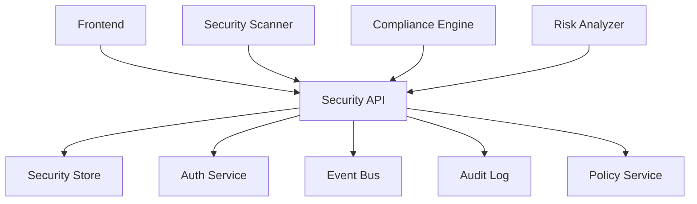
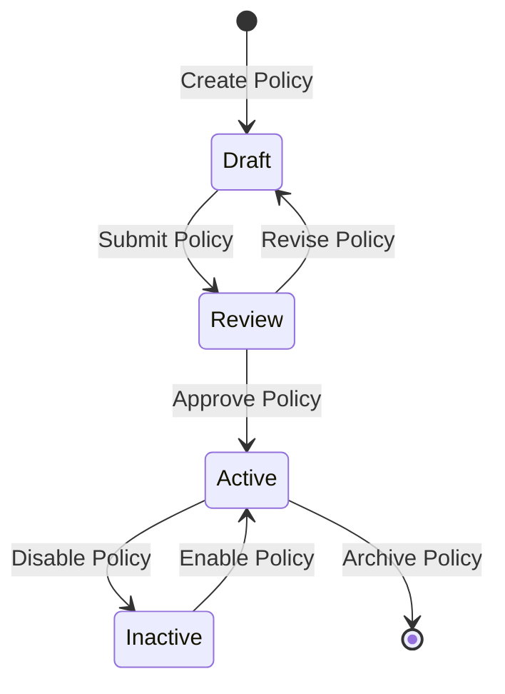
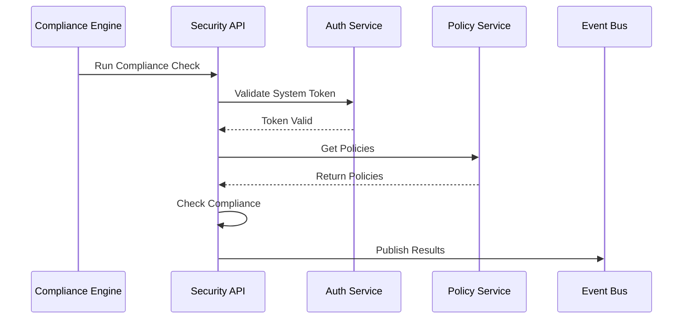
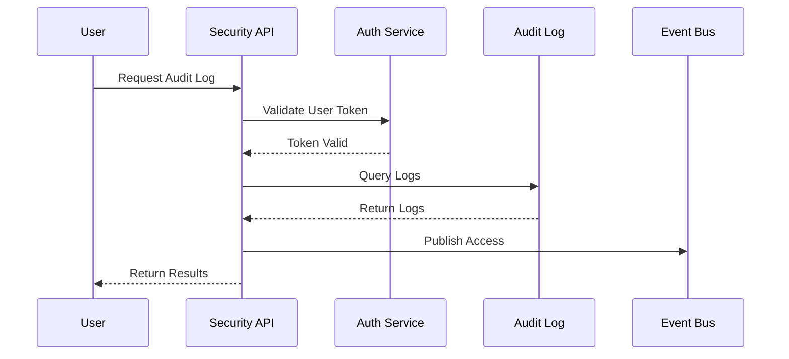
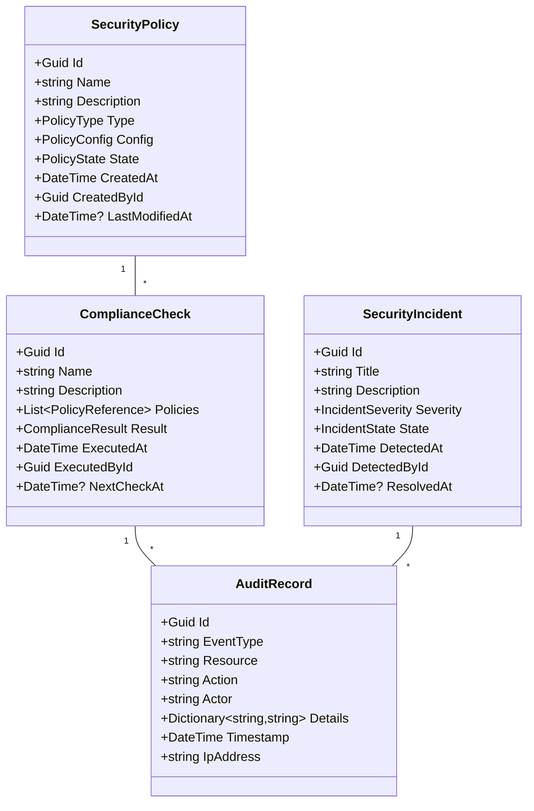

# RFC 006: Security & Compliance System

## Status
- **Status**: Draft
- **Type**: Feature
- **Start Date**: 2024-01-20
- **Author**: System
- **Priority**: P0
- **Related Issues**: N/A
- **Dependencies**: 
  - RFC 000 (Authentication & User Management)
  - RFC 001 (Project Management)
  - RFC 002 (Database Connection Management)
  - RFC 003 (Schema Management)
  - RFC 004 (Data Migration Execution)
  - RFC 005 (Monitoring & Analytics)

## Summary
This RFC proposes the implementation of a comprehensive security and compliance system that provides secure, efficient, and user-scoped access to security features and compliance monitoring. The system will handle security policies, compliance checks, audit logging, and vulnerability management while ensuring proper access control and security.

## Motivation
A robust security and compliance system is essential for:
1. Data protection and privacy
2. Access control and authorization
3. Security policy enforcement
4. Compliance monitoring and reporting
5. Audit trail maintenance
6. Vulnerability management
7. Incident response
8. Risk assessment

## Design Details

### System Architecture

### Security Policy Flow

### Compliance Check Flow

### Audit Log Flow

### Domain Model

## Implementation Strategy

### Phase 1: Core Security
1. Security policy management
2. Basic compliance checks
3. Access control
4. Integration with auth
5. Audit logging
6. Incident tracking

### Phase 2: Enhanced Features
1. Advanced policies
2. Custom compliance rules
3. Risk assessment
4. Vulnerability scanning
5. Security metrics
6. Policy automation

### Phase 3: Compliance
1. Compliance reporting
2. Policy enforcement
3. Automated checks
4. Evidence collection
5. Gap analysis
6. Remediation tracking

### Phase 4: Advanced Features
1. AI-powered security
2. Threat detection
3. Behavioral analysis
4. Auto-remediation
5. Risk prediction
6. Security analytics

## Security Considerations
1. Role-based access control
2. Policy enforcement
3. Data encryption
4. Resource isolation
5. Access monitoring
6. Compliance requirements
7. Vulnerability scanning
8. Security updates
9. Data protection
10. Access reviews

## Testing Strategy
1. Unit tests for all commands and queries
2. Integration tests with auth system
3. Security policy testing
4. Compliance testing
5. Penetration testing
6. Load testing
7. Performance testing
8. Security testing
9. Audit testing
10. UI/UX testing

## Monitoring
1. Security metrics
2. Policy compliance
3. Resource access
4. Incident rates
5. Security events
6. User activity
7. System health
8. Audit trails
9. Compliance metrics
10. Risk metrics

## Documentation
1. API documentation
2. Security guide
3. Policy templates
4. Compliance guide
5. Best practices
6. Incident response
7. Integration guide
8. Troubleshooting
9. Audit guide
10. User guide

## Migration Strategy
1. Existing policy migration
2. Access control migration
3. Compliance rules
4. Audit history
5. Incident records
6. Security configs
7. Policy templates
8. User preferences
9. Documentation
10. Analytics data

## Dependencies
1. Authentication System (RFC 000)
2. Project Management (RFC 001)
3. Database Connection (RFC 002)
4. Schema Management (RFC 003)
5. Data Migration (RFC 004)
6. Monitoring System (RFC 005)
7. Event bus
8. Policy engine
9. Scanner service
10. Analytics service

## Timeline
- Phase 1 (Core Features): 2 weeks
  - Policy management
  - Compliance checks
  - Access control
  - Auth integration
- Phase 2 (Enhanced Features): 2 weeks
  - Advanced policies
  - Risk assessment
  - Vulnerability scanning
  - Automation
- Phase 3 (Compliance): 2 weeks
  - Compliance reporting
  - Policy enforcement
  - Automated checks
  - Remediation
- Phase 4 (Advanced): 2 weeks
  - AI security
  - Threat detection
  - Behavioral analysis
  - Prediction

## Unresolved Questions
1. Policy complexity limits?
   - Rule engine capacity
   - Performance impact
2. Compliance scope?
   - Standard coverage
   - Custom requirements
3. Audit retention?
   - Storage requirements
   - Legal compliance
4. AI integration?
   - Model selection
   - Training data
5. Auto-remediation scope?
   - Action boundaries
   - Safety checks

## Command Queries and Models

### Commands
1. CreatePolicyCommand
2. UpdatePolicyCommand
3. CreateComplianceCheckCommand
4. CreateIncidentCommand
5. UpdateIncidentCommand
6. CreateAuditRecordCommand
7. ConfigureSecurityCommand
8. CreateScanCommand
9. CreateRemediationCommand
10. CreateRiskAssessmentCommand

### Queries
1. GetPolicyByIdQuery
2. GetPolicyListQuery
3. GetComplianceCheckQuery
4. GetIncidentListQuery
5. GetAuditLogQuery
6. GetSecurityMetricsQuery
7. GetRiskAssessmentQuery
8. GetVulnerabilityReportQuery
9. GetComplianceReportQuery
10. GetSecurityDashboardQuery

### Models
1. SecurityPolicyDto
2. ComplianceCheckDto
3. AuditRecordDto
4. SecurityIncidentDto
5. RiskAssessmentDto
6. VulnerabilityDto
7. SecurityMetricsDto
8. ComplianceReportDto
9. SecurityDashboardDto
10. RemediationPlanDto

### Events
1. PolicyCreatedEvent
2. PolicyUpdatedEvent
3. ComplianceCheckCompletedEvent
4. IncidentCreatedEvent
5. IncidentResolvedEvent
6. AuditRecordCreatedEvent
7. SecurityViolationEvent
8. RiskLevelChangedEvent
9. RemediationCompletedEvent
10. ComplianceStatusChangedEvent 