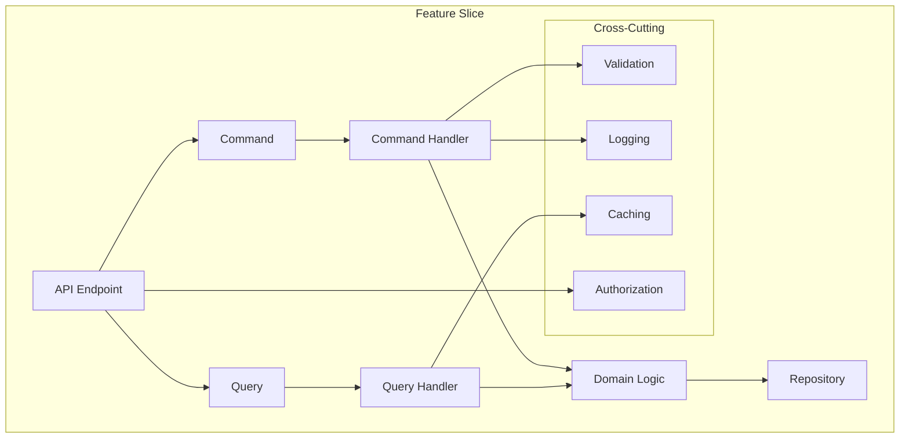

# Development Rules and Guidelines

## Table of Contents
1. [Authentication & User Management Rules](#authentication--user-management-rules)
2. [Project Structure](#project-structure)
3. [Coding Standards](#coding-standards)
4. [CQRS Implementation](#cqrs-implementation)
5. [Testing Requirements](#testing-requirements)
6. [Performance Guidelines](#performance-guidelines)
7. [Security Rules](#security-rules)
8. [Blazor Guidelines](#blazor-guidelines)
9. [Git Workflow](#git-workflow)
10. [Code Review Guidelines](#code-review-guidelines)
11. [Deployment Rules](#deployment-rules)
12. [Monitoring Requirements](#monitoring-requirements)

## Authentication & User Management Rules

### Authentication Implementation

1. **Password Handling**
   ```csharp
   public class PasswordService : IPasswordService
   {
       public string HashPassword(string password)
       {
           // Use Argon2id for password hashing
           var config = new Argon2Config
           {
               Type = Argon2Type.Argon2id,
               TimeCost = 4,
               MemoryCost = 32768,
               Lanes = 4
           };
           var argon2 = new Argon2(config);
           return Convert.ToBase64String(argon2.Hash());
       }
   
       public bool VerifyPassword(string password, string hash)
       {
           var argon2 = new Argon2(Convert.FromBase64String(hash));
           return argon2.Verify(password);
       }
   }
   ```

2. **JWT Token Management**
   ```csharp
   public class JwtService : IJwtService
   {
       public string GenerateToken(User user, IEnumerable<string> roles)
       {
           var claims = new List<Claim>
           {
               new Claim(ClaimTypes.NameIdentifier, user.Id.ToString()),
               new Claim(ClaimTypes.Email, user.Email),
               new Claim(ClaimTypes.Name, $"{user.FirstName} {user.LastName}")
           };
           claims.AddRange(roles.Select(role => new Claim(ClaimTypes.Role, role)));
   
           var key = new SymmetricSecurityKey(Encoding.UTF8.GetBytes(_configuration["Jwt:Key"]));
           var creds = new SigningCredentials(key, SecurityAlgorithms.HmacSha256);
   
           var token = new JwtSecurityToken(
               issuer: _configuration["Jwt:Issuer"],
               audience: _configuration["Jwt:Audience"],
               claims: claims,
               expires: DateTime.Now.AddHours(1),
               signingCredentials: creds);
   
           return new JwtSecurityTokenHandler().WriteToken(token);
       }
   }
   ```

3. **MFA Implementation**
   ```csharp
   public class MfaService : IMfaService
   {
       public string GenerateSecret()
       {
           var key = KeyGeneration.GenerateRandomKey(20);
           return Base32Encoding.ToString(key);
       }
   
       public bool ValidateCode(string secret, string code)
       {
           var totp = new Totp(Base32Encoding.ToBytes(secret));
           return totp.VerifyTotp(code, out _, VerificationWindow.Valid);
       }
   }
   ```

### Authorization Rules

1. **Role-Based Access Control**
   ```csharp
   [Authorize(Roles = "SystemAdmin,OrgAdmin")]
   public class UserManagementController : ApiControllerBase
   {
       [HttpPost]
       public async Task<IActionResult> CreateUser([FromBody] CreateUserCommand command)
       {
           if (!await _authorizationService.CanManageUsers(User, command.OrganizationId))
               return Forbid();
   
           return await _mediator.Send(command);
       }
   }
   ```

2. **Resource-Based Authorization**
   ```csharp
   public class ProjectAuthorizationHandler : AuthorizationHandler<ProjectOperationRequirement, Project>
   {
       protected override Task HandleRequirementAsync(
           AuthorizationHandlerContext context,
           ProjectOperationRequirement requirement,
           Project resource)
       {
           var user = context.User;
           if (resource.OwnerId == user.GetUserId() ||
               user.IsInRole("SystemAdmin") ||
               user.IsInRole("OrgAdmin") && resource.OrganizationId == user.GetOrganizationId())
           {
               context.Succeed(requirement);
           }
   
           return Task.CompletedTask;
       }
   }
   ```

### Security Guidelines

1. **Password Requirements**
   ```csharp
   public class PasswordValidator : IPasswordValidator
   {
       public bool ValidatePassword(string password)
       {
           return password.Length >= 12 &&
                  Regex.IsMatch(password, @"[A-Z]") &&
                  Regex.IsMatch(password, @"[a-z]") &&
                  Regex.IsMatch(password, @"[0-9]") &&
                  Regex.IsMatch(password, @"[^A-Za-z0-9]");
       }
   }
   ```

2. **API Key Management**
   ```csharp
   public class ApiKeyService : IApiKeyService
   {
       public string GenerateApiKey()
       {
           var key = new byte[32];
           using (var rng = new RNGCryptoServiceProvider())
           {
               rng.GetBytes(key);
           }
           return Convert.ToBase64String(key);
       }
   
       public string HashApiKey(string key)
       {
           using var sha256 = SHA256.Create();
           var hashedBytes = sha256.ComputeHash(Encoding.UTF8.GetBytes(key));
           return Convert.ToBase64String(hashedBytes);
       }
   }
   ```

### Audit Requirements

1. **Activity Logging**
   ```csharp
   public class AuditLogService : IAuditLogService
   {
       public async Task LogActivity(
           Guid userId,
           string action,
           string resourceType,
           Guid resourceId,
           object details)
       {
           var log = new AuditLog
           {
               Id = Guid.NewGuid(),
               UserId = userId,
               Action = action,
               ResourceType = resourceType,
               ResourceId = resourceId,
               Details = JsonSerializer.Serialize(details),
               Timestamp = DateTime.UtcNow
           };
   
           await _dbContext.AuditLogs.AddAsync(log);
           await _dbContext.SaveChangesAsync();
       }
   }
   ```

2. **Security Event Monitoring**
   ```csharp
   public class SecurityMonitor : ISecurityMonitor
   {
       public async Task MonitorLoginAttempts(string email)
       {
           var attempts = await _cache.GetAsync<int>($"login_attempts:{email}") ?? 0;
           if (attempts >= 5)
           {
               await _userService.LockAccount(email);
               await _notificationService.NotifySecurityTeam(
                   "Multiple failed login attempts",
                   new { Email = email, Attempts = attempts });
           }
           
           await _cache.SetAsync($"login_attempts:{email}", attempts + 1,
               TimeSpan.FromMinutes(15));
       }
   }
   ```

### Testing Requirements

1. **Authentication Tests**
   ```csharp
   public class AuthenticationTests
   {
       [Fact]
       public async Task Login_WithValidCredentials_ShouldSucceed()
       {
           // Arrange
           var command = new LoginCommand
           {
               Email = "test@example.com",
               Password = "SecurePass123!"
           };
   
           // Act
           var result = await _handler.Handle(command, CancellationToken.None);
   
           // Assert
           Assert.NotNull(result.Token);
           Assert.NotNull(result.RefreshToken);
       }
   
       [Fact]
       public async Task Login_WithInvalidPassword_ShouldFail()
       {
           // Arrange
           var command = new LoginCommand
           {
               Email = "test@example.com",
               Password = "WrongPassword123!"
           };
   
           // Act & Assert
           await Assert.ThrowsAsync<InvalidCredentialsException>(
               () => _handler.Handle(command, CancellationToken.None));
       }
   }
   ```

2. **Authorization Tests**
   ```csharp
   public class AuthorizationTests
   {
       [Fact]
       public async Task AccessProject_WithoutPermission_ShouldBeDenied()
       {
           // Arrange
           var user = await CreateTestUser(Roles.DataEngineer);
           var project = await CreateTestProject(differentOrganization: true);
   
           // Act
           var result = await _authorizationService.AuthorizeAsync(
               user, project, Operations.View);
   
           // Assert
           Assert.False(result.Succeeded);
       }
   }
   ```

### Performance Guidelines

1. **Caching Strategy**
   ```csharp
   public class UserPermissionCache : IUserPermissionCache
   {
       public async Task<IEnumerable<string>> GetUserPermissions(Guid userId)
       {
           var cacheKey = $"user_permissions:{userId}";
           var permissions = await _cache.GetAsync<string[]>(cacheKey);
           
           if (permissions == null)
           {
               permissions = await _permissionService.GetUserPermissions(userId);
               await _cache.SetAsync(cacheKey, permissions,
                   TimeSpan.FromMinutes(15));
           }
           
           return permissions;
       }
   }
   ```

2. **Token Validation Optimization**
   ```csharp
   public class TokenValidationService : ITokenValidationService
   {
       private readonly IMemoryCache _cache;
       private readonly TokenValidationParameters _validationParameters;
   
       public async Task<ClaimsPrincipal> ValidateToken(string token)
       {
           if (_cache.TryGetValue($"invalid_token:{token}", out _))
               throw new SecurityTokenException("Token has been invalidated");
   
           var principal = new JwtSecurityTokenHandler()
               .ValidateToken(token, _validationParameters, out var validatedToken);
   
           if (await IsTokenRevoked(token))
           {
               _cache.Set($"invalid_token:{token}", true,
                   TimeSpan.FromMinutes(15));
               throw new SecurityTokenException("Token has been revoked");
           }
   
           return principal;
       }
   }
   ```

## 1. Project Structure

### Directory Organization
```
src/
├── DataMigrationSystem.Web/               # Blazor WebAssembly Project
│   ├── Features/                          # Feature-based Components
│   ├── Shared/                            # Shared Components
│   ├── Services/                          # Frontend Services
│   └── Store/                             # State Management
├── DataMigrationSystem.Api/               # API Project
│   ├── Features/                          # Vertical Slices
│   │   ├── Projects/                      # Project Management Feature
│   │   ├── Connections/                   # Database Connection Feature
│   │   ├── Schemas/                       # Schema Management Feature
│   │   └── Migrations/                    # Data Migration Feature
│   ├── Infrastructure/                    # Cross-cutting Infrastructure
│   └── Common/                            # Shared Code
└── DataMigrationSystem.Shared/            # Shared DTOs and Contracts
```

### Feature Organization
Each feature must follow Vertical Slice Architecture:
- One folder per feature
- Self-contained functionality
- Minimal cross-feature dependencies
- Feature-specific models and validation

## 2. Coding Standards

### General Rules
1. Maximum line length: 100 characters
2. Maximum method length: 20 lines
3. Maximum class length: 200 lines
4. Use meaningful names for variables, methods, and classes
5. No magic numbers or strings
6. Always use braces for control structures
7. Use expression-bodied members for simple methods

### Naming Conventions
1. **Classes**: PascalCase
   ```csharp
   public class ProjectManager
   ```

2. **Interfaces**: IPascalCase
   ```csharp
   public interface IProjectRepository
   ```

3. **Methods**: PascalCase
   ```csharp
   public async Task<Project> GetProjectByIdAsync(Guid id)
   ```

4. **Variables**: camelCase
   ```csharp
   private readonly string connectionString;
   ```

5. **Constants**: UPPER_CASE
   ```csharp
   private const string DEFAULT_CONNECTION = "DefaultConnection";
   ```

### Documentation Requirements
1. All public APIs must have XML documentation
2. Complex logic must have inline comments
3. Use // TODO: for temporary solutions
4. Include examples in complex method documentation

## 3. CQRS Implementation

### Commands
```csharp
public record CreateProjectCommand : ICommand<ProjectDto>
{
    public string Name { get; init; }
    public string Description { get; init; }
}
```

### Queries
```csharp
public record GetProjectQuery : IQuery<ProjectDto>
{
    public Guid Id { get; init; }
}
```

### Handlers
```csharp
public class CreateProjectCommandHandler : ICommandHandler<CreateProjectCommand, ProjectDto>
{
    // Implementation
}
```

## 4. Testing Requirements

### Unit Tests
1. Follow Arrange-Act-Assert pattern
2. One assertion per test
3. Descriptive test names
4. Use mock objects for dependencies
5. Minimum 80% code coverage

### Integration Tests
1. Test complete features
2. Use test database
3. Clean up after tests
4. Test happy and error paths

## 5. Performance Guidelines

### Database
1. Use async/await for all I/O operations
2. Implement caching for frequent queries
3. Use pagination for large datasets
4. Optimize queries with proper indexing

### API
1. Implement response compression
2. Use ETags for caching
3. Implement rate limiting
4. Use bulk operations where possible

## 6. Security Rules

### Authentication
1. Use JWT tokens
2. Implement refresh tokens
3. Secure token storage
4. Implement token rotation

### Authorization
1. Use policy-based authorization
2. Implement role-based access control
3. Validate all inputs
4. Implement request validation

## 7. Blazor Guidelines

### Components
1. Use small, focused components
2. Implement proper lifecycle methods
3. Use cascading parameters wisely
4. Implement proper disposal

### State Management
1. Use Fluxor for state management
2. Implement proper state immutability
3. Use feature states
4. Implement proper error handling

## 8. Git Workflow

### Branching Strategy
1. main - production code
2. develop - development code
3. feature/* - new features
4. bugfix/* - bug fixes
5. release/* - release preparation

### Commit Messages
```
type(scope): subject

body

footer
```

Types:
- feat: new feature
- fix: bug fix
- docs: documentation
- style: formatting
- refactor: code restructuring
- test: adding tests
- chore: maintenance

## 9. Code Review Guidelines

### Review Checklist
1. Code follows style guide
2. Tests are included
3. Documentation is updated
4. No security vulnerabilities
5. Performance considerations
6. Error handling is proper

### Pull Request Template
```markdown
## Description
[Description of the changes]

## Type of change
- [ ] Bug fix
- [ ] New feature
- [ ] Breaking change
- [ ] Documentation update

## Checklist
- [ ] Tests added
- [ ] Documentation updated
- [ ] Code follows style guide
- [ ] All tests passing
```

## 10. Deployment Rules

### Environment Configuration
1. Use environment-specific settings
2. No secrets in code
3. Use configuration validation
4. Implement proper logging

### Release Process
1. Version all releases
2. Create release notes
3. Perform security scan
4. Run performance tests
5. Update documentation

## 11. Monitoring Requirements

### Application Monitoring
1. Implement health checks
2. Monitor performance metrics
3. Track error rates
4. Monitor resource usage

### Logging Standards
1. Use structured logging
2. Include correlation IDs
3. Log appropriate detail level
4. Implement log rotation 

### Feature Structure
```
Features/
└── ProjectManagement/
    ├── Commands/                    # Command handlers
    │   └── CreateProject/
    │       ├── CreateProjectCommand.cs
    │       ├── CreateProjectCommandHandler.cs
    │       ├── CreateProjectCommandValidator.cs
    │       └── CreateProjectCommandTests.cs
    ├── Queries/                     # Query handlers
    │   └── GetProject/
    │       ├── GetProjectQuery.cs
    │       ├── GetProjectQueryHandler.cs
    │       └── GetProjectQueryTests.cs
    ├── Events/                      # Domain events
    │   └── ProjectCreated/
    │       ├── ProjectCreatedEvent.cs
    │       └── ProjectCreatedEventHandler.cs
    ├── Models/                      # Feature-specific models
    │   ├── ProjectDto.cs
    │   └── ProjectMappingProfile.cs
    ├── Exceptions/                  # Feature-specific exceptions
    │   └── ProjectValidationException.cs
    └── Services/                    # Feature-specific services
        └── IProjectService.cs
```

### Clean Architecture Implementation


### Exception Handling
```csharp
public class ExceptionHandlingMiddleware : IMiddleware
{
    private readonly ILogger<ExceptionHandlingMiddleware> _logger;

    public async Task InvokeAsync(HttpContext context, RequestDelegate next)
    {
        try
        {
            await next(context);
        }
        catch (ValidationException ex)
        {
            await HandleValidationExceptionAsync(context, ex);
        }
        catch (NotFoundException ex)
        {
            await HandleNotFoundExceptionAsync(context, ex);
        }
        catch (Exception ex)
        {
            await HandleUnknownExceptionAsync(context, ex);
        }
    }
}
```

### Validation Implementation
```csharp
public class CreateProjectCommandValidator : AbstractValidator<CreateProjectCommand>
{
    public CreateProjectCommandValidator()
    {
        RuleFor(x => x.Name)
            .NotEmpty()
            .MaximumLength(100)
            .Matches("^[a-zA-Z0-9-_]+$")
            .WithMessage("Project name can only contain letters, numbers, hyphens and underscores");

        RuleFor(x => x.Description)
            .MaximumLength(500)
            .When(x => !string.IsNullOrEmpty(x.Description));
            
        RuleFor(x => x.StartDate)
            .NotEmpty()
            .Must(BeAValidDate)
            .WithMessage("Start date must be a valid date");
    }
}
```

### Event Sourcing
```csharp
public abstract class AggregateRoot
{
    private readonly List<IDomainEvent> _domainEvents = new();
    
    public IReadOnlyCollection<IDomainEvent> DomainEvents => _domainEvents.AsReadOnly();
    
    protected void AddDomainEvent(IDomainEvent domainEvent)
    {
        _domainEvents.Add(domainEvent);
    }
    
    public void ClearDomainEvents()
    {
        _domainEvents.Clear();
    }
}

public class Project : AggregateRoot
{
    public void Create(string name, string description)
    {
        // Business logic
        AddDomainEvent(new ProjectCreatedEvent(Id, name));
    }
}
```

### Mediator Pattern Implementation
```csharp
public interface ICommandHandler<in TCommand, TResponse> 
    where TCommand : ICommand<TResponse>
{
    Task<TResponse> Handle(TCommand command, CancellationToken cancellationToken);
}

public class MediatorPipeline<TRequest, TResponse> : IPipelineBehavior<TRequest, TResponse>
{
    private readonly IEnumerable<IValidator<TRequest>> _validators;
    private readonly ILogger<MediatorPipeline<TRequest, TResponse>> _logger;

    public async Task<TResponse> Handle(TRequest request, RequestHandlerDelegate<TResponse> next)
    {
        // Pre-processing
        await ValidateRequest(request);
        
        try
        {
            // Handler execution
            var response = await next();
            
            // Post-processing
            return response;
        }
        catch (Exception ex)
        {
            _logger.LogError(ex, "Error processing request {RequestType}", typeof(TRequest).Name);
            throw;
        }
    }
}
```

### Test Examples
```csharp
[Fact]
public async Task Handle_ValidCommand_CreatesProject()
{
    // Arrange
    var command = new CreateProjectCommand 
    { 
        Name = "Test Project",
        Description = "Test Description"
    };
    
    var handler = new CreateProjectCommandHandler(_mockRepo.Object, _mockMapper.Object);
    
    _mockRepo.Setup(x => x.AddAsync(It.IsAny<Project>()))
            .ReturnsAsync((Project p) => p);
    
    // Act
    var result = await handler.Handle(command, CancellationToken.None);
    
    // Assert
    result.Should().NotBeNull();
    result.Name.Should().Be(command.Name);
    _mockRepo.Verify(x => x.AddAsync(It.IsAny<Project>()), Times.Once);
}
```

### Performance Testing
```csharp
[Fact]
public async Task BulkOperation_Performance_Test()
{
    // Arrange
    var stopwatch = new Stopwatch();
    var items = Enumerable.Range(1, 10000)
                         .Select(i => new ProjectDto { Name = $"Project {i}" })
                         .ToList();
    
    // Act
    stopwatch.Start();
    await _handler.HandleBulkCreate(items);
    stopwatch.Stop();
    
    // Assert
    stopwatch.ElapsedMilliseconds.Should().BeLessThan(5000); // 5 seconds max
}
```

### Security Implementation Examples
```csharp
public class SecurityHeadersMiddleware
{
    public async Task InvokeAsync(HttpContext context)
    {
        context.Response.Headers.Add("X-Frame-Options", "DENY");
        context.Response.Headers.Add("X-Content-Type-Options", "nosniff");
        context.Response.Headers.Add("X-XSS-Protection", "1; mode=block");
        context.Response.Headers.Add("Referrer-Policy", "strict-origin-when-cross-origin");
        context.Response.Headers.Add("Content-Security-Policy", 
            "default-src 'self'; script-src 'self' 'unsafe-inline' 'unsafe-eval'; style-src 'self' 'unsafe-inline';");
        
        await _next(context);
    }
}
```

## 12. API Design Guidelines

### RESTful Endpoints
1. Use nouns for resources
2. Use plural forms for collections
3. Use proper HTTP methods
4. Implement proper status codes

### Example Endpoints
```csharp
// Collection endpoints
GET    /api/v1/projects
POST   /api/v1/projects

// Single resource endpoints
GET    /api/v1/projects/{id}
PUT    /api/v1/projects/{id}
DELETE /api/v1/projects/{id}

// Sub-resource endpoints
GET    /api/v1/projects/{id}/mappings
POST   /api/v1/projects/{id}/mappings

// Action endpoints
POST   /api/v1/projects/{id}/start
POST   /api/v1/projects/{id}/pause
```

### Response Format
```json
{
    "data": {
        "id": "guid",
        "type": "project",
        "attributes": {
            "name": "string",
            "status": "string"
        },
        "relationships": {
            "mappings": {
                "links": {
                    "related": "/api/v1/projects/guid/mappings"
                }
            }
        }
    },
    "meta": {
        "timestamp": "datetime",
        "version": "string"
    }
}
```

## 13. Database Guidelines

### Entity Framework Core
1. Use migrations for schema changes
2. Implement soft deletes
3. Use appropriate data types
4. Implement proper indexing

### Example Entity Configuration
```csharp
public class ProjectConfiguration : IEntityTypeConfiguration<Project>
{
    public void Configure(EntityTypeBuilder<Project> builder)
    {
        builder.ToTable("Projects");
        
        builder.HasKey(x => x.Id);
        
        builder.Property(x => x.Name)
               .HasMaxLength(100)
               .IsRequired();
               
        builder.Property(x => x.CreatedAt)
               .HasDefaultValueSql("CURRENT_TIMESTAMP");
               
        builder.HasIndex(x => x.Name)
               .IsUnique();
               
        builder.HasQueryFilter(x => !x.IsDeleted);
    }
}
```

## 14. Error Handling Standards

### Error Response Format
```json
{
    "error": {
        "code": "string",
        "message": "string",
        "details": [
            {
                "field": "string",
                "message": "string"
            }
        ],
        "traceId": "string"
    }
}
```

### Error Codes
1. VALIDATION_ERROR: 400
2. AUTHENTICATION_ERROR: 401
3. AUTHORIZATION_ERROR: 403
4. NOT_FOUND: 404
5. CONFLICT: 409
6. INTERNAL_ERROR: 500

## 15. Documentation Standards

### API Documentation
```csharp
/// <summary>
/// Creates a new project in the system
/// </summary>
/// <param name="command">Project creation parameters</param>
/// <returns>Created project details</returns>
/// <response code="201">Project created successfully</response>
/// <response code="400">Invalid input parameters</response>
/// <response code="409">Project with same name already exists</response>
[ProducesResponseType(typeof(ProjectDto), StatusCodes.Status201Created)]
[ProducesResponseType(typeof(ErrorResponse), StatusCodes.Status400BadRequest)]
[ProducesResponseType(typeof(ErrorResponse), StatusCodes.Status409Conflict)]
public async Task<ActionResult<ProjectDto>> Create([FromBody] CreateProjectCommand command)
```

### Code Documentation
1. Use XML comments for public APIs
2. Document exceptions
3. Include usage examples
4. Document thread safety

## 16. Blazor Component Guidelines

### Component Lifecycle
```csharp
@implements IDisposable

protected override async Task OnInitializedAsync()
{
    await LoadDataAsync();
    _subscription = StateService.OnChange += StateHasChanged;
}

public void Dispose()
{
    _subscription?.Dispose();
}
```

### Component Communication
```csharp
[Parameter]
public ProjectDto Project { get; set; }

[Parameter]
public EventCallback<ProjectDto> OnProjectUpdated { get; set; }

[CascadingParameter]
private Task<AuthenticationState> AuthState { get; set; }

private async Task UpdateProject()
{
    await OnProjectUpdated.InvokeAsync(Project);
}
``` 

## 17. Enterprise Architecture Guidelines

### Domain-Driven Design
1. **Bounded Contexts**
   - Clear context boundaries
   - Context mapping
   - Shared kernel definition
   - Anti-corruption layers

2. **Aggregates**
   - Single responsibility
   - Transactional boundaries
   - Invariant protection
   - Identity management

3. **Value Objects**
   - Immutability
   - Equality by value
   - Self-validation
   - No side effects

### Microservices Guidelines
1. **Service Boundaries**
   - Business capability alignment
   - Data ownership
   - Independent deployment
   - API versioning

2. **Communication Patterns**
   - Synchronous (HTTP/gRPC)
   - Asynchronous (Message Queue)
   - Event-driven
   - Saga pattern

3. **Data Management**
   - Database per service
   - Event sourcing
   - CQRS implementation
   - Data consistency

## 18. Cloud-Native Development

### Container Guidelines
1. **Docker Best Practices**
   - Multi-stage builds
   - Layer optimization
   - Security scanning
   - Resource limits

2. **Kubernetes Deployment**
   - Pod specifications
   - Service definitions
   - Resource quotas
   - Health probes

### Cloud Patterns
1. **Resilience**
   ```csharp
   public class ResiliencePolicy
   {
       public int MaxRetries { get; set; }
       public TimeSpan Timeout { get; set; }
       public CircuitBreakerConfig CircuitBreaker { get; set; }
       public BulkheadConfig Bulkhead { get; set; }
   }
   ```

2. **Scalability**
   ```csharp
   public class ScalingPolicy
   {
       public int MinReplicas { get; set; }
       public int MaxReplicas { get; set; }
       public int TargetCpuUtilization { get; set; }
       public Dictionary<string, string> CustomMetrics { get; set; }
   }
   ```

## 19. Security Guidelines

### Authentication & Authorization
1. **JWT Implementation**
   ```csharp
   public class JwtConfig
   {
       public string Issuer { get; set; }
       public string Audience { get; set; }
       public TimeSpan TokenLifetime { get; set; }
       public TimeSpan RefreshTokenLifetime { get; set; }
       public RsaSecurityKey SigningKey { get; set; }
   }
   ```

2. **Role-Based Access**
   ```csharp
   [Authorize(Policy = "RequireAdminRole")]
   public class AdminController : ControllerBase
   {
       [RequirePermission("Migration.Write")]
       public async Task<IActionResult> CreateMigration([FromBody] CreateMigrationCommand command)
       {
           // Implementation
       }
   }
   ```

### Data Protection
1. **Encryption Standards**
   ```csharp
   public interface IEncryptionService
   {
       Task<string> EncryptAsync(string plaintext, string purpose);
       Task<string> DecryptAsync(string ciphertext, string purpose);
       Task<byte[]> GenerateKeyAsync(string purpose);
   }
   ```

2. **Data Masking**
   ```csharp
   public class DataMaskingPolicy
   {
       public Dictionary<string, MaskingRule> Rules { get; set; }
       public List<string> ExcludedRoles { get; set; }
       public bool AuditMasking { get; set; }
   }
   ```

## 20. Performance Guidelines

### Caching Strategy
1. **Multi-Level Caching**
   ```csharp
   public interface ICacheProvider
   {
       Task<T> GetOrSetAsync<T>(
           string key,
           Func<Task<T>> factory,
           CacheOptions options);
       
       Task InvalidateAsync(string key);
       Task InvalidatePatternAsync(string pattern);
   }
   ```

2. **Cache Configuration**
   ```csharp
   public class CacheConfig
   {
       public TimeSpan DefaultExpiration { get; set; }
       public bool EnableCompression { get; set; }
       public int MaxMemorySize { get; set; }
       public string[] InvalidationTags { get; set; }
   }
   ```

### Query Optimization
1. **EF Core Best Practices**
   ```csharp
   public static class QueryableExtensions
   {
       public static IQueryable<T> WithNoTracking<T>(this IQueryable<T> query)
           where T : class
       {
           return query.AsNoTracking()
                      .TagWith("No Tracking Query");
       }

       public static IQueryable<T> WithEagerLoading<T>(
           this IQueryable<T> query,
           params Expression<Func<T, object>>[] includes)
           where T : class
       {
           return includes.Aggregate(query,
               (current, include) => current.Include(include));
       }
   }
   ```

2. **Batch Processing**
   ```csharp
   public class BatchProcessor<T>
   {
       private readonly int _batchSize;
       private readonly ILogger _logger;

       public async Task ProcessBatchAsync(
           IEnumerable<T> items,
           Func<IEnumerable<T>, Task> processor)
       {
           var batches = items.Chunk(_batchSize);
           foreach (var batch in batches)
           {
               try
               {
                   await processor(batch);
               }
               catch (Exception ex)
               {
                   _logger.LogError(ex, "Batch processing failed");
                   throw;
               }
           }
       }
   }
   ```

## 21. Testing Standards

### Integration Testing
```csharp
public class IntegrationTestBase : IClassFixture<WebApplicationFactory<Program>>
{
    protected readonly WebApplicationFactory<Program> Factory;
    protected readonly HttpClient Client;

    public IntegrationTestBase(WebApplicationFactory<Program> factory)
    {
        Factory = factory.WithWebHostBuilder(builder =>
        {
            builder.ConfigureServices(services =>
            {
                // Test configurations
            });
        });
        Client = Factory.CreateClient();
    }
}
```

### Performance Testing
```csharp
public class PerformanceTest
{
    [Fact]
    public async Task MeasureResponseTime()
    {
        // Arrange
        var stopwatch = new Stopwatch();
        var endpoint = "/api/v1/migrations";

        // Act
        stopwatch.Start();
        var response = await _client.GetAsync(endpoint);
        stopwatch.Stop();

        // Assert
        response.Should().BeSuccessful();
        stopwatch.ElapsedMilliseconds.Should().BeLessThan(200);
    }
} 