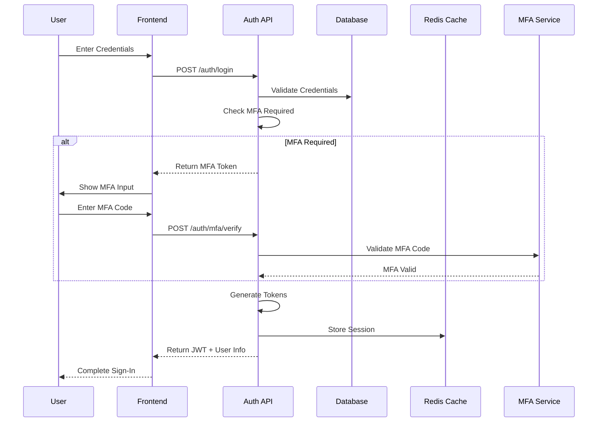
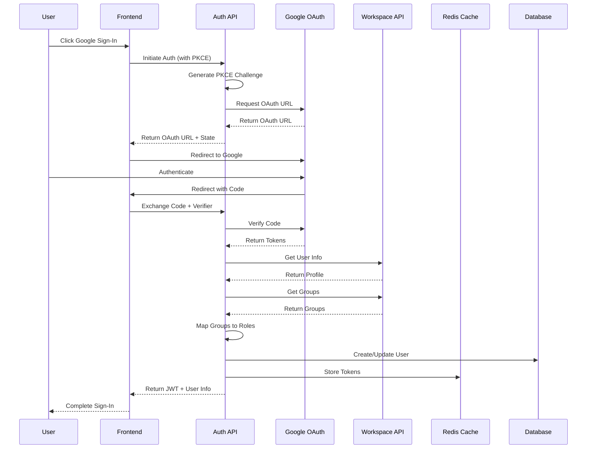

# RFC 000: Authentication & User Management

## Status Information
- **Status**: Draft
- **Type**: Feature
- **Start Date**: 2024-01-20
- **Author**: System
- **Priority**: P0 (Highest)
- **Dependencies**: None (Foundational Component)

## 1. Overview
### 1.1 Summary
A foundational authentication and user management system that provides secure access control and user management capabilities across all features of the Data Migration System. The system supports both traditional username/password authentication and Google Workspace integration for enterprise users.

### 1.2 Goals
1. Implement secure user authentication and authorization
2. Support multiple authentication providers (Local + Google)
3. Provide seamless Google Workspace integration
4. Support enterprise SSO through Google
5. Manage user roles and permissions effectively
6. Enable API key management for automation
7. Maintain comprehensive audit logs
8. Ensure SOC2 and ISO27001 compliance

### 1.3 Success Metrics
1. Authentication response time < 200ms (both providers)
2. Zero security breaches
3. 99.99% system availability
4. < 0.1% failed login attempts
5. 100% audit log coverage
6. < 1s Google Sign-In flow completion
7. 100% successful Google Workspace user sync

## 2. Requirements

### 2.1 Functional Requirements
1. Local Authentication
   - Username/password authentication
   - Password hashing with Argon2id
   - Password complexity requirements
   - Password reset flow
   - Email verification
   - Multi-factor authentication (TOTP)
   - Account lockout after failed attempts
   - Remember me functionality

2. Google Workspace Integration
   - Google OAuth2 authentication
   - Google directory sync
   - Group-based role mapping
   - Domain-based access control
   - Google Cloud KMS integration
   - Workspace audit log integration

3. User Management
   - Support for both local and Google users
   - Profile management for both types
   - Role inheritance (from local roles or Google Groups)
   - Automated user provisioning
   - Just-in-time user creation
   - Account linking (Google to Local)
   - Role and permission assignment

4. Authentication Services and CQRS Implementation

   ```csharp
   // Commands
   public record AuthenticateLocalCommand : IRequest<AuthResult>
   {
       public string Username { get; init; }
       public string Password { get; init; }
   }

   public record AuthenticateGoogleCommand : IRequest<AuthResult>
   {
       public string Code { get; init; }
   }

   public record EnableMfaCommand : IRequest<Unit>
   {
       public string UserId { get; init; }
   }

   public record UpdateUserProfileCommand : IRequest<Unit>
   {
       public string UserId { get; init; }
       public string Name { get; init; }
       public string Email { get; init; }
   }

   // Queries
   public record GetUserProfileQuery : IRequest<UserProfileDto>
   {
       public string UserId { get; init; }
   }

   public record GetUserPermissionsQuery : IRequest<List<string>>
   {
       public string UserId { get; init; }
   }

   public record ValidateTokenQuery : IRequest<TokenInfo>
   {
       public string Token { get; init; }
   }

   // Additional Commands
   public record RefreshTokenCommand : IRequest<AuthResult>
   {
       public string RefreshToken { get; init; }
   }

   public record LogoutCommand : IRequest<Unit>
   {
       public string UserId { get; init; }
       public string AccessToken { get; init; }
   }

   public record VerifyMfaCommand : IRequest<AuthResult>
   {
       public string UserId { get; init; }
       public string MfaToken { get; init; }
       public string Code { get; init; }
   }

   public record ChangePasswordCommand : IRequest<Unit>
   {
       public string UserId { get; init; }
       public string CurrentPassword { get; init; }
       public string NewPassword { get; init; }
   }

   // Additional Queries
   public record GetUserRolesQuery : IRequest<List<RoleDto>>
   {
       public string UserId { get; init; }
   }

   public record GetUserLoginHistoryQuery : IRequest<List<LoginHistoryDto>>
   {
       public string UserId { get; init; }
       public DateTime? FromDate { get; init; }
       public DateTime? ToDate { get; init; }
   }

   public record GetUserMfaStatusQuery : IRequest<MfaStatusDto>
   {
       public string UserId { get; init; }
   }

   // Command Handlers
   public class AuthenticateLocalCommandHandler : IRequestHandler<AuthenticateLocalCommand, AuthResult>
   {
       private readonly IPasswordHasher _passwordHasher;
       private readonly ITotpService _totpService;
       private readonly IUserService _userService;
       private readonly IJwtService _jwtService;

       public async Task<AuthResult> Handle(AuthenticateLocalCommand command, CancellationToken cancellationToken)
       {
           var user = await _userService.GetByUsernameAsync(command.Username);
           if (user == null || !await _passwordHasher.ValidateAsync(command.Password, user.PasswordHash))
           {
               throw new AuthenticationException("Invalid credentials");
           }

           if (user.IsMfaEnabled)
           {
               return new AuthResult 
               { 
                   RequiresMfa = true,
                   MfaToken = await _jwtService.GenerateMfaTokenAsync(user)
               };
           }

           return await GenerateAuthResultAsync(user);
       }
   }

   public class AuthenticateGoogleCommandHandler : IRequestHandler<AuthenticateGoogleCommand, AuthResult>
   {
       private readonly IGoogleAuthClient _googleClient;
       private readonly IUserService _userService;
       private readonly IJwtService _jwtService;

       public async Task<AuthResult> Handle(AuthenticateGoogleCommand command, CancellationToken cancellationToken)
       {
           var tokenResponse = await _googleClient.ExchangeCodeAsync(command.Code);
           var userInfo = await _googleClient.GetUserInfoAsync(tokenResponse.AccessToken);
           
           var user = await _userService.GetOrCreateGoogleUserAsync(userInfo);
           var roles = await SyncGoogleGroupsAsync(user, tokenResponse.AccessToken);
           
           return new AuthResult
           {
               AccessToken = _jwtService.GenerateAccessToken(user, roles),
               RefreshToken = _jwtService.GenerateRefreshToken(),
               ExpiresIn = 3600,
               User = user.ToDto()
           };
       }
   }

   // Query Handlers
   public class GetUserProfileQueryHandler : IRequestHandler<GetUserProfileQuery, UserProfileDto>
   {
       private readonly IUserService _userService;

       public async Task<UserProfileDto> Handle(GetUserProfileQuery query, CancellationToken cancellationToken)
       {
           var user = await _userService.GetByIdAsync(query.UserId);
           return user?.ToDto();
       }
   }

   // API Controllers
   [ApiController]
   [Route("api/[controller]")]
   public class AuthController : ControllerBase
   {
       private readonly IMediator _mediator;

       public AuthController(IMediator mediator)
       {
           _mediator = mediator;
       }

       [HttpPost("local/login")]
       public async Task<ActionResult<AuthResult>> LocalLogin([FromBody] AuthenticateLocalCommand command)
       {
           var result = await _mediator.Send(command);
           return Ok(result);
       }

       [HttpPost("google/login")]
       public async Task<ActionResult<AuthResult>> GoogleLogin([FromBody] AuthenticateGoogleCommand command)
       {
           var result = await _mediator.Send(command);
           return Ok(result);
       }

       [HttpGet("profile")]
       [Authorize]
       public async Task<ActionResult<UserProfileDto>> GetProfile()
       {
           var query = new GetUserProfileQuery { UserId = User.GetUserId() };
           var result = await _mediator.Send(query);
           return Ok(result);
       }

       [HttpPost("mfa/verify")]
       public async Task<ActionResult<AuthResult>> VerifyMfa([FromBody] VerifyMfaCommand command)
       {
           var result = await _mediator.Send(command);
           return Ok(result);
       }

       [HttpPost("logout")]
       [Authorize]
       public async Task<ActionResult> Logout()
       {
           var command = new LogoutCommand 
           { 
               UserId = User.GetUserId(),
               AccessToken = Request.Headers["Authorization"].ToString().Replace("Bearer ", "")
           };
           await _mediator.Send(command);
           return Ok();
       }

       [HttpPost("refresh")]
       public async Task<ActionResult<AuthResult>> RefreshToken([FromBody] RefreshTokenCommand command)
       {
           var result = await _mediator.Send(command);
           return Ok(result);
       }

       [HttpGet("history")]
       [Authorize]
       public async Task<ActionResult<List<LoginHistoryDto>>> GetLoginHistory(
           [FromQuery] DateTime? fromDate,
           [FromQuery] DateTime? toDate)
       {
           var query = new GetUserLoginHistoryQuery 
           { 
               UserId = User.GetUserId(),
               FromDate = fromDate,
               ToDate = toDate
           };
           var result = await _mediator.Send(query);
           return Ok(result);
       }
   }

   // Pipeline Behaviors
   public class LoggingBehavior<TRequest, TResponse> : IPipelineBehavior<TRequest, TResponse>
       where TRequest : IRequest<TResponse>
   {
       private readonly ILogger<LoggingBehavior<TRequest, TResponse>> _logger;

       public async Task<TResponse> Handle(
           TRequest request,
           RequestHandlerDelegate<TResponse> next,
           CancellationToken cancellationToken)
       {
           _logger.LogInformation("Handling {RequestName}", typeof(TRequest).Name);
           var response = await next();
           _logger.LogInformation("Handled {RequestName}", typeof(TRequest).Name);
           return response;
       }
   }

   public class ValidationBehavior<TRequest, TResponse> : IPipelineBehavior<TRequest, TResponse>
       where TRequest : IRequest<TResponse>
   {
       private readonly IEnumerable<IValidator<TRequest>> _validators;

       public async Task<TResponse> Handle(
           TRequest request,
           RequestHandlerDelegate<TResponse> next,
           CancellationToken cancellationToken)
       {
           if (_validators.Any())
           {
               var context = new ValidationContext<TRequest>(request);
               var validationResults = await Task.WhenAll(
                   _validators.Select(v => v.ValidateAsync(context, cancellationToken)));
               var failures = validationResults
                   .SelectMany(r => r.Errors)
                   .Where(f => f != null)
                   .ToList();

               if (failures.Count != 0)
               {
                   throw new ValidationException(failures);
               }
           }
           return await next();
       }
   }

   // Dependency Registration
   public static class CqrsServiceRegistration
   {
       public static IServiceCollection AddCqrsServices(this IServiceCollection services)
       {
           services.AddMediatR(cfg => {
               cfg.RegisterServicesFromAssembly(Assembly.GetExecutingAssembly());
               cfg.AddBehavior(typeof(IPipelineBehavior<,>), typeof(LoggingBehavior<,>));
               cfg.AddBehavior(typeof(IPipelineBehavior<,>), typeof(ValidationBehavior<,>));
           });

           services.AddValidatorsFromAssembly(Assembly.GetExecutingAssembly());
           
           return services;
       }
   }

   // Additional Command Handlers
   public class VerifyMfaCommandHandler : IRequestHandler<VerifyMfaCommand, AuthResult>
   {
       private readonly ITotpService _totpService;
       private readonly IUserService _userService;
       private readonly IJwtService _jwtService;

       public async Task<AuthResult> Handle(VerifyMfaCommand command, CancellationToken cancellationToken)
       {
           var mfaTokenInfo = await _jwtService.ValidateMfaTokenAsync(command.MfaToken);
           var user = await _userService.GetByIdAsync(mfaTokenInfo.UserId);
           
           if (!await _totpService.ValidateCodeAsync(user.MfaSecret, command.Code))
           {
               throw new InvalidMfaCodeException("Invalid MFA code");
           }

           return await GenerateAuthResultAsync(user);
       }
   }

   public class LogoutCommandHandler : IRequestHandler<LogoutCommand, Unit>
   {
       private readonly ITokenManager _tokenManager;
       private readonly IEventBus _eventBus;

       public async Task<Unit> Handle(LogoutCommand command, CancellationToken cancellationToken)
       {
           await _tokenManager.RevokeTokenAsync(command.AccessToken);
           
           await _eventBus.PublishAsync(new UserLoggedOutEvent
           {
               UserId = command.UserId,
               Timestamp = DateTime.UtcNow
           });

           return Unit.Value;
       }
   }

   // Additional Query Handlers
   public class GetUserLoginHistoryQueryHandler : IRequestHandler<GetUserLoginHistoryQuery, List<LoginHistoryDto>>
   {
       private readonly ILoginHistoryRepository _loginHistoryRepository;

       public async Task<List<LoginHistoryDto>> Handle(
           GetUserLoginHistoryQuery query, 
           CancellationToken cancellationToken)
       {
           var history = await _loginHistoryRepository.GetUserLoginHistoryAsync(
               query.UserId,
               query.FromDate,
               query.ToDate
           );

           return history.Select(h => h.ToDto()).ToList();
       }
   }

   // Additional Validators
   public class ChangePasswordCommandValidator : AbstractValidator<ChangePasswordCommand>
   {
       public ChangePasswordCommandValidator()
       {
           RuleFor(x => x.CurrentPassword).NotEmpty();
           RuleFor(x => x.NewPassword)
               .NotEmpty()
               .MinimumLength(12)
               .Matches("[A-Z]").WithMessage("Password must contain uppercase letter")
               .Matches("[a-z]").WithMessage("Password must contain lowercase letter")
               .Matches("[0-9]").WithMessage("Password must contain number")
               .Matches("[^a-zA-Z0-9]").WithMessage("Password must contain special character");
       }
   }

   public class VerifyMfaCommandValidator : AbstractValidator<VerifyMfaCommand>
   {
       public VerifyMfaCommandValidator()
       {
           RuleFor(x => x.MfaToken).NotEmpty();
           RuleFor(x => x.Code)
               .NotEmpty()
               .Length(6)
               .Matches("^[0-9]+$").WithMessage("MFA code must be numeric");
       }
   }
   ```

5. Authorization
   ```csharp
   public interface IAuthorizationService
   {
       Task<bool> AuthorizeAsync(string userId, string resource, string action);
       Task<List<string>> GetUserPermissionsAsync(string userId);
       Task<bool> IsInRoleAsync(string userId, string role);
   }

   public interface IWorkspaceAuthorizationService : IAuthorizationService
   {
       Task<List<string>> GetUserGroupsAsync(string email);
       Task<bool> ValidateDomainAccessAsync(string email, string domain);
       Task<List<Role>> MapGroupsToRolesAsync(List<string> groups);
   }
   ```

### 2.2 Non-Functional Requirements
1. Performance
   - Authentication response time < 200ms (both providers)
   - Password hashing time < 500ms
   - Token validation < 50ms
   - Google Sign-In response < 1s
   - Group sync < 5s

2. Security
   - Argon2id for password hashing
   - OAuth2 PKCE flow for Google
   - JWT with Google KMS signing
   - Secure token storage in Redis
   - Domain allowlist
   - IP range restrictions
   - MFA enforcement options
   - Password complexity requirements
   - Account lockout policies

3. Scalability
   - Support for 100,000 concurrent users
   - Redis cluster for token storage
   - Caching for group memberships
   - Distributed session management

## 3. Technical Design

### 3.1 Authentication Flows

#### Local Authentication Flow


#### Google Authentication Flow


### 3.2 Data Models

```csharp
public class User : AggregateRoot
{
    public Guid Id { get; private set; }
    public string Email { get; private set; }
    public string Username { get; private set; }
    public string? PasswordHash { get; private set; }
    public string? GoogleId { get; private set; }
    public string Name { get; private set; }
    public string? Picture { get; private set; }
    public string? Domain { get; private set; }
    public bool IsWorkspaceUser { get; private set; }
    public bool IsMfaEnabled { get; private set; }
    public string? MfaSecret { get; private set; }
    public int FailedLoginAttempts { get; private set; }
    public DateTime? LockoutEnd { get; private set; }
    public DateTime LastSyncedAt { get; private set; }
    private readonly List<UserRole> _roles = new();
    private readonly List<UserGroup> _groups = new();

    protected override void When(IDomainEvent @event)
    {
        switch (@event)
        {
            case UserCreatedEvent e:
                Id = e.UserId;
                Email = e.Email;
                Username = e.Username;
                Name = e.Name;
                break;
            case UserCreatedFromGoogleEvent e:
                Id = e.UserId;
                Email = e.Email;
                GoogleId = e.GoogleId;
                Name = e.Name;
                Picture = e.Picture;
                Domain = e.Domain;
                IsWorkspaceUser = e.IsWorkspaceUser;
                LastSyncedAt = DateTime.UtcNow;
                break;
            case UserGroupsSyncedEvent e:
                _groups.Clear();
                _groups.AddRange(e.Groups);
                LastSyncedAt = DateTime.UtcNow;
                break;
            case MfaEnabledEvent e:
                IsMfaEnabled = true;
                MfaSecret = e.Secret;
                break;
            case LoginFailedEvent e:
                FailedLoginAttempts++;
                if (FailedLoginAttempts >= 5)
                {
                    LockoutEnd = DateTime.UtcNow.AddMinutes(15);
                }
                break;
            case LoginSucceededEvent e:
                FailedLoginAttempts = 0;
                LockoutEnd = null;
                break;
        }
    }
}
```

### 3.3 Token Management

```csharp
public interface ITokenManager
{
    Task<TokenInfo> ValidateTokenAsync(string token);
    Task<TokenInfo> RefreshTokenAsync(string refreshToken);
    Task RevokeTokenAsync(string token);
    Task<bool> IsTokenBlacklistedAsync(string token);
}

public class TokenManager : ITokenManager
{
    private readonly IDistributedCache _cache;
    private readonly IJwtService _jwtService;
    private readonly IGoogleAuthClient _googleClient;

    public async Task<TokenInfo> ValidateTokenAsync(string token)
    {
        if (await IsTokenBlacklistedAsync(token))
            throw new InvalidTokenException("Token is blacklisted");

        var tokenInfo = _jwtService.ValidateToken(token);
        if (tokenInfo.IsWorkspaceToken)
        {
            await ValidateGoogleTokenAsync(tokenInfo.GoogleToken);
        }

        return tokenInfo;
    }

    private async Task ValidateGoogleTokenAsync(string token)
    {
        try
        {
            await _googleClient.ValidateTokenAsync(token);
        }
        catch (GoogleApiException ex)
        {
            throw new InvalidTokenException("Invalid Google token", ex);
        }
    }
}
```

### 3.4 Group Synchronization

```csharp
public interface IGroupSyncService
{
    Task SyncUserGroupsAsync(string email);
    Task SyncDomainGroupsAsync(string domain);
    Task<List<Role>> MapGroupsToRolesAsync(List<string> groups);
}

public class GoogleGroupSyncService : IGroupSyncService
{
    private readonly IDirectoryService _directoryService;
    private readonly IRoleManager _roleManager;
    private readonly IEventBus _eventBus;

    public async Task SyncUserGroupsAsync(string email)
    {
        var groups = await _directoryService.GetUserGroupsAsync(email);
        var roles = await MapGroupsToRolesAsync(groups);

        await _eventBus.PublishAsync(new UserGroupsSyncedEvent
        {
            Email = email,
            Groups = groups,
            Roles = roles,
            SyncedAt = DateTime.UtcNow
        });
    }
}
```

## 3.5 Domain Entities

### 3.5.1 Core Domain Entities
```csharp
public class User : AggregateRoot
{
    public Guid Id { get; private set; }
    public string Email { get; private set; }
    public string Username { get; private set; }
    public string? PasswordHash { get; private set; }
    public string? GoogleId { get; private set; }
    public string Name { get; private set; }
    public string? Picture { get; private set; }
    public string? Domain { get; private set; }
    public bool IsWorkspaceUser { get; private set; }
    public bool IsMfaEnabled { get; private set; }
    public string? MfaSecret { get; private set; }
    public int FailedLoginAttempts { get; private set; }
    public DateTime? LockoutEnd { get; private set; }
    public DateTime LastSyncedAt { get; private set; }
    private readonly List<UserRole> _roles = new();
    private readonly List<UserGroup> _groups = new();

    // Factory method for local user creation
    public static User CreateLocal(string email, string username, string name, string hashedPassword)
    {
        var user = new User();
        user.Apply(new UserCreatedEvent(
            Guid.NewGuid(),
            email,
            username,
            name
        ));
        user.Apply(new PasswordSetEvent(hashedPassword));
        return user;
    }

    // Factory method for Google user creation
    public static User CreateFromGoogle(GoogleUserInfo info)
    {
        var user = new User();
        user.Apply(new UserCreatedFromGoogleEvent(
            Guid.NewGuid(),
            info.Email,
            info.Id,
            info.Name,
            info.Picture,
            info.Domain,
            true
        ));
        return user;
    }

    protected override void When(IDomainEvent @event) 
    {
        switch (@event)
        {
            case UserCreatedEvent e:
                Id = e.UserId;
                Email = e.Email;
                Username = e.Username;
                Name = e.Name;
                break;
            case UserCreatedFromGoogleEvent e:
                Id = e.UserId;
                Email = e.Email;
                GoogleId = e.GoogleId;
                Name = e.Name;
                Picture = e.Picture;
                Domain = e.Domain;
                IsWorkspaceUser = e.IsWorkspaceUser;
                LastSyncedAt = DateTime.UtcNow;
                break;
            // ... existing event handlers ...
        }
    }

    public void EnableMfa(string secret)
    {
        if (IsMfaEnabled)
            throw new DomainException("MFA is already enabled");

        Apply(new MfaEnabledEvent(Id, secret));
    }

    public void DisableMfa()
    {
        if (!IsMfaEnabled)
            throw new DomainException("MFA is not enabled");

        Apply(new MfaDisabledEvent(Id));
    }

    public void UpdateProfile(string name, string email)
    {
        if (string.IsNullOrEmpty(name))
            throw new DomainException("Name cannot be empty");

        if (string.IsNullOrEmpty(email))
            throw new DomainException("Email cannot be empty");

        Apply(new UserProfileUpdatedEvent(Id, name, email));
    }
}

public class Role : AggregateRoot
{
    public Guid Id { get; private set; }
    public string Name { get; private set; }
    public string Description { get; private set; }
    private readonly List<Permission> _permissions = new();
    private readonly List<string> _allowedDomains = new();

    public static Role Create(string name, string description)
    {
        var role = new Role();
        role.Apply(new RoleCreatedEvent(Guid.NewGuid(), name, description));
        return role;
    }

    protected override void When(IDomainEvent @event)
    {
        switch (@event)
        {
            case RoleCreatedEvent e:
                Id = e.RoleId;
                Name = e.Name;
                Description = e.Description;
                break;
            case PermissionAddedEvent e:
                _permissions.Add(new Permission(e.Permission));
                break;
            case DomainAllowedEvent e:
                _allowedDomains.Add(e.Domain);
                break;
        }
    }
}

public class UserRole : Entity
{
    public Guid UserId { get; private set; }
    public Guid RoleId { get; private set; }
    public string Source { get; private set; } // "Local" or "Google"
    public DateTime AssignedAt { get; private set; }
    public DateTime? ExpiresAt { get; private set; }

    public static UserRole Create(Guid userId, Guid roleId, string source, DateTime? expiresAt = null)
    {
        return new UserRole
        {
            UserId = userId,
            RoleId = roleId,
            Source = source,
            AssignedAt = DateTime.UtcNow,
            ExpiresAt = expiresAt
        };
    }
}

public class UserGroup : Entity
{
    public Guid UserId { get; private set; }
    public string GroupEmail { get; private set; }
    public string GroupName { get; private set; }
    public DateTime SyncedAt { get; private set; }

    public static UserGroup Create(Guid userId, string groupEmail, string groupName)
    {
        return new UserGroup
        {
            UserId = userId,
            GroupEmail = groupEmail,
            GroupName = groupName,
            SyncedAt = DateTime.UtcNow
        };
    }
}

public class LoginHistory : Entity
{
    public Guid Id { get; private set; }
    public Guid UserId { get; private set; }
    public string Provider { get; private set; } // "Local" or "Google"
    public string IpAddress { get; private set; }
    public string UserAgent { get; private set; }
    public bool Success { get; private set; }
    public string? FailureReason { get; private set; }
    public DateTime Timestamp { get; private set; }

    public static LoginHistory Create(
        Guid userId, 
        string provider, 
        string ipAddress, 
        string userAgent, 
        bool success, 
        string? failureReason = null)
    {
        return new LoginHistory
        {
            Id = Guid.NewGuid(),
            UserId = userId,
            Provider = provider,
            IpAddress = ipAddress,
            UserAgent = userAgent,
            Success = success,
            FailureReason = failureReason,
            Timestamp = DateTime.UtcNow
        };
    }
}

### 3.5.2 Value Objects
```csharp
public record Permission
{
    public string Name { get; }
    public string Resource { get; }
    public string Action { get; }

    public Permission(string permission)
    {
        var parts = permission.Split(':');
        if (parts.Length != 3)
            throw new ArgumentException("Invalid permission format");

        Resource = parts[0];
        Action = parts[1];
        Name = parts[2];
    }

    public override string ToString() => $"{Resource}:{Action}:{Name}";
}

public record GoogleUserInfo
{
    public string Id { get; init; }
    public string Email { get; init; }
    public string Name { get; init; }
    public string Picture { get; init; }
    public string Domain { get; init; }
    public bool EmailVerified { get; init; }
    public List<string> Groups { get; init; }
}

public record TokenInfo
{
    public string UserId { get; init; }
    public List<string> Roles { get; init; }
    public bool IsWorkspaceToken { get; init; }
    public string? GoogleToken { get; init; }
    public DateTime ExpiresAt { get; init; }
}

public record MfaStatusDto
{
    public bool IsEnabled { get; init; }
    public string? Secret { get; init; }
    public DateTime? EnabledAt { get; init; }
    public string? RecoveryCodes { get; init; }
}

### 3.5.3 Domain Events
```csharp
public record UserCreatedEvent : IDomainEvent
{
    public Guid UserId { get; }
    public string Email { get; }
    public string Username { get; }
    public string Name { get; }

    public UserCreatedEvent(Guid userId, string email, string username, string name)
    {
        UserId = userId;
        Email = email;
        Username = username;
        Name = name;
    }
}

public record UserCreatedFromGoogleEvent : IDomainEvent
{
    public Guid UserId { get; }
    public string Email { get; }
    public string GoogleId { get; }
    public string Name { get; }
    public string Picture { get; }
    public string Domain { get; }
    public bool IsWorkspaceUser { get; }
}

public record MfaEnabledEvent : IDomainEvent
{
    public Guid UserId { get; }
    public string Secret { get; }
}

public record UserLoggedInEvent : IDomainEvent
{
    public Guid UserId { get; }
    public string Provider { get; }
    public DateTime Timestamp { get; }
}

public record UserLoggedOutEvent : IDomainEvent
{
    public Guid UserId { get; }
    public DateTime Timestamp { get; }
}

public record LoginFailedEvent : IDomainEvent
{
    public Guid UserId { get; }
    public string Reason { get; }
    public DateTime Timestamp { get; }
}
```

## 4. Implementation Plan

### 4.1 Phase 1: Core Authentication (Week 1-2)
1. Implement local authentication
2. Add password hashing
3. Setup MFA (TOTP)
4. Create token service
5. Add account lockout
6. Implement session management

### 4.2 Phase 2: Google Integration (Week 3-4)
1. Implement Google OAuth2 flow
2. Add PKCE support
3. Setup Google Cloud project
4. Configure OAuth consent screen
5. Implement token management
6. Add Google profile sync

### 4.3 Phase 3: Advanced Features (Week 5-6)
1. Account linking
2. Role mapping
3. Group synchronization
4. Audit logging
5. Security policies
6. Admin controls

## 5. Security Considerations

### 5.1 OAuth2 Security
1. PKCE flow for all OAuth requests
2. State parameter validation
3. Nonce validation for ID tokens
4. Strict redirect URI validation
5. Token encryption at rest
6. Access token rotation

### 5.2 Workspace Security
1. Domain verification
2. IP range restrictions
3. Group-based access control
4. Session management
5. Token revocation
6. Audit logging

## 6. Monitoring & Alerts

### 6.1 Metrics
```csharp
public interface IAuthMetricsCollector
{
    Task RecordAuthenticationAttemptAsync(string provider, bool success);
    Task RecordTokenValidationAsync(bool success);
    Task RecordGroupSyncAsync(string domain, int groupCount);
    Task RecordLatencyAsync(string operation, TimeSpan duration);
}
```

### 6.2 Alerts
1. Failed Google authentication spikes
2. Group sync failures
3. Token validation errors
4. Domain verification issues
5. API quota warnings
6. Security violations

## 7. Testing Strategy

### 7.1 Integration Tests
```csharp
[TestFixture]
public class GoogleAuthTests
{
    [Test]
    public async Task GoogleSignIn_ValidWorkspaceUser_SuccessfulAuthentication()
    {
        // Arrange
        var code = await GetTestAuthorizationCode();
        var service = GetAuthenticationService();

        // Act
        var result = await service.AuthenticateWithGoogleAsync(code);

        // Assert
        Assert.That(result.User.IsWorkspaceUser, Is.True);
        Assert.That(result.Roles, Is.Not.Empty);
        Assert.That(result.AccessToken, Is.Not.Null);
    }
}
```

### 7.2 Security Tests
```csharp
[TestFixture]
public class SecurityTests
{
    [Test]
    public async Task TokenValidation_ExpiredToken_ThrowsException()
    {
        // Arrange
        var expiredToken = CreateExpiredGoogleToken();
        var validator = GetTokenValidator();

        // Act & Assert
        var ex = Assert.ThrowsAsync<InvalidTokenException>(
            () => validator.ValidateTokenAsync(expiredToken));
        Assert.That(ex.Message, Contains.Substring("token expired"));
    }
}
```

### 7.3 CQRS Tests
```csharp
[TestFixture]
public class AuthenticationCommandTests
{
    private IMediator _mediator;
    private Mock<IUserService> _userService;
    private Mock<IPasswordHasher> _passwordHasher;

    [SetUp]
    public void Setup()
    {
        var services = new ServiceCollection();
        _userService = new Mock<IUserService>();
        _passwordHasher = new Mock<IPasswordHasher>();
        
        services.AddMediatR(cfg => {
            cfg.RegisterServicesFromAssembly(Assembly.GetExecutingAssembly());
        });
        services.AddSingleton(_userService.Object);
        services.AddSingleton(_passwordHasher.Object);
        
        var provider = services.BuildServiceProvider();
        _mediator = provider.GetRequiredService<IMediator>();
    }

    [Test]
    public async Task AuthenticateLocalCommand_ValidCredentials_ReturnsAuthResult()
    {
        // Arrange
        var command = new AuthenticateLocalCommand 
        { 
            Username = "testuser",
            Password = "password123"
        };
        
        var user = new User { /* ... */ };
        _userService.Setup(x => x.GetByUsernameAsync(command.Username))
            .ReturnsAsync(user);
        _passwordHasher.Setup(x => x.ValidateAsync(command.Password, user.PasswordHash))
            .ReturnsAsync(true);

        // Act
        var result = await _mediator.Send(command);

        // Assert
        Assert.That(result, Is.Not.Null);
        Assert.That(result.AccessToken, Is.Not.Null);
    }
}
``` 