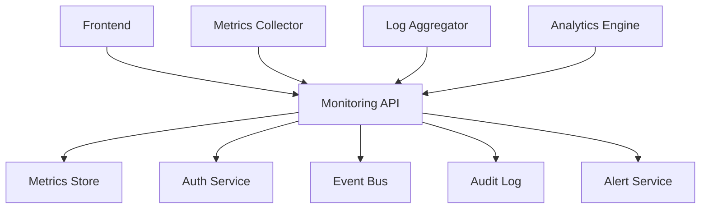
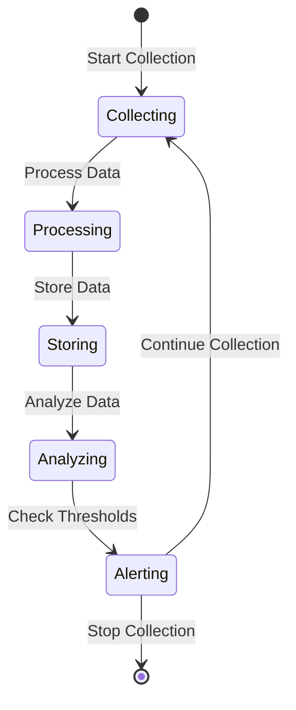
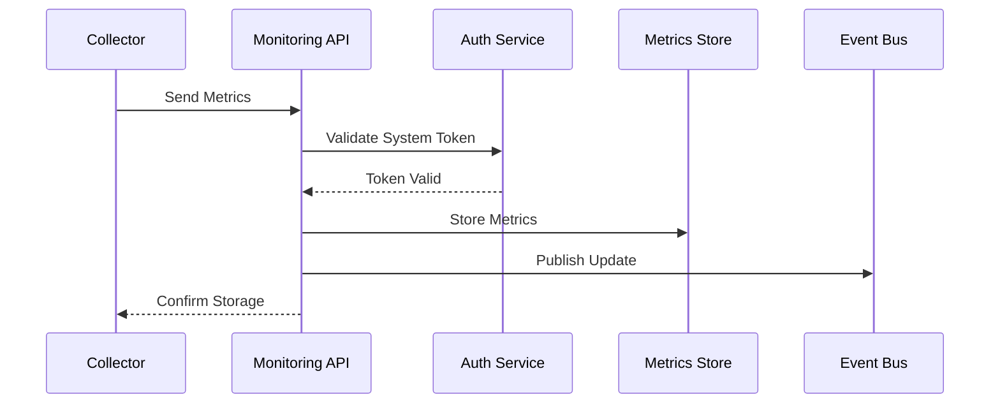
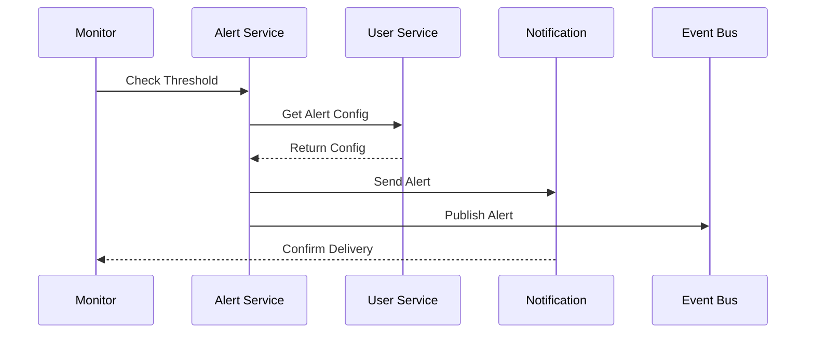
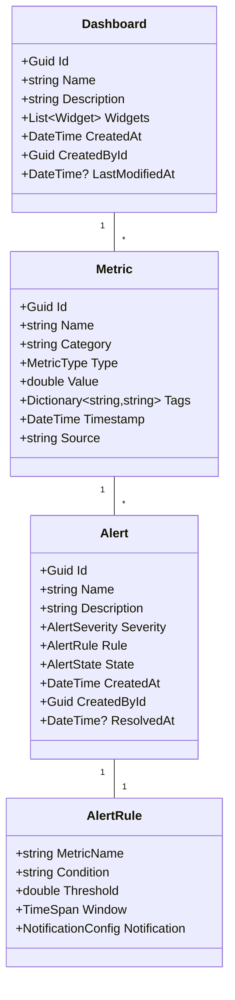

# RFC 005: Monitoring & Analytics System

## Status
- **Status**: Draft
- **Type**: Feature
- **Start Date**: 2024-01-20
- **Author**: System
- **Priority**: P1
- **Related Issues**: N/A
- **Dependencies**: 
  - RFC 000 (Authentication & User Management)
  - RFC 001 (Project Management)
  - RFC 002 (Database Connection Management)
  - RFC 003 (Schema Management)
  - RFC 004 (Data Migration Execution)

## Summary
This RFC proposes the implementation of a monitoring and analytics system that provides secure, efficient, and user-scoped access to system metrics, logs, and analytics. The system will handle real-time monitoring, historical analysis, alerting, and reporting while ensuring proper access control and security.

## Motivation
A robust monitoring and analytics system is essential for:
1. Real-time system monitoring
2. Performance analysis and optimization
3. Error detection and diagnosis
4. Resource utilization tracking
5. Security and compliance monitoring
6. User activity analysis
7. Cost optimization
8. Capacity planning

## Design Details

### System Architecture

### Monitoring Lifecycle Flow

### Metrics Collection Flow

### Alert Processing Flow

### Domain Model

## Implementation Strategy

### Phase 1: Core Monitoring
1. Metrics collection with auth
2. Basic alerting system
3. Access control
4. Integration with auth
5. Real-time monitoring
6. Basic dashboards

### Phase 2: Enhanced Features
1. Advanced metrics
2. Custom dashboards
3. Alert templates
4. Trend analysis
5. Performance tracking
6. Resource monitoring

### Phase 3: Analytics
1. Historical analysis
2. Pattern detection
3. Predictive analytics
4. Cost analysis
5. Usage analytics
6. Custom reports

### Phase 4: Advanced Features
1. Machine learning
2. Anomaly detection
3. Capacity planning
4. Auto-remediation
5. Smart alerting
6. Custom analytics

## Security Considerations
1. Role-based access control
2. Metrics access auditing
3. Data encryption
4. Resource isolation
5. Access monitoring
6. Compliance requirements
7. Vulnerability scanning
8. Security updates
9. Data protection
10. Access reviews

## Testing Strategy
1. Unit tests for all commands and queries
2. Integration tests with auth system
3. Metrics collection testing
4. Alert system testing
5. Dashboard testing
6. Load testing
7. Performance testing
8. Security testing
9. Compliance testing
10. UI/UX testing

## Monitoring
1. System performance metrics
2. API response times
3. Resource utilization
4. Error rates
5. Security events
6. User activity
7. System health
8. Audit trails
9. Compliance metrics
10. Cost metrics

## Documentation
1. API documentation
2. Metrics guide
3. Alert configuration
4. Dashboard creation
5. Best practices
6. Security guide
7. Integration guide
8. Troubleshooting
9. Compliance guide
10. User guide

## Migration Strategy
1. Existing metrics migration
2. Alert configuration
3. Dashboard migration
4. Access control
5. Historical data
6. Alert templates
7. Custom reports
8. User preferences
9. Documentation
10. Analytics data

## Dependencies
1. Authentication System (RFC 000)
2. Project Management (RFC 001)
3. Database Connection (RFC 002)
4. Schema Management (RFC 003)
5. Data Migration (RFC 004)
6. Event bus
7. Time series database
8. Analytics engine
9. Alert service
10. Notification service

## Timeline
- Phase 1 (Core Features): 2 weeks
  - Metrics collection
  - Basic alerting
  - Access control
  - Auth integration
- Phase 2 (Enhanced Features): 2 weeks
  - Advanced metrics
  - Custom dashboards
  - Alert templates
  - Trend analysis
- Phase 3 (Analytics): 2 weeks
  - Historical analysis
  - Pattern detection
  - Predictive analytics
  - Custom reports
- Phase 4 (Advanced): 2 weeks
  - Machine learning
  - Anomaly detection
  - Auto-remediation
  - Smart alerting

## Unresolved Questions
1. Data retention policy?
   - Storage requirements
   - Performance impact
2. Alert complexity?
   - Correlation rules
   - Notification rules
3. Analytics depth?
   - Processing requirements
   - Storage needs
4. Machine learning scope?
   - Model selection
   - Training data
5. Auto-remediation limits?
   - Action boundaries
   - Safety checks

## Command Queries and Models

### Commands
1. CreateMetricCommand
2. CreateAlertCommand
3. CreateDashboardCommand
4. UpdateAlertCommand
5. UpdateDashboardCommand
6. AcknowledgeAlertCommand
7. ResolveAlertCommand
8. CreateReportCommand
9. ConfigureNotificationCommand
10. CreateAnalyticsJobCommand

### Queries
1. GetMetricsByIdQuery
2. GetMetricsListQuery
3. GetAlertsByIdQuery
4. GetAlertsListQuery
5. GetDashboardQuery
6. GetAnalyticsQuery
7. GetNotificationQuery
8. GetSystemHealthQuery
9. GetAuditLogQuery
10. GetComplianceReportQuery

### Models
1. MetricDto
2. AlertDto
3. DashboardDto
4. NotificationDto
5. AnalyticsDto
6. ReportDto
7. HealthCheckDto
8. AuditLogDto
9. ComplianceDto
10. PerformanceDto

### Events
1. MetricCollectedEvent
2. AlertTriggeredEvent
3. AlertResolvedEvent
4. DashboardCreatedEvent
5. ReportGeneratedEvent
6. ThresholdExceededEvent
7. SystemHealthChangedEvent
8. AnalyticsCompletedEvent
9. NotificationSentEvent
10. ComplianceCheckedEvent 