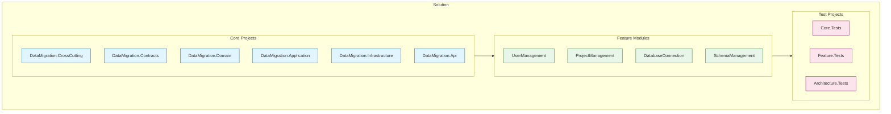
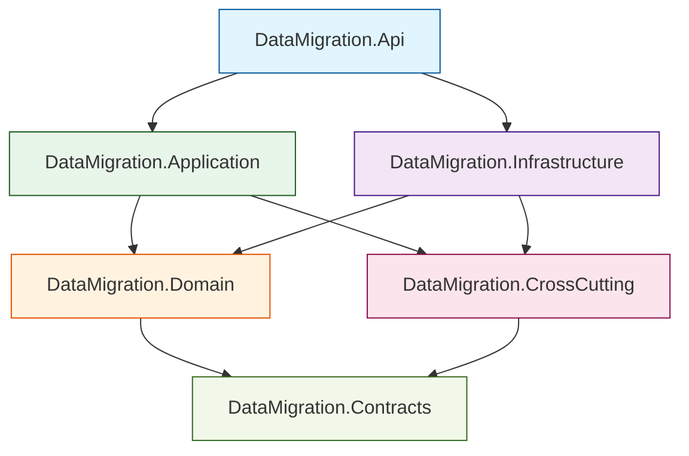
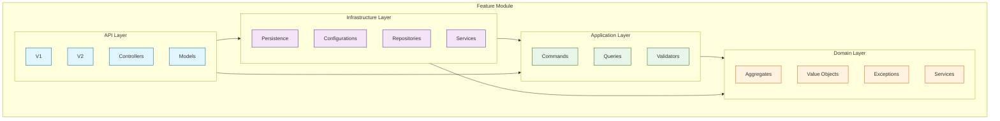
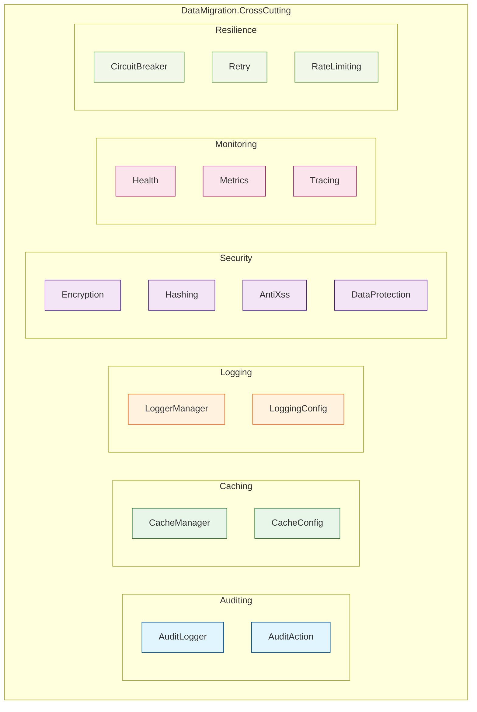

# Data Migration System - Solution Structure

## Overview

The Data Migration System is built following Clean Architecture principles, emphasizing:

### Key Principles
- Separation of concerns
- Domain-driven design
- CQRS pattern
- Vertical slice architecture
- Test-driven development

### Core Features
- Modular design with clear boundaries
- Feature-based organization
- Comprehensive testing strategy
- Cross-cutting concerns separation
- Versioned API design

### Technology Stack
- .NET 7.0 Core
- Entity Framework Core
- MediatR for CQRS
- FluentValidation
- Serilog & OpenTelemetry
- Redis Caching

# Solution Structure

## Architecture Overview


### Core Layer Dependencies


### Feature Module Structure


### Cross-Cutting Concerns


## Directory Structure

### Organization Principles
- Clean separation of concerns
- Feature-based modularity
- Clear dependency boundaries
- Consistent naming conventions
- Standardized project structure

## Simple Directory Structure
```
src/
├── Core/                                  # Core components
│   ├── DataMigration.CrossCutting/       # Cross-cutting concerns
│   │   ├── Auditing/
│   │   │   ├── Interfaces/
│   │   │   ├── Services/
│   │   │   └── Models/
│   │   ├── Caching/
│   │   │   ├── Interfaces/
│   │   │   ├── Services/
│   │   │   └── Configuration/
│   │   ├── Logging/
│   │   │   ├── Interfaces/
│   │   │   ├── Services/
│   │   │   └── Configuration/
│   │   ├── Security/
│   │   │   ├── Encryption/
│   │   │   ├── Hashing/
│   │   │   ├── AntiXss/
│   │   │   └── DataProtection/
│   │   ├── Monitoring/
│   │   │   ├── Health/
│   │   │   ├── Metrics/
│   │   │   └── Tracing/
│   │   └── Resilience/
│   │       ├── CircuitBreaker/
│   │       ├── Retry/
│   │       └── RateLimiting/
│   │
│   ├── DataMigration.Contracts/          # Shared contracts
│   │   ├── Authentication/
│   │   ├── Events/
│   │   └── Constants/
│   │
│   ├── DataMigration.Domain/             # Domain layer
│   │   ├── Common/
│   │   │   ├── Events/
│   │   │   ├── Interfaces/
│   │   │   ├── Models/
│   │   │   └── Security/
│   │   └── Shared/
│   │       ├── Entity.cs
│   │       ├── AggregateRoot.cs
│   │       ├── ValueObject.cs
│   │       ├── Enumeration.cs
│   │       ├── Guard.cs
│   │       └── Result.cs
│   │
│   ├── DataMigration.Application/        # Application layer
│   │   ├── Common/
│   │   │   ├── Behaviors/
│   │   │   │   ├── LoggingBehavior.cs
│   │   │   │   ├── ValidationBehavior.cs
│   │   │   │   ├── AuthorizationBehavior.cs
│   │   │   │   ├── TransactionBehavior.cs
│   │   │   │   ├── MetricsBehavior.cs
│   │   │   │   ├── CachingBehavior.cs
│   │   │   │   ├── RetryBehavior.cs
│   │   │   │   ├── AuditingBehavior.cs
│   │   │   │   └── TracingBehavior.cs
│   │   │   ├── Interfaces/
│   │   │   └── Models/
│   │   └── DependencyInjection.cs
│   │
│   ├── DataMigration.Infrastructure/     # Infrastructure layer
│   │   ├── Authentication/
│   │   │   ├── Services/
│   │   │   │   ├── JwtTokenService.cs
│   │   │   │   ├── AuthenticationService.cs
│   │   │   │   └── GoogleAuthService.cs
│   │   │   └── Configuration/
│   │   ├── Authorization/
│   │   │   ├── Services/
│   │   │   └── Policies/
│   │   ├── Persistence/
│   │   │   ├── Context/
│   │   │   ├── Repositories/
│   │   │   ├── Configurations/
│   │   │   └── Interceptors/
│   │   ├── Messaging/
│   │   │   ├── Services/
│   │   │   └── Handlers/
│   │   └── DependencyInjection.cs
│   │
│   └── DataMigration.Api/               # API layer
│       ├── Common/
│       │   ├── Controllers/
│       │   ├── Models/
│       │   └── Filters/
│       ├── Configuration/
│       │   ├── ApiOptions.cs
│       │   ├── SwaggerOptions.cs
│       │   └── AuthOptions.cs
│       ├── Middleware/
│       │   ├── ErrorHandling/
│       │   ├── RequestLogging/
│       │   └── RateLimiting/
│       └── Extensions/
│
├── Features/                            # Feature modules
│   └── DataMigration.UserManagement/    # User Management feature
│       ├── Domain/
│       │   ├── Aggregates/
│       │   │   ├── UserAggregate/
│       │   │   │   ├── User.cs
│       │   │   │   ├── Role.cs
│       │   │   │   ├── Permission.cs
│       │   │   │   ├── LoginHistory.cs
│       │   │   │   └── Events/
│       │   │   └── ApiKeyAggregate/
│       │   ├── ValueObjects/
│       │   ├── Exceptions/
│       │   └── Services/
│       ├── Application/
│       │   ├── Commands/
│       │   │   ├── Users/
│       │   │   ├── Authentication/
│       │   │   └── ApiKeys/
│       │   ├── Queries/
│       │   │   ├── Users/
│       │   │   ├── Authentication/
│       │   │   └── ApiKeys/
│       │   └── Validators/
│       ├── Infrastructure/
│       │   ├── Persistence/
│       │   │   ├── Configurations/
│       │   │   └── Repositories/
│       │   └── Services/
│       └── Api/
│           ├── V1/
│           │   ├── Controllers/
│           │   │   ├── UsersController.cs
│           │   │   ├── AuthController.cs
│           │   │   ├── MfaController.cs
│           │   │   └── ApiKeysController.cs
│           │   └── Models/
│           │       ├── Requests/
│           │       └── Responses/
│           └── V2/
│
└── Tests/                              # Test projects
    ├── Core/
    │   ├── DataMigration.CrossCutting.Tests/
    │   ├── DataMigration.Domain.Tests/
    │   ├── DataMigration.Application.Tests/
    │   └── DataMigration.Infrastructure.Tests/
    ├── Features/
    │   └── DataMigration.UserManagement.Tests/
    │       ├── Unit/
    │       ├── Integration/
    │       └── E2E/
    └── Architecture.Tests/              # Architecture validation tests
```

[Detailed directory structure can be found here](docs/detailed-directory-structure.md)

## Detailed Component Structure

### Layer Organization
- Each layer has specific responsibilities
- Clear dependency rules
- Standardized component structure
- Consistent implementation patterns

## Implementation Details

### Core Layer Components

1. **Domain Layer**
   - Entities and Value Objects
   - Domain Events
   - Repository Interfaces
   - Domain Services

2. **Application Layer**
   - Commands and Queries
   - Validation
   - Business Rules
   - Application Services

3. **Infrastructure Layer**
   - Data Access
   - External Services
   - Security Implementation
   - Technical Services

4. **API Layer**
   - Controllers
   - Middleware
   - API Documentation
   - Request/Response Models

### Testing Strategy

1. **Unit Tests**
   - Domain Logic
   - Application Services
   - Infrastructure Components

2. **Integration Tests**
   - API Endpoints
   - Database Operations
   - External Services

### Best Practices
1. **Domain Layer**
   - Rich domain models
   - Encapsulated business rules
   - Immutable value objects
   - Domain events for changes

2. **Application Layer**
   - CQRS implementation
   - Validation pipeline
   - Business workflows
   - Cross-cutting concerns

3. **Infrastructure Layer**
   - Repository implementations
   - External service integrations
   - Technical concerns
   - Performance optimizations

4. **API Layer**
   - RESTful endpoints
   - Versioning strategy
   - Documentation
   - Security implementation