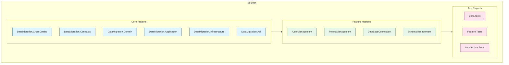
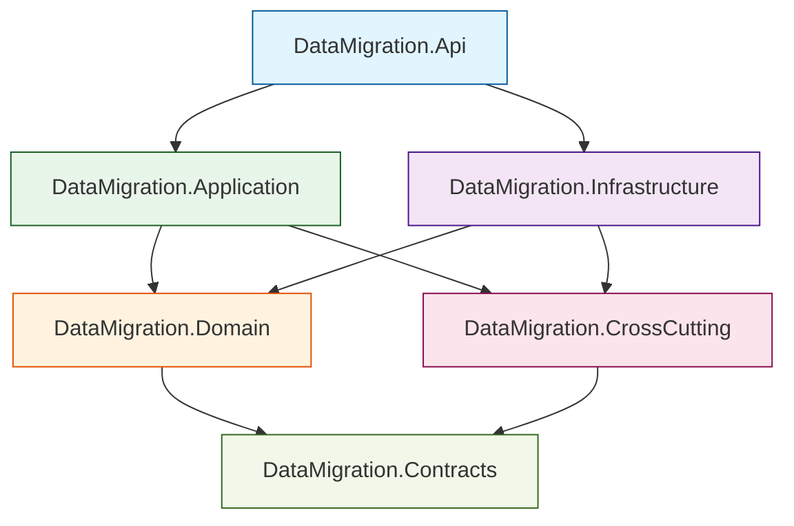
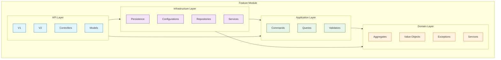
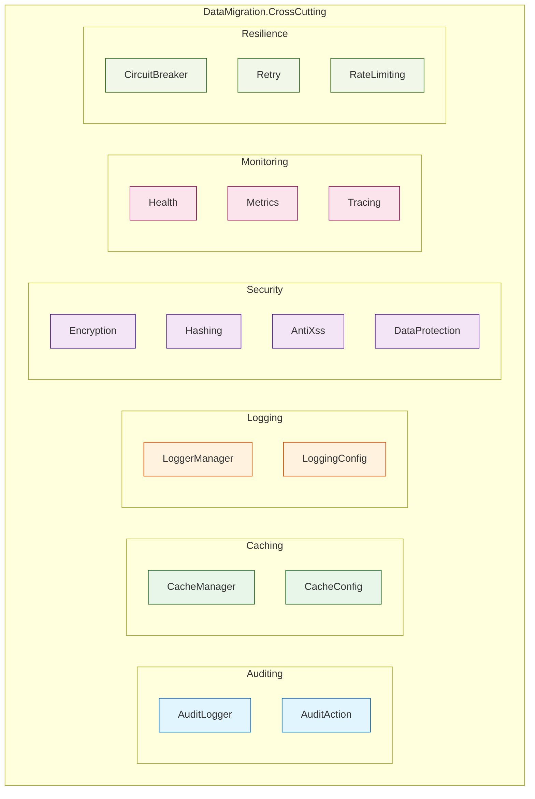
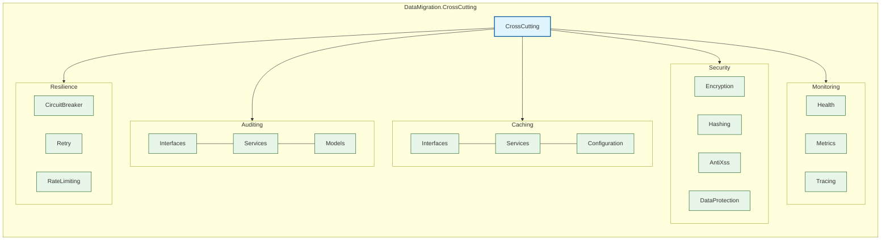
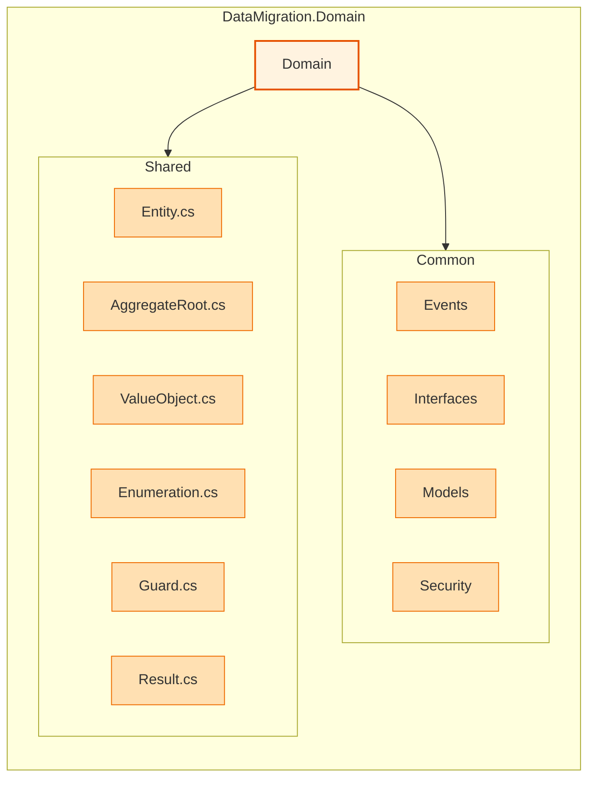
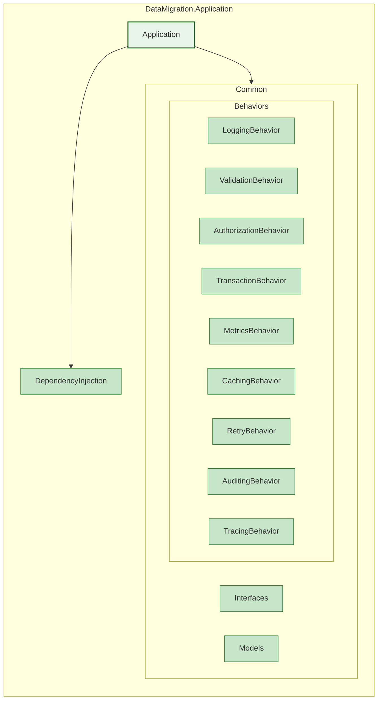
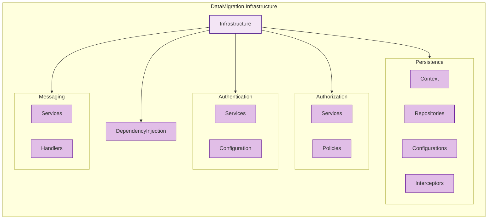
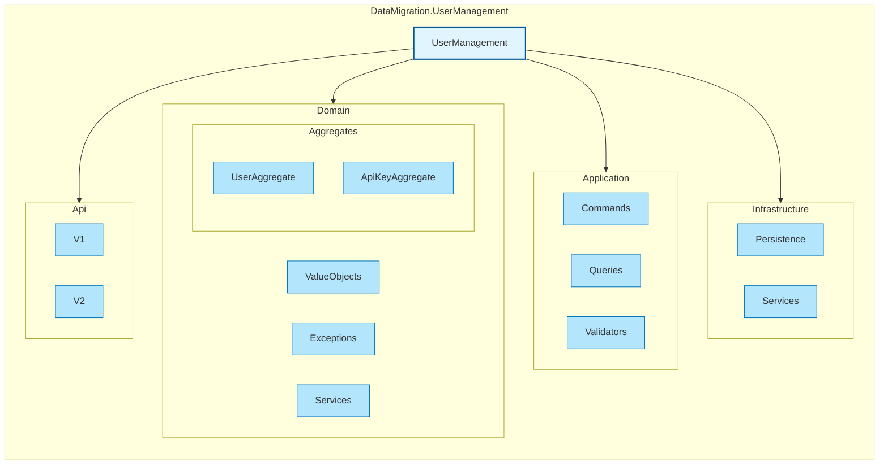
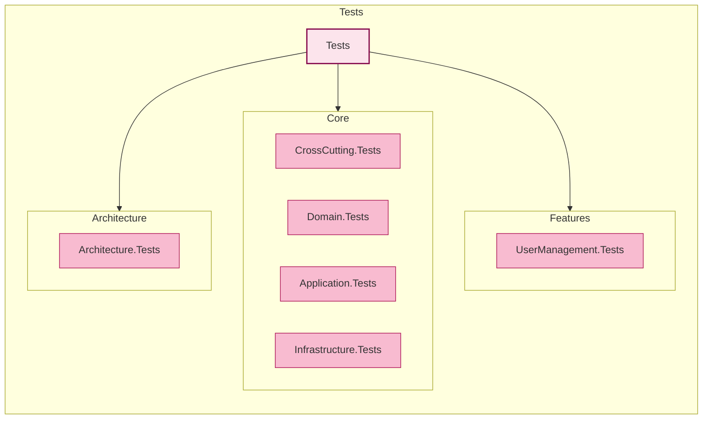

# Solution Structure

## Architecture Overview

### Solution Layout


### Core Layer Dependencies


### Feature Module Structure


### Cross-Cutting Concerns


## Simple Directory Structure
```
src/
├── Core/                                  # Core components
│   ├── DataMigration.CrossCutting/       # Cross-cutting concerns
│   │   ├── Auditing/
│   │   │   ├── Interfaces/
│   │   │   ├── Services/
│   │   │   └── Models/
│   │   ├── Caching/
│   │   │   ├── Interfaces/
│   │   │   ├── Services/
│   │   │   └── Configuration/
│   │   ├── Logging/
│   │   │   ├── Interfaces/
│   │   │   ├── Services/
│   │   │   └── Configuration/
│   │   ├── Security/
│   │   │   ├── Encryption/
│   │   │   ├── Hashing/
│   │   │   ├── AntiXss/
│   │   │   └── DataProtection/
│   │   ├── Monitoring/
│   │   │   ├── Health/
│   │   │   ├── Metrics/
│   │   │   └── Tracing/
│   │   └── Resilience/
│   │       ├── CircuitBreaker/
│   │       ├── Retry/
│   │       └── RateLimiting/
│   │
│   ├── DataMigration.Contracts/          # Shared contracts
│   │   ├── Authentication/
│   │   ├── Events/
│   │   └── Constants/
│   │
│   ├── DataMigration.Domain/             # Domain layer
│   │   ├── Common/
│   │   │   ├── Events/
│   │   │   ├── Interfaces/
│   │   │   ├── Models/
│   │   │   └── Security/
│   │   └── Shared/
│   │       ├── Entity.cs
│   │       ├── AggregateRoot.cs
│   │       ├── ValueObject.cs
│   │       ├── Enumeration.cs
│   │       ├── Guard.cs
│   │       └── Result.cs
│   │
│   ├── DataMigration.Application/        # Application layer
│   │   ├── Common/
│   │   │   ├── Behaviors/
│   │   │   │   ├── LoggingBehavior.cs
│   │   │   │   ├── ValidationBehavior.cs
│   │   │   │   ├── AuthorizationBehavior.cs
│   │   │   │   ├── TransactionBehavior.cs
│   │   │   │   ├── MetricsBehavior.cs
│   │   │   │   ├── CachingBehavior.cs
│   │   │   │   ├── RetryBehavior.cs
│   │   │   │   ├── AuditingBehavior.cs
│   │   │   │   └── TracingBehavior.cs
│   │   │   ├── Interfaces/
│   │   │   └── Models/
│   │   └── DependencyInjection.cs
│   │
│   ├── DataMigration.Infrastructure/     # Infrastructure layer
│   │   ├── Authentication/
│   │   │   ├── Services/
│   │   │   │   ├── JwtTokenService.cs
│   │   │   │   ├── AuthenticationService.cs
│   │   │   │   └── GoogleAuthService.cs
│   │   │   └── Configuration/
│   │   ├── Authorization/
│   │   │   ├── Services/
│   │   │   └── Policies/
│   │   ├── Persistence/
│   │   │   ├── Context/
│   │   │   ├── Repositories/
│   │   │   ├── Configurations/
│   │   │   └── Interceptors/
│   │   ├── Messaging/
│   │   │   ├── Services/
│   │   │   └── Handlers/
│   │   └── DependencyInjection.cs
│   │
│   └── DataMigration.Api/               # API layer
│       ├── Common/
│       │   ├── Controllers/
│       │   ├── Models/
│       │   └── Filters/
│       ├── Configuration/
│       │   ├── ApiOptions.cs
│       │   ├── SwaggerOptions.cs
│       │   └── AuthOptions.cs
│       ├── Middleware/
│       │   ├── ErrorHandling/
│       │   ├── RequestLogging/
│       │   └── RateLimiting/
│       └── Extensions/
│
├── Features/                            # Feature modules
│   └── DataMigration.UserManagement/    # User Management feature
│       ├── Domain/
│       │   ├── Aggregates/
│       │   │   ├── UserAggregate/
│       │   │   │   ├── User.cs
│       │   │   │   ├── Role.cs
│       │   │   │   ├── Permission.cs
│       │   │   │   ├── LoginHistory.cs
│       │   │   │   └── Events/
│       │   │   └── ApiKeyAggregate/
│       │   ├── ValueObjects/
│       │   ├── Exceptions/
│       │   └── Services/
│       ├── Application/
│       │   ├── Commands/
│       │   │   ├── Users/
│       │   │   ├── Authentication/
│       │   │   └── ApiKeys/
│       │   ├── Queries/
│       │   │   ├── Users/
│       │   │   ├── Authentication/
│       │   │   └── ApiKeys/
│       │   └── Validators/
│       ├── Infrastructure/
│       │   ├── Persistence/
│       │   │   ├── Configurations/
│       │   │   └── Repositories/
│       │   └── Services/
│       └── Api/
│           ├── V1/
│           │   ├── Controllers/
│           │   │   ├── UsersController.cs
│           │   │   ├── AuthController.cs
│           │   │   ├── MfaController.cs
│           │   │   └── ApiKeysController.cs
│           │   └── Models/
│           │       ├── Requests/
│           │       └── Responses/
│           └── V2/
│
└── Tests/                              # Test projects
    ├── Core/
    │   ├── DataMigration.CrossCutting.Tests/
    │   ├── DataMigration.Domain.Tests/
    │   ├── DataMigration.Application.Tests/
    │   └── DataMigration.Infrastructure.Tests/
    ├── Features/
    │   └── DataMigration.UserManagement.Tests/
    │       ├── Unit/
    │       ├── Integration/
    │       └── E2E/
    └── Architecture.Tests/              # Architecture validation tests
```

## Detailed Directory Structure with Diagrams

### Core Projects Structure


### Domain Layer Structure


### Application Layer Structure


### Infrastructure Layer Structure


### Feature Module Structure


### Test Projects Structure


Each diagram represents a major component of the solution, with clear hierarchical relationships and color-coding to distinguish different types of components. The diagrams show both the structure and the relationships between different parts of the system.